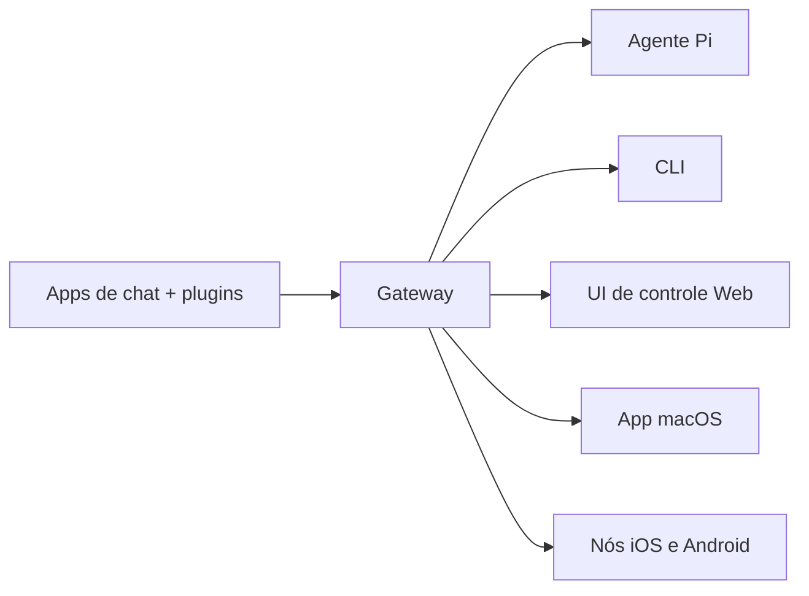

---
read_when:
    - Apresentando o OpenClaw para novos usuários
summary: OpenClaw é um gateway multicanal para agentes de IA que roda em qualquer sistema operacional.
title: OpenClaw
x-i18n:
    generated_at: "2026-04-05T10:47:45Z"
    model: gpt-5.4
    provider: openai
    source_hash: 9c29a8d9fc41a94b650c524bb990106f134345560e6d615dac30e8815afff481
    source_path: index.md
    workflow: 15
---

# OpenClaw 🦞

<p align="center">
    
    
</p>

> _"EXFOLIATE! EXFOLIATE!"_ — Uma lagosta espacial, provavelmente

<p align="center">
  <strong>Gateway para agentes de IA em qualquer sistema operacional, em Discord, Google Chat, iMessage, Matrix, Microsoft Teams, Signal, Slack, Telegram, WhatsApp, Zalo e muito mais.</strong><br />
  Envie uma mensagem e receba uma resposta do agente no seu bolso. Execute um Gateway em canais integrados, plugins de canal incluídos, WebChat e nós móveis.
</p>

<Columns>
  <Card title="Primeiros passos" href="/start/getting-started" icon="rocket">
    Instale o OpenClaw e coloque o Gateway no ar em minutos.
  </Card>
  <Card title="Executar o onboarding" href="/start/wizard" icon="sparkles">
    Configuração guiada com `openclaw onboard` e fluxos de pareamento.
  </Card>
  <Card title="Abrir a UI de controle" href="/web/control-ui" icon="layout-dashboard">
    Inicie o painel do navegador para chat, configuração e sessões.
  </Card>
</Columns>

## O que é OpenClaw?

OpenClaw é um **gateway auto-hospedado** que conecta seus apps de chat e superfícies de canal favoritos — canais integrados, além de plugins de canal incluídos ou externos, como Discord, Google Chat, iMessage, Matrix, Microsoft Teams, Signal, Slack, Telegram, WhatsApp, Zalo e muito mais — a agentes de IA para programação, como Pi. Você executa um único processo de Gateway na sua própria máquina (ou em um servidor), e ele se torna a ponte entre seus aplicativos de mensagens e um assistente de IA sempre disponível.

**Para quem é?** Desenvolvedores e usuários avançados que querem um assistente pessoal de IA com o qual possam falar de qualquer lugar — sem abrir mão do controle sobre seus dados nem depender de um serviço hospedado.

**O que o torna diferente?**

- **Auto-hospedado**: roda no seu hardware, com as suas regras
- **Multicanal**: um Gateway atende simultaneamente a canais integrados e plugins de canal incluídos ou externos
- **Nativo para agentes**: criado para agentes de programação com uso de ferramentas, sessões, memória e roteamento multiagente
- **Código aberto**: licenciado sob MIT, guiado pela comunidade

**Do que você precisa?** Node 24 (recomendado), ou Node 22 LTS (`22.14+`) por compatibilidade, uma chave de API do provedor escolhido e 5 minutos. Para a melhor qualidade e segurança, use o modelo de última geração mais forte disponível.

## Como funciona



O Gateway é a fonte única da verdade para sessões, roteamento e conexões de canal.

## Principais recursos

<Columns>
  <Card title="Gateway multicanal" icon="network">
    Discord, iMessage, Signal, Slack, Telegram, WhatsApp, WebChat e muito mais com um único processo de Gateway.
  </Card>
  <Card title="Plugins de canal" icon="plug">
    Plugins incluídos adicionam Matrix, Nostr, Twitch, Zalo e muito mais nas versões atuais normais.
  </Card>
  <Card title="Roteamento multiagente" icon="route">
    Sessões isoladas por agente, workspace ou remetente.
  </Card>
  <Card title="Suporte a mídia" icon="image">
    Envie e receba imagens, áudio e documentos.
  </Card>
  <Card title="UI de controle Web" icon="monitor">
    Painel no navegador para chat, configuração, sessões e nós.
  </Card>
  <Card title="Nós móveis" icon="smartphone">
    Faça o pareamento de nós iOS e Android para fluxos com Canvas, câmera e voz.
  </Card>
</Columns>

## Início rápido

<Steps>
  <Step title="Instale o OpenClaw">
    ```bash
    npm install -g openclaw@latest
    ```
  </Step>
  <Step title="Faça o onboarding e instale o serviço">
    ```bash
    openclaw onboard --install-daemon
    ```
  </Step>
  <Step title="Converse">
    Abra a UI de controle no navegador e envie uma mensagem:

    ```bash
    openclaw dashboard
    ```

    Ou conecte um canal ([Telegram](/channels/telegram) é o mais rápido) e converse pelo telefone.

  </Step>
</Steps>

Precisa da instalação completa e da configuração de desenvolvimento? Veja [Primeiros passos](/start/getting-started).

## Painel

Abra a UI de controle no navegador depois que o Gateway iniciar.

- Padrão local: [http://127.0.0.1:18789/](http://127.0.0.1:18789/)
- Acesso remoto: [Superfícies Web](/web) e [Tailscale](/gateway/tailscale)

<p align="center">
  
</p>

## Configuração (opcional)

A configuração fica em `~/.openclaw/openclaw.json`.

- Se você **não fizer nada**, o OpenClaw usa o binário Pi incluído em modo RPC com sessões por remetente.
- Se quiser restringi-lo, comece com `channels.whatsapp.allowFrom` e (para grupos) regras de menção.

Exemplo:

```json5
{
  channels: {
    whatsapp: {
      allowFrom: ["+15555550123"],
      groups: { "*": { requireMention: true } },
    },
  },
  messages: { groupChat: { mentionPatterns: ["@openclaw"] } },
}
```

## Comece aqui

<Columns>
  <Card title="Centrais de documentação" href="/start/hubs" icon="book-open">
    Toda a documentação e os guias, organizados por caso de uso.
  </Card>
  <Card title="Configuração" href="/gateway/configuration" icon="settings">
    Configurações centrais do Gateway, tokens e configuração de provedores.
  </Card>
  <Card title="Acesso remoto" href="/gateway/remote" icon="globe">
    Padrões de acesso por SSH e tailnet.
  </Card>
  <Card title="Canais" href="/channels/telegram" icon="message-square">
    Configuração específica por canal para Feishu, Microsoft Teams, WhatsApp, Telegram, Discord e muito mais.
  </Card>
  <Card title="Nós" href="/nodes" icon="smartphone">
    Nós iOS e Android com pareamento, Canvas, câmera e ações do dispositivo.
  </Card>
  <Card title="Ajuda" href="/help" icon="life-buoy">
    Correções comuns e ponto de entrada para solução de problemas.
  </Card>
</Columns>

## Saiba mais

<Columns>
  <Card title="Lista completa de recursos" href="/concepts/features" icon="list">
    Recursos completos de canais, roteamento e mídia.
  </Card>
  <Card title="Roteamento multiagente" href="/concepts/multi-agent" icon="route">
    Isolamento de workspace e sessões por agente.
  </Card>
  <Card title="Segurança" href="/gateway/security" icon="shield">
    Tokens, listas de permissão e controles de segurança.
  </Card>
  <Card title="Solução de problemas" href="/gateway/troubleshooting" icon="wrench">
    Diagnósticos do Gateway e erros comuns.
  </Card>
  <Card title="Sobre e créditos" href="/reference/credits" icon="info">
    Origens do projeto, colaboradores e licença.
  </Card>
</Columns>
