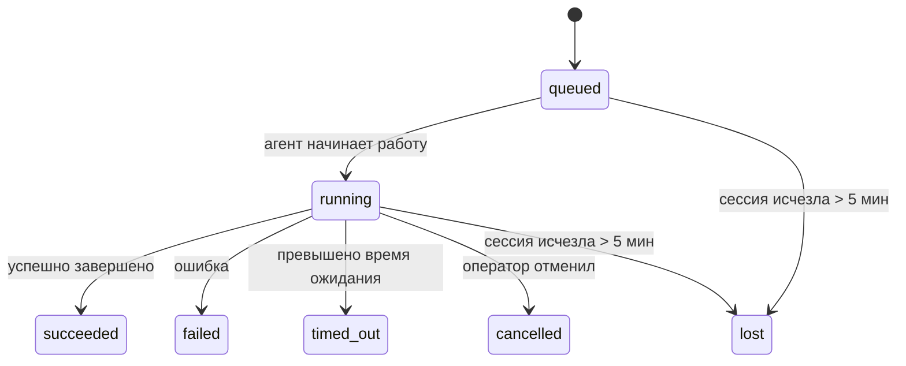

# Фоновые задачи

> **Ищете механизмы планирования?** Ознакомьтесь с разделом [Automation & Tasks](/automation), чтобы выбрать подходящий механизм. На этой странице рассматривается **отслеживание** фоновой работы, а не её планирование.

Фоновые задачи отслеживают работу, которая выполняется **вне основной сессии диалога**: запуски ACP, создание субагентов, выполнение изолированных cron‑задач и операции, инициированные через CLI.

Задачи **не заменяют** сессии, cron‑задачи или heartbeat — они являются **реестром активности**, в котором фиксируется, какая отсоединённая работа была выполнена, когда и была ли она успешной.

<Note>
Не каждый запуск агента создаёт задачу. Циклы heartbeat и обычный интерактивный чат — нет. Задачи создаются при выполнении всех cron‑задач, запуске ACP, создании субагентов и выполнении команд агента через CLI.
</Note>

## Кратко

- Задачи — это **записи**, а не планировщики: cron и heartbeat определяют, _когда_ выполняется работа, а задачи отслеживают, _что произошло_.
- Задачи создаются для ACP, субагентов, всех cron‑задач и операций через CLI. Циклы heartbeat — нет.
- Каждая задача проходит состояния `queued → running → terminal` (succeeded, failed, timed_out, cancelled или lost).
- Cron‑задачи остаются активными, пока среда выполнения cron владеет задачей; задачи CLI, связанные с чатом, остаются активными только пока активен контекст запуска.
- Завершение работы осуществляется по принципу push: отсоединённая работа может напрямую уведомить или разбудить сессию/heartbeat запрашивающей стороны по завершении, поэтому циклы опроса статуса обычно нецелесообразны.
- Изолированные cron‑запуски и завершение работы субагентов по возможности очищают отслеживаемые вкладки браузера/процессы для дочерней сессии перед окончательной очисткой.
- Доставка изолированных cron‑задач подавляет устаревшие промежуточные ответы родительского процесса, пока дочерние субагенты ещё выполняют работу, и отдаёт предпочтение окончательному результату дочернего процесса, если он поступает до доставки.
- Уведомления о завершении доставляются напрямую в канал или ставятся в очередь для следующего цикла heartbeat.
- Команда `openclaw tasks list` отображает все задачи; `openclaw tasks audit` выявляет проблемы.
- Записи о завершённых задачах хранятся в течение 7 дней, затем автоматически удаляются.

## Быстрый старт

```bash
# Вывести список всех задач (сначала самые новые)
openclaw tasks list

# Фильтрация по среде выполнения или статусу
openclaw tasks list --runtime acp
openclaw tasks list --status running

# Показать детали конкретной задачи (по ID, ID запуска или ключу сессии)
openclaw tasks show <lookup>

# Отменить выполняющуюся задачу (завершает дочернюю сессию)
openclaw tasks cancel <lookup>

# Изменить политику уведомлений для задачи
openclaw tasks notify <lookup> state_changes

# Выполнить аудит работоспособности
openclaw tasks audit

# Просмотреть или применить обслуживание
openclaw tasks maintenance
openclaw tasks maintenance --apply

# Проверить состояние TaskFlow
openclaw tasks flow list
openclaw tasks flow show <lookup>
openclaw tasks flow cancel <lookup>
```

## Что создаёт задачу

| Источник | Тип среды выполнения | Когда создаётся запись о задаче | Политика уведомлений по умолчанию |
| --- | --- | --- | --- |
| Фоновые запуски ACP | `acp` | При создании дочерней сессии ACP | `done_only` |
| Оркестрация субагентов | `subagent` | При создании субагента через `sessions_spawn` | `done_only` |
| Cron‑задачи (все типы) | `cron` | При каждом выполнении cron (в основной сессии и изолированно) | `silent` |
| Операции через CLI | `cli` | Команды `openclaw agent`, выполняемые через шлюз | `silent` |
| Задачи медиаагента | `cli` | Запуски `video_generate` в рамках сессии | `silent` |

Cron‑задачи в основной сессии используют политику уведомлений `silent` по умолчанию — они создают записи для отслеживания, но не генерируют уведомления. Изолированные cron‑задачи также используют `silent` по умолчанию, но более заметны, поскольку выполняются в собственной сессии.

Запуски `video_generate` в рамках сессии также используют политику уведомлений `silent`. Они по‑прежнему создают записи о задачах, но завершение работы передаётся обратно в исходную сессию агента как внутреннее пробуждение, чтобы агент мог написать последующее сообщение и прикрепить готовое видео. Если вы включите `tools.media.asyncCompletion.directSend`, асинхронные завершения `music_generate` и `video_generate` сначала попытаются выполнить прямую доставку в канал, прежде чем вернуться к пути пробуждения запрашивающей сессии.

Пока задача `video_generate` в рамках сессии активна, инструмент также действует как ограничительный механизм: повторные вызовы `video_generate` в той же сессии возвращают статус активной задачи вместо запуска второго параллельного процесса генерации. Используйте `action: "status"`, если вам нужен явный запрос статуса/прогресса со стороны агента.

**Что не создаёт задачи:**

- Циклы heartbeat в основной сессии — см. [Heartbeat](/gateway/heartbeat)
- Обычные циклы интерактивного чата
- Прямые ответы на команды `/command`

## Жизненный цикл задачи



| Статус | Что означает |
| --- | --- |
| `queued` | Создана, ожидает начала работы агента |
| `running` | Цикл агента активно выполняется |
| `succeeded` | Успешно завершено |
| `failed` | Завершено с ошибкой |
| `timed_out` | Превышено настроенное время ожидания |
| `cancelled` | Остановлено оператором через `openclaw tasks cancel` |
| `lost` | Среда выполнения потеряла авторитетное состояние поддержки после 5‑минутного льготного периода |

Переходы происходят автоматически — когда связанный запуск агента завершается, статус задачи обновляется соответствующим образом.

Статус `lost` зависит от среды выполнения:

- Задачи ACP: метаданные дочерней сессии ACP исчезли.
- Задачи субагентов: дочерняя сессия исчезла из хранилища агентов целевой стороны.
- Cron‑задачи: среда выполнения cron больше не отслеживает задачу как активную.
- Задачи CLI: для изолированных задач дочерней сессии используется дочерняя сессия; для задач CLI, связанных с чатом, используется активный контекст запуска, поэтому остаточные строки канала/группы/прямой сессии не поддерживают их активность.

## Доставка и уведомления

Когда задача достигает конечного состояния, OpenClaw уведомляет вас. Есть два пути доставки:

**Прямая доставка** — если у задачи есть целевой канал ( `requesterOrigin`), сообщение о завершении отправляется напрямую в этот канал (Telegram, Discord, Slack и т. д.). Для завершения работы субагентов OpenClaw также сохраняет привязку к ветке/теме, если она доступна, и может заполнить отсутствующие поля `to` / account из сохранённого маршрута запрашивающей сессии (`lastChannel` / `lastTo` / `lastAccountId`), прежде чем отказаться от прямой доставки.

**Доставка с постановкой в очередь в сессии** — если прямая доставка не удаётся или происхождение не задано, обновление ставится в очередь как системное событие в сессии запрашивающей стороны и отображается при следующем цикле heartbeat.

<Tip>
Завершение задачи запускает немедленное пробуждение heartbeat, чтобы вы быстро увидели результат — вам не нужно ждать следующего запланированного цикла heartbeat.
</Tip>

Это означает, что обычный рабочий процесс основан на принципе push: запустите отсоединённую работу один раз, а затем позвольте среде выполнения разбудить или уведомить вас о завершении. Опрашивайте состояние задачи только тогда, когда вам нужна отладка, вмешательство или явный аудит.

### Политики уведомлений

Управляйте тем, насколько подробно вы хотите получать информацию о каждой задаче:

| Политика | Что доставляется |
| --- | --- |
| `done_only` (по умолчанию) | Только конечное состояние (succeeded, failed и т. д.) — **это значение по умолчанию** |
| `state_changes` | Каждое изменение состояния и обновление прогресса |
| `silent` | Ничего |

Измените политику, пока задача выполняется:

```bash
openclaw tasks notify <lookup> state_changes
```

## Справочная информация по CLI

### `tasks list`

```bash
openclaw tasks list [--runtime <acp|subagent|cron|cli>] [--status <status>] [--json]
```

Столбцы вывода: ID задачи, тип, статус, доставка, ID запуска, дочерняя сессия, сводка.

### `tasks show`

```bash
openclaw tasks show <lookup>
```

