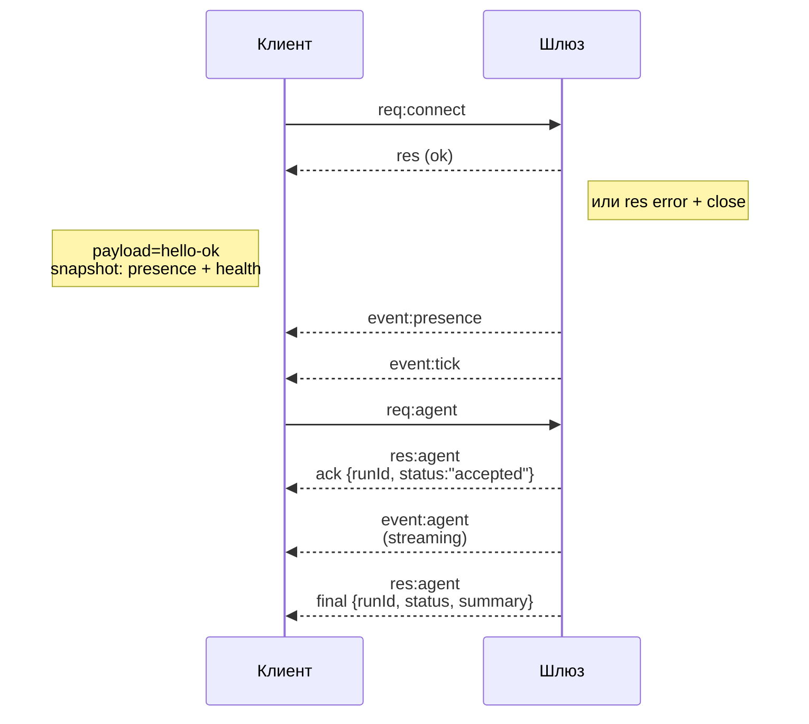

# Архитектура шлюза

## Обзор

- Единый долгоживущий **шлюз (Gateway)** управляет всеми каналами обмена сообщениями (WhatsApp через Baileys, Telegram через grammY, Slack, Discord, Signal, iMessage, WebChat).
- Клиенты плоскости управления (приложение для macOS, CLI, веб-интерфейс, автоматизации) подключаются к шлюзу через **WebSocket** на настроенном хосте привязки (по умолчанию `127.0.0.1:18789`).
- **Узлы (Nodes)** (macOS/iOS/Android/без интерфейса) также подключаются через **WebSocket**, но указывают `role: node` с явными возможностями/командами.
- Один шлюз на хост; это единственное место, где открывается сессия WhatsApp.
- **Хост canvas** обслуживается HTTP-сервером шлюза по следующим адресам:
  - `/__openclaw__/canvas/` (HTML/CSS/JS, редактируемые агентом);
  - `/__openclaw__/a2ui/` (хост A2UI).
  Используется тот же порт, что и у шлюза (по умолчанию `18789`).

## Компоненты и потоки

### Шлюз (демон)

- Поддерживает подключения к провайдерам.
- Предоставляет типизированный WS-API (запросы, ответы, события, отправляемые сервером).
- Проверяет входящие фреймы на соответствие JSON Schema.
- Генерирует события типа `agent`, `chat`, `presence`, `health`, `heartbeat`, `cron`.

### Клиенты (приложение для macOS / CLI / веб-админ)

- Одно WS-подключение на клиент.
- Отправляют запросы (`health`, `status`, `send`, `agent`, `system-presence`).
- Подписываются на события (`tick`, `agent`, `presence`, `shutdown`).

### Узлы (macOS / iOS / Android / без интерфейса)

- Подключаются к **тому же WS-серверу** с `role: node`.
- Указывают идентификатор устройства в `connect`; сопряжение основано на **устройстве** (роль `node`), а утверждение хранится в хранилище сопряжения устройств.
- Предоставляют команды типа `canvas.*`, `camera.*`, `screen.record`, `location.get`.

Детали протокола:

- [Протокол шлюза](/gateway/protocol)

### WebChat

- Статический пользовательский интерфейс, использующий WS-API шлюза для истории чата и отправки сообщений.
- В удалённых конфигурациях подключается через тот же туннель SSH/Tailscale, что и другие клиенты.

## Жизненный цикл подключения (один клиент)



## Протокол передачи данных (кратко)

- Транспорт: WebSocket, текстовые фреймы с JSON-полезной нагрузкой.
- Первый фрейм **должен** быть `connect`.
- После рукопожатия:
  - Запросы: `{type:"req", id, method, params}` → `{type:"res", id, ok, payload|error}`
  - События: `{type:"event", event, payload, seq?, stateVersion?}`
- `hello-ok.features.methods` / `events` — метаданные для обнаружения, а не сгенерированный дамп всех вызываемых вспомогательных маршрутов.
- Аутентификация с общим секретом использует `connect.params.auth.token` или `connect.params.auth.password` в зависимости от настроенного режима аутентификации шлюза.
- Режимы с идентификацией, такие как Tailscale Serve (`gateway.auth.allowTailscale: true`) или не-loopback `gateway.auth.mode: "trusted-proxy"`, удовлетворяют требованиям аутентификации из заголовков запроса вместо `connect.params.auth.*`.
- Режим приватного входа `gateway.auth.mode: "none"` полностью отключает аутентификацию с общим секретом; не используйте этот режим для публичного/ненадёжного входа.
- Ключи идемпотентности обязательны для методов с побочными эффектами (`send`, `agent`) для безопасной повторной отправки; сервер хранит недолговечный кэш дедупликации.
- Узлы должны включать `role: "node"` плюс возможности/команды/разрешения в `connect`.

## Сопряжение и локальное доверие

- Все WS-клиенты (операторы и узлы) включают **идентификатор устройства** в `connect`.
- Для новых идентификаторов устройств требуется утверждение сопряжения; шлюз выдаёт **токен устройства** для последующих подключений.
- Прямые локальные loopback-подключения могут быть автоматически утверждены для удобства работы на том же хосте.
- OpenClaw также имеет узкий путь самоподключения для бэкенда/контейнера для доверенных потоков с общим секретом.
- Подключения через Tailnet и LAN, включая привязки tailnet на том же хосте, по-прежнему требуют явного утверждения сопряжения.
- Все подключения должны подписывать одноразовый номер `connect.challenge`.
- Полезная нагрузка подписи `v3` также связывает `platform` + `deviceFamily`; шлюз фиксирует сопоставленные метаданные при переподключении и требует повторного сопряжения при изменении метаданных.
- Для **нелокальных** подключений по-прежнему требуется явное утверждение.
- Аутентификация шлюза (`gateway.auth.*`) по-прежнему применяется ко **всем** подключениям, локальным или удалённым.

Подробности: [Протокол шлюза](/gateway/protocol), [Сопряжение](/channels/pairing), [Безопасность](/gateway/security).

## Типизация протокола и генерация кода

- Схемы TypeBox определяют протокол.
- JSON Schema генерируется из этих схем.
- Модели Swift генерируются из JSON Schema.

## Удалённый доступ

- Предпочтительно: Tailscale или VPN.
- Альтернатива: туннель SSH

  ```bash
  ssh -N -L 18789:127.0.0.1:18789 user@host
  ```

- То же рукопожатие и токен аутентификации применяются через туннель.
- TLS с необязательным закреплением может быть включён для WS в удалённых конфигурациях.

## Снапшот операций

- Запуск: `openclaw gateway` (в foreground, логи выводятся в stdout).
- Проверка работоспособности: `health` через WS (также включён в `hello-ok`).
- Контроль: launchd/systemd для автоматического перезапуска.

## Инварианты

- Ровно один шлюз управляет одной сессией Baileys на хост.
- Рукопожатие обязательно; любой первый фрейм, не являющийся JSON или `connect`, приводит к жёсткому закрытию соединения.
- События не воспроизводятся; клиенты должны обновлять данные при пропусках.

## Связанные материалы

- [Цикл агента](/concepts/agent-loop) — подробный цикл выполнения агента
- [Протокол шлюза](/gateway/protocol) — контракт протокола WebSocket
- [Очередь](/concepts/queue) — очередь команд и параллелизм
- [Безопасность](/gateway/security) — модель доверия и усиление защиты