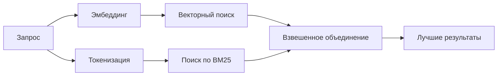

# Поиск в памяти

`memory_search` находит релевантные заметки в ваших файлах памяти, даже если формулировки отличаются от исходного текста. Механизм работает за счёт индексации памяти в виде небольших фрагментов и поиска по ним с использованием эмбеддингов, ключевых слов или обоих методов.

## Быстрый старт

Если у вас настроен API-ключ OpenAI, Gemini, Voyage или Mistral, поиск в памяти работает автоматически. Чтобы явно указать провайдера:

```json5
{
  agents: {
    defaults: {
      memorySearch: {
        provider: "openai", // или "gemini", "local", "ollama" и т. д.
      },
    },
  },
}
```

Для локальных эмбеддингов без API-ключа используйте `provider: "local"` (требуется node-llama-cpp).

## Поддерживаемые провайдеры

| Провайдер | ID | Требуется API-ключ | Примечания |
| -------- | --------- | ------------- | ---------------------------------------------------- |
| OpenAI | `openai` | Да | Определяется автоматически, быстрый |
| Gemini | `gemini` | Да | Поддерживает индексацию изображений и аудио |
| Voyage | `voyage` | Да | Определяется автоматически |
| Mistral | `mistral` | Да | Определяется автоматически |
| Bedrock | `bedrock` | Нет | Определяется автоматически при наличии цепочки учётных данных AWS |
| Ollama | `ollama` | Нет | Локальный, необходимо указать явно |
| Local | `local` | Нет | Модель GGUF, загрузка ~0,6 ГБ |

## Как работает поиск

OpenClaw запускает два пути поиска параллельно и объединяет результаты:



- **Векторный поиск** находит заметки со схожим смыслом ("gateway host" соответствует "the machine running OpenClaw").
- **Поиск по ключевым словам BM25** находит точные совпадения (ID, строки ошибок, ключи конфигурации).

Если доступен только один путь (нет эмбеддингов или нет FTS), выполняется только он.

## Улучшение качества поиска

Две дополнительные функции полезны при большом объёме истории заметок:

### Временное затухание

Старые заметки постепенно теряют весовой коэффициент ранжирования, благодаря чему свежая информация выводится в первую очередь. При стандартном периоде полураспада в 30 дней заметка месячной давности получает 50 % от своего исходного веса. Вечно актуальные файлы, такие как `MEMORY.md`, не подвергаются затуханию.

<Tip>
Включите временное затухание, если у вашего агента есть месяцы ежедневных заметок и устаревшая информация вытесняет свежий контекст.
</Tip>

### MMR (разнообразие)

Снижает количество избыточных результатов. Если пять заметок содержат упоминание одной и той же конфигурации маршрутизатора, MMR гарантирует, что лучшие результаты будут охватывать разные темы, а не повторяться.

<Tip>
Включите MMR, если `memory_search` продолжает возвращать почти дублирующиеся фрагменты из разных ежедневных заметок.
</Tip>

### Включение обоих механизмов

```json5
{
  agents: {
    defaults: {
      memorySearch: {
        query: {
          hybrid: {
            mmr: { enabled: true },
            temporalDecay: { enabled: true },
          },
        },
      },
    },
  },
}
```

## Мультимодальная память

С Gemini Embedding 2 вы можете индексировать изображения и аудиофайлы наряду с Markdown. Запросы на поиск остаются текстовыми, но они сопоставляются с визуальным и аудиоконтентом. См. [справочник по конфигурации памяти](/reference/memory-config) для настройки.

## Поиск в памяти сессии

Вы можете дополнительно индексировать транскрипты сессий, чтобы `memory_search` мог вспоминать предыдущие диалоги. Это включается через `memorySearch.experimental.sessionMemory`. Подробности см. в [справочнике по конфигурации](/reference/memory-config).

## Устранение неполадок

**Нет результатов?** Выполните `openclaw memory status`, чтобы проверить индекс. Если он пуст, выполните `openclaw memory index --force`.

**Только совпадения по ключевым словам?** Возможно, провайдер эмбеддингов не настроен. Проверьте с помощью `openclaw memory status --deep`.

**Текст CJK не найден?** Перестройте индекс FTS с помощью `openclaw memory index --force`.

## Дополнительные материалы

- [Память](/concepts/memory) — структура файлов, бэкенды, инструменты
- [Справочник по конфигурации памяти](/reference/memory-config) — все параметры конфигурации