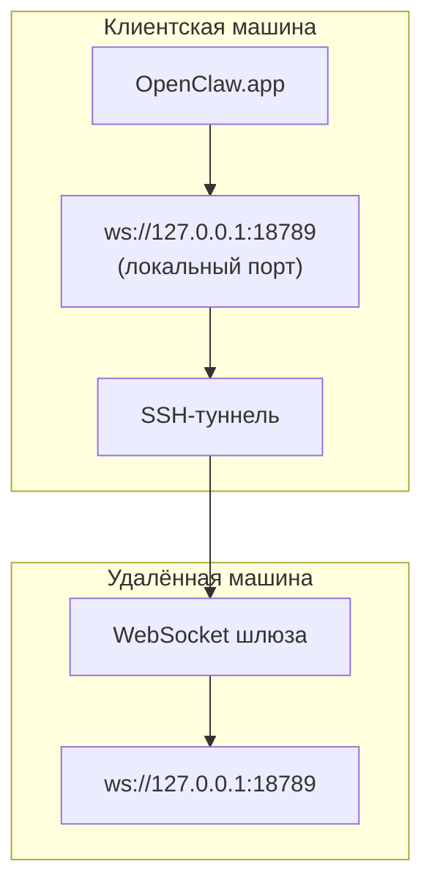

> Этот контент был объединён с разделом [Удаленный доступ](/gateway/remote#macos-persistent-ssh-tunnel-via-launchagent). Ознакомьтесь с этой страницей для получения актуального руководства.

# Запуск OpenClaw.app с удалённым шлюзом

OpenClaw.app использует SSH-туннелирование для подключения к удалённому шлюзу. В этом руководстве показано, как выполнить настройку.

## Обзор



## Быстрая настройка

### Шаг 1: Добавление конфигурации SSH

Отредактируйте файл `~/.ssh/config` и добавьте следующее:

```ssh
Host remote-gateway
    HostName <REMOTE_IP>          # например, 172.27.187.184
    User <REMOTE_USER>            # например, jefferson
    LocalForward 18789 127.0.0.1:18789
    IdentityFile ~/.ssh/id_rsa
```

Замените `<REMOTE_IP>` и `<REMOTE_USER>` на свои значения.

### Шаг 2: Копирование SSH-ключа

Скопируйте свой открытый ключ на удалённую машину (один раз введите пароль):

```bash
ssh-copy-id -i ~/.ssh/id_rsa <REMOTE_USER>@<REMOTE_IP>
```

### Шаг 3: Настройка аутентификации удалённого шлюза

```bash
openclaw config set gateway.remote.token "<your-token>"
```

Используйте `gateway.remote.password`, если ваш удалённый шлюз использует аутентификацию по паролю.
`OPENCLAW_GATEWAY_TOKEN` по-прежнему действует как переопределение на уровне оболочки, но для устойчивой настройки удалённого клиента следует использовать `gateway.remote.token` / `gateway.remote.password`.

### Шаг 4: Запуск SSH-туннеля

```bash
ssh -N remote-gateway &
```

### Шаг 5: Перезапуск OpenClaw.app

```bash
# Закройте OpenClaw.app (⌘Q), затем откройте заново:
open /path/to/OpenClaw.app
```

Теперь приложение будет подключаться к удалённому шлюзу через SSH-туннель.

---

## Автоматический запуск туннеля при входе в систему

Чтобы SSH-туннель запускался автоматически при входе в систему, создайте Launch Agent.

### Создание PLIST-файла

Сохраните следующее как `~/Library/LaunchAgents/ai.openclaw.ssh-tunnel.plist`:

```xml
<?xml version="1.0" encoding="UTF-8"?>
<!DOCTYPE plist PUBLIC "-//Apple//DTD PLIST 1.0//EN" "http://www.apple.com/DTDs/PropertyList-1.0.dtd">
<plist version="1.0">
<dict>
    <key>Label</key>
    <string>ai.openclaw.ssh-tunnel</string>
    <key>ProgramArguments</key>
    <array>
        <string>/usr/bin/ssh</string>
        <string>-N</string>
        <string>remote-gateway</string>
    </array>
    <key>KeepAlive</key>
    <true/>
    <key>RunAtLoad</key>
    <true/>
</dict>
</plist>
```

### Загрузка Launch Agent

```bash
launchctl bootstrap gui/$UID ~/Library/LaunchAgents/ai.openclaw.ssh-tunnel.plist
```

Теперь туннель будет:

- запускаться автоматически при входе в систему;
- перезапускаться в случае сбоя;
- работать в фоновом режиме.

Примечание для устаревших версий: удалите любой оставшийся LaunchAgent `com.openclaw.ssh-tunnel`, если он присутствует.

---

## Устранение неполадок

**Проверка работы туннеля:**

```bash
ps aux | grep "ssh -N remote-gateway" | grep -v grep
lsof -i :18789
```

**Перезапуск туннеля:**

```bash
launchctl kickstart -k gui/$UID/ai.openclaw.ssh-tunnel
```

**Остановка туннеля:**

```bash
launchctl bootout gui/$UID/ai.openclaw.ssh-tunnel
```

---

## Принцип работы

| Компонент | Что делает |
| --- | --- |
| `LocalForward 18789 127.0.0.1:18789` | Перенаправляет локальный порт 18789 на удалённый порт 18789 |
| `ssh -N` | SSH без выполнения удалённых команд (только перенаправление портов) |
| `KeepAlive` | Автоматически перезапускает туннель в случае сбоя |
| `RunAtLoad` | Запускает туннель при загрузке агента |

OpenClaw.app подключается к `ws://127.0.0.1:18789` на вашей клиентской машине. SSH-туннель перенаправляет это подключение на порт 18789 на удалённой машине, где работает шлюз.