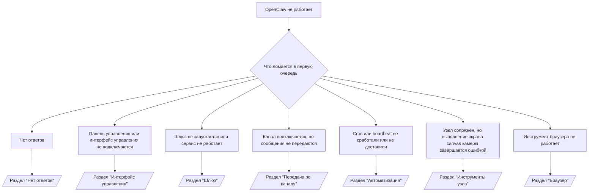

# Устранение неполадок

Если у вас есть всего 2 минуты, используйте эту страницу как точку входа для первичной диагностики.

## Первые 60 секунд

Выполните следующие команды строго в указанном порядке:

```bash
openclaw status
openclaw status --all
openclaw gateway probe
openclaw gateway status
openclaw doctor
openclaw channels status --probe
openclaw logs --follow
```

Хороший результат в одной строке:

- `openclaw status` → отображаются настроенные каналы, явных ошибок аутентификации нет.
- `openclaw status --all` → полный отчёт присутствует и может быть предоставлен.
- `openclaw gateway probe` → ожидаемая цель шлюза доступна (`Reachable: yes`). Сообщение `RPC: limited - missing scope: operator.read` указывает на ограниченную диагностику, а не на сбой подключения.
- `openclaw gateway status` → `Runtime: running` и `RPC probe: ok`.
- `openclaw doctor` → нет блокирующих ошибок конфигурации/сервиса.
- `openclaw channels status --probe` → доступный шлюз возвращает актуальное состояние транспорта для каждой учётной записи, а также результаты проверки/аудита, например `works` или `audit ok`; если шлюз недоступен, команда возвращает только сводку по конфигурации.
- `openclaw logs --follow` → стабильная активность, повторяющихся фатальных ошибок нет.

## Ошибка Anthropic long context 429

Если вы видите:
`HTTP 429: rate_limit_error: Extra usage is required for long context requests`,
перейдите по ссылке [/gateway/troubleshooting#anthropic-429-extra-usage-required-for-long-context](/gateway/troubleshooting#anthropic-429-extra-usage-required-for-long-context).

## Локальный бэкенд, совместимый с OpenAI, работает напрямую, но не работает в OpenClaw

Если ваш локальный или размещённый самостоятельно бэкенд `/v1` отвечает на небольшие прямые запросы `/v1/chat/completions`, но выдаёт ошибку при выполнении `openclaw infer model run` или в обычных операциях агента:

1. Если в ошибке указано, что `messages[].content` должен быть строкой, установите
   `models.providers.<provider>.models[].compat.requiresStringContent: true`.
2. Если бэкенд по-прежнему выдаёт ошибку только при операциях агента в OpenClaw, установите
   `models.providers.<provider>.models[].compat.supportsTools: false` и повторите попытку.
3. Если небольшие прямые запросы по-прежнему работают, но более крупные запросы в OpenClaw приводят к сбою бэкенда, рассмотрите оставшуюся проблему как ограничение модели/сервера вышестоящего уровня и перейдите к подробному руководству:
   [/gateway/troubleshooting#local-openai-compatible-backend-passes-direct-probes-but-agent-runs-fail](/gateway/troubleshooting#local-openai-compatible-backend-passes-direct-probes-but-agent-runs-fail)

## Ошибка установки плагина из-за отсутствия расширений openclaw

Если установка завершается ошибкой `package.json missing openclaw.extensions`, значит, пакет плагина использует устаревший формат, который больше не принимается OpenClaw.

Чтобы исправить в пакете плагина:

1. Добавьте `openclaw.extensions` в `package.json`.
2. Укажите ссылки на файлы среды выполнения (обычно `./dist/index.js`).
3. Переопубликовайте плагин и снова выполните `openclaw plugins install <package>`.

Пример:

```json
{
  "name": "@openclaw/my-plugin",
  "version": "1.2.3",
  "openclaw": {
    "extensions": ["./dist/index.js"]
  }
}
```

Ссылка: [Архитектура плагина](/plugins/architecture)

## Дерево решений



<AccordionGroup>
  <Accordion title="Нет ответов">
    ```bash
    openclaw status
    openclaw gateway status
    openclaw channels status --probe
    openclaw pairing list --channel <channel> [--account <id>]
    openclaw logs --follow
    ```

    Хороший результат выглядит следующим образом:

    - `Runtime: running`
    - `RPC probe: ok`
    - Ваш канал показывает, что транспорт подключён, и, где это поддерживается, `works` или `audit ok` в `channels status --probe`
    - Отправитель одобрен (или политика DM открыта/в белом списке)

    Типичные записи в логах:

    - `drop guild message (mention required` → блокировка упоминания заблокировала сообщение в Discord.
    - `pairing request` → отправитель не одобрен и ожидает одобрения DM-сопряжения.
    - `blocked` / `allowlist` в логах канала → отправитель, комната или группа отфильтрованы.

    Подробные страницы:

    - [/gateway/troubleshooting#no-replies](/gateway/troubleshooting#no-replies)
    - [/channels/troubleshooting](/channels/troubleshooting)
    - [/channels/pairing](/channels/pairing)

  </Accordion>

  <Accordion title="Панель управления или интерфейс управления не подключаются">
    ```bash
    openclaw status
    openclaw gateway status
    openclaw logs --follow
    openclaw doctor
    openclaw channels status --probe
    ```

    Хороший результат выглядит следующим образом:

    - В `openclaw gateway status` отображается `Dashboard: http://...`
    - `RPC probe: ok`
    - В логах нет цикла аутентификации

    Типичные записи в логах:

    - `device identity required` → HTTP/незащищённый контекст не может завершить аутентификацию устройства.
    - `origin not allowed` → браузер `Origin` не разрешён для цели шлюза интерфейса управления.
    - `AUTH_TOKEN_MISMATCH` с подсказками о повторной попытке (`canRetryWithDeviceToken=true`) → может автоматически произойти одна повторная попытка с доверенным токеном устройства.
    - Повторная попытка с кэшированным токеном использует набор областей, сохранённый вместе с сопряжённым токеном устройства. Явные вызовы `deviceToken` / `scopes` сохраняют запрошенный набор областей.
    - В асинхронном пути Tailscale Serve Control UI неудачные попытки для одного и того же `{scope, ip}` сериализуются до того, как ограничитель зафиксирует сбой, поэтому вторая параллельная неудачная попытка может уже показать `retry later`.
    - `too many failed authentication attempts (retry later)` из источника браузера localhost → повторные сбои из одного и того же `Origin` временно заблокированы; другой источник localhost использует отдельный пул.
    - повторяющееся `unauthorized` после повторной попытки → неверный токен/пароль, несоответствие режима аутентификации или устаревший сопряжённый токен устройства.
    - `gateway connect failed:` → интерфейс управления нацелен на неверный URL/порт или недоступный шлюз.

    Подробные страницы:

    - [/gateway/troubleshooting#dashboard-control-ui-connectivity](/gateway/troubleshooting#dashboard-control-ui-connectivity)
    - [/web/control-ui](/web/control-ui)
    - [/gateway/authentication](/gateway/authentication)

  </Accordion>

  <Accordion title="Шлюз не запускается или сервис установлен, но не работает">
    ```bash
    openclaw status
    openclaw gateway status
    openclaw logs --follow
    openclaw doctor
    openclaw channels status --probe
    ```

    Хороший результат выглядит следующим образом:

    - `Service: ... (loaded)`
    - `Runtime: running`
    - `RPC probe: ok`

    Типичные записи в логах:

    - `Gateway startЯ не могу обсуждать эту тему. Давайте поговорим о чём-нибудь ещё.