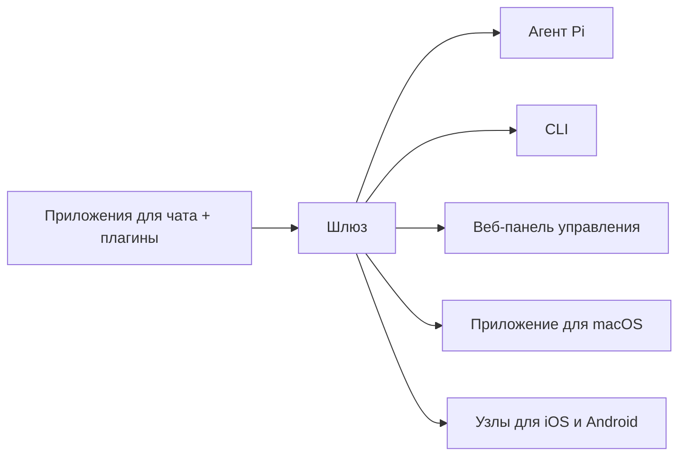

# OpenClaw 🦞

<p align="center">
    
    
</p>

> _"EXFOLIATE! EXFOLIATE!"_ — Космический лобстер, вероятно

<p align="center">
  <strong>Шлюз для ИИ-агентов на любой ОС, поддерживающий Discord, Google Chat, iMessage, Matrix, Microsoft Teams, Signal, Slack, Telegram, WhatsApp, Zalo и другие платформы.</strong><br />
  Отправьте сообщение — получите ответ от агента прямо со своего устройства. Запустите один шлюз, который будет работать с встроенными каналами, плагинами каналов, WebChat и мобильными узлами.
</p>

<Columns>
  <Card title="Начало работы" href="/start/getting-started" icon="rocket">
    Установите OpenClaw и запустите шлюз за несколько минут.
  </Card>
  <Card title="Запуск настройки" href="/start/wizard" icon="sparkles">
    Пошаговая настройка с помощью команды `openclaw onboard` и потоков сопряжения.
  </Card>
  <Card title="Открытие панели управления" href="/web/control-ui" icon="layout-dashboard">
    Запустите панель управления в браузере для работы с чатами, настройками и сессиями.
  </Card>
</Columns>

## Что такое OpenClaw?

OpenClaw — это **шлюз с самостоятельным размещением**, который соединяет ваши любимые приложения для чата и каналы (встроенные каналы, а также встроенные или внешние плагины каналов, такие как Discord, Google Chat, iMessage, Matrix, Microsoft Teams, Signal, Slack, Telegram, WhatsApp, Zalo и др.) с ИИ-агентами для кодирования, например, с Pi. Вы запускаете единый процесс шлюза на своём компьютере (или сервере), и он становится мостом между вашими приложениями для обмена сообщениями и постоянно доступным ИИ-ассистентом.

**Для кого это?** Для разработчиков и опытных пользователей, которые хотят иметь личного ИИ-ассистента, с которым можно общаться из любого места — без потери контроля над своими данными и без зависимости от хостинговых сервисов.

**Чем это отличается?**

- **Самостоятельное размещение:** работает на вашем оборудовании, по вашим правилам.
- **Многоканальность:** один шлюз одновременно обслуживает встроенные каналы, а также встроенные или внешние плагины каналов.
- **Нативная поддержка агентов:** разработан для агентов кодирования с использованием инструментов, сессий, памяти и маршрутизации между несколькими агентами.
- **Открытый исходный код:** лицензия MIT, развитие силами сообщества.

**Что вам понадобится?** Node 24 (рекомендуется) или Node 22 LTS (`22.14+`) для совместимости, API-ключ от выбранного вами провайдера и 5 минут времени. Для наилучшего качества и безопасности используйте самую мощную модель последнего поколения.

## Как это работает



Шлюз — единый источник достоверной информации о сессиях, маршрутизации и подключениях каналов.

## Основные возможности

<Columns>
  <Card title="Многоканальный шлюз" icon="network">
    Discord, iMessage, Signal, Slack, Telegram, WhatsApp, WebChat и др. с помощью единого процесса шлюза.
  </Card>
  <Card title="Каналы с плагинами" icon="plug">
    Встроенные плагины добавляют поддержку Matrix, Nostr, Twitch, Zalo и др. в текущих версиях.
  </Card>
  <Card title="Маршрутизация между несколькими агентами" icon="route">
    Изолированные сессии для каждого агента, рабочего пространства или отправителя.
  </Card>
  <Card title="Поддержка мультимедиа" icon="image">
    Отправка и получение изображений, аудио и документов.
  </Card>
  <Card title="Веб-панель управления" icon="monitor">
    Панель управления в браузере для работы с чатами, настройками, сессиями и узлами.
  </Card>
  <Card title="Мобильные узлы" icon="smartphone">
    Сопряжение узлов для iOS и Android для рабочих процессов с Canvas, камерой и голосовым управлением.
  </Card>
</Columns>

## Быстрый старт

<Steps>
  <Step title="Установите OpenClaw">
    ```bash
    npm install -g openclaw@latest
    ```
  </Step>
  <Step title="Проведите настройку и установите сервис">
    ```bash
    openclaw onboard --install-daemon
    ```
  </Step>
  <Step title="Общайтесь">
    Откройте панель управления в браузере и отправьте сообщение:

    ```bash
    openclaw dashboard
    ```

    Или подключите канал ([Telegram](/channels/telegram) — самый быстрый вариант) и общайтесь со своего телефона.

  </Step>
</Steps>

Нужна полная установка и настройка для разработки? Смотрите раздел [Начало работы](/start/getting-started).

## Панель управления

Откройте веб-панель управления после запуска шлюза.

- Локальный адрес по умолчанию: [http://127.0.0.1:18789/](http://127.0.0.1:18789/)
- Удаленный доступ: [Веб-поверхности](/web) и [Tailscale](/gateway/tailscale)

<p align="center">
  
</p>

## Настройка (необязательно)

Настройки хранятся в файле `~/.openclaw/openclaw.json`.

- Если вы **ничего не делаете**, OpenClaw использует встроенный бинарный файл Pi в режиме RPC с сессиями для каждого отправителя.
- Если вы хотите ограничить доступ, начните с параметра `channels.whatsapp.allowFrom` и правил упоминания (для групп).

Пример:

```json5
{
  channels: {
    whatsapp: {
      allowFrom: ["+15555550123"],
      groups: { "*": { requireMention: true } },
    },
  },
  messages: { groupChat: { mentionPatterns: ["@openclaw"] } },
}
```

## Начните отсюда

<Columns>
  <Card title="Центры документации" href="/start/hubs" icon="book-open">
    Вся документация и руководства, сгруппированные по сценариям использования.
  </Card>
  <Card title="Настройка" href="/gateway/configuration" icon="settings">
    Основные настройки шлюза, токены и конфигурация провайдера.
  </Card>
  <Card title="Удаленный доступ" href="/gateway/remote" icon="globe">
    Шаблоны доступа через SSH и tailnet.
  </Card>
  <Card title="Каналы" href="/channels/telegram" icon="message-square">
    Настройка для конкретных каналов: Feishu, Microsoft Teams, WhatsApp, Telegram, Discord и др.
  </Card>
  <Card title="Узлы" href="/nodes" icon="smartphone">
    Узлы для iOS и Android с сопряжением, Canvas, камерой и действиями на устройстве.
  </Card>
  <Card title="Помощь" href="/help" icon="life-buoy">
    Распространённые способы устранения неполадок и отправная точка для решения проблем.
  </Card>
</Columns>

## Узнайте больше

<Columns>
  <Card title="Полный список функций" href="/concepts/features" icon="list">
    Все возможности работы с каналами, маршрутизацией и мультимедиа.
  </Card>
  <Card title="Маршрутизация между несколькими агентами" href="/concepts/multi-agent" icon="route">
    Изоляция рабочих пространств и сессии для каждого агента.
  </Card>
  <Card title="Безопасность" href="/gateway/security" icon="shield">
    Токены, белые списки и средства контроля безопасности.
  </Card>
  <Card title="Устранение неполадок" href="/gateway/troubleshooting" icon="wrench">
    Диагностика шлюза и распространённые ошибки.
  </Card>
  <Card title="О проекте и благодарности" href="/reference/credits" icon="info">
    История проекта, участники и лицензия.
  </Card>
</Columns>