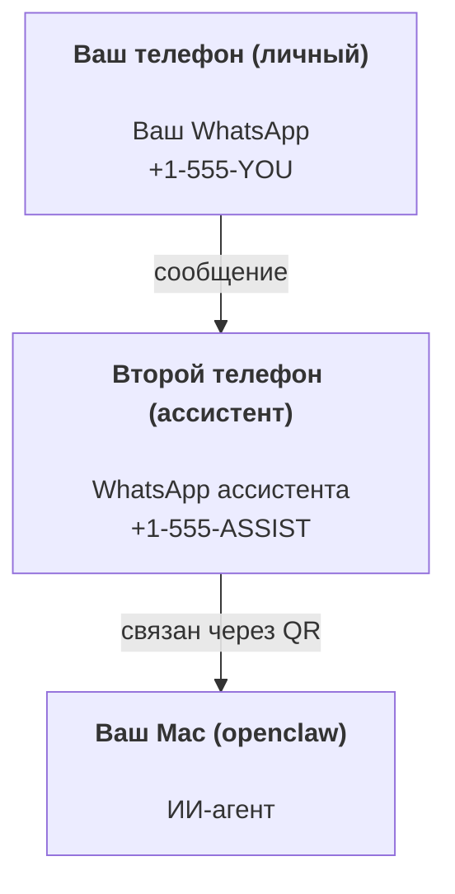

# Создание персонального ассистента с OpenClaw

OpenClaw — это шлюз с самостоятельным хостингом, который соединяет Discord, Google Chat, iMessage, Matrix, Microsoft Teams, Signal, Slack, Telegram, WhatsApp, Zalo и другие сервисы с ИИ-агентами. В этом руководстве описана настройка "персонального ассистента": выделенного номера WhatsApp, который работает как ваш постоянно доступный ИИ-ассистент.

## ⚠️ Сначала безопасность

Вы предоставляете агенту возможность:

- выполнять команды на вашем компьютере (в зависимости от вашей политики инструментов);
- читать и записывать файлы в вашем рабочем пространстве;
- отправлять сообщения через WhatsApp, Telegram, Discord, Mattermost и другие подключённые каналы.

Начните с осторожных настроек:

- Всегда устанавливайте параметр `channels.whatsapp.allowFrom` (не запускайте открытую для всего мира конфигурацию на вашем личном Mac).
- Используйте выделенный номер WhatsApp для ассистента.
- По умолчанию "пульс" (heartbeats) отправляется каждые 30 минут. Отключите его, пока не будете доверять настройке, установив `agents.defaults.heartbeat.every: "0m"`.

## Предварительные требования

- OpenClaw установлен и настроен — см. [Начало работы](/start/getting-started), если вы ещё этого не сделали;
- Второй номер телефона (SIM/eSIM/предоплаченный) для ассистента.

## Настройка с двумя телефонами (рекомендуется)

Вам нужно следующее:



Если вы свяжете свой личный WhatsApp с OpenClaw, каждое сообщение, адресованное вам, станет "входом для агента". Это редко соответствует вашим ожиданиям.

## Быстрый старт за 5 минут

1. Свяжите WhatsApp Web (отобразит QR-код; отсканируйте его с телефона ассистента):

```bash
openclaw channels login
```

2. Запустите шлюз (оставьте его работающим):

```bash
openclaw gateway --port 18789
```

3. Разместите минимальную конфигурацию в `~/.openclaw/openclaw.json`:

```json5
{
  gateway: { mode: "local" },
  channels: { whatsapp: { allowFrom: ["+15555550123"] } },
}
```

Теперь отправьте сообщение на номер ассистента с телефона, включённого в список разрешённых.

Когда настройка завершится, мы автоматически откроем панель управления и выведем чистую (не токенизированную) ссылку. Если появится запрос на аутентификацию, вставьте сконфигурированный общий секрет в настройки пользовательского интерфейса управления. При настройке по умолчанию используется токен (`gateway.auth.token`), но также возможна аутентификация по паролю, если вы переключили `gateway.auth.mode` на `password`. Чтобы открыть панель позже: `openclaw dashboard`.

## Предоставьте агенту рабочее пространство (AGENTS)

OpenClaw считывает инструкции по работе и "память" из каталога рабочего пространства.

По умолчанию OpenClaw использует `~/.openclaw/workspace` в качестве рабочего пространства агента и создаёт его (а также начальные файлы `AGENTS.md`, `SOUL.md`, `TOOLS.md`, `IDENTITY.md`, `USER.md`, `HEARTBEAT.md`) автоматически при настройке или первом запуске агента. Файл `BOOTSTRAP.md` создаётся только при создании совершенно нового рабочего пространства (он не должен появляться снова после удаления). Файл `MEMORY.md` необязателен (не создаётся автоматически); если он присутствует, он загружается для обычных сеансов. Сеансы субагентов загружают только `AGENTS.md` и `TOOLS.md`.

Совет: относитесь к этой папке как к "памяти" OpenClaw и сделайте её репозиторием Git (в идеале — приватным), чтобы ваши файлы `AGENTS.md` и файлы памяти были сохранены. Если Git установлен, новые рабочие пространства инициализируются автоматически.

```bash
openclaw setup
```

Полное описание структуры рабочего пространства и руководство по резервному копированию: [Рабочее пространство агента](/concepts/agent-workspace).
Рабочий процесс с памятью: [Память](/concepts/memory).

Дополнительно: выберите другое рабочее пространство с помощью `agents.defaults.workspace` (поддерживается `~`).

```json5
{
  agent: {
    workspace: "~/.openclaw/workspace",
  },
}
```

Если вы уже поставляете свои собственные файлы рабочего пространства из репозитория, вы можете полностью отключить создание файлов начальной загрузки:

```json5
{
  agent: {
    skipBootstrap: true,
  },
}
```

## Конфигурация, которая превращает это в "ассистента"

По умолчанию OpenClaw настроен как хороший ассистент, но обычно вам потребуется настроить:

- личность/инструкции в [`SOUL.md`](/concepts/soul);
- настройки мышления (при необходимости);
- "пульс" (heartbeats) (после того, как вы будете доверять системе).

Пример:

```json5
{
  logging: { level: "info" },
  agent: {
    model: "anthropic/claude-opus-4-6",
    workspace: "~/.openclaw/workspace",
    thinkingDefault: "high",
    timeoutSeconds: 1800,
    // Начните с 0; включите позже.
    heartbeat: { every: "0m" },
  },
  channels: {
    whatsapp: {
      allowFrom: ["+15555550123"],
      groups: {
        "*": { requireMention: true },
      },
    },
  },
  routing: {
    groupChat: {
      mentionPatterns: ["@openclaw", "openclaw"],
    },
  },
  session: {
    scope: "per-sender",
    resetTriggers: ["/new", "/reset"],
    reset: {
      mode: "daily",
      atHour: 4,
      idleMinutes: 10080,
    },
  },
}
```

## Сеансы и память

- Файлы сеансов: `~/.openclaw/agents/<agentId>/sessions/{{SessionId}}.jsonl`.
- Метаданные сеанса (использование токенов, последний маршрут и т. д.): `~/.openclaw/agents/<agentId>/sessions/sessions.json` (устаревший формат: `~/.openclaw/sessions/sessions.json`).
- Команды `/new` или `/reset` запускают новый сеанс для этого чата (настраивается через `resetTriggers`). Если они отправлены отдельно, агент отвечает коротким приветствием, чтобы подтвердить сброс.
- Команда `/compact [instructions]` сжимает контекст сеанса и сообщает об оставшемся бюджете контекста.

## "Пульс" (heartbeats, проактивный режим)

По умолчанию OpenClaw отправляет "пульс" каждые 30 минут с запросом:
`Прочитайте HEARTBEAT.md, если он существует (контекст рабочего пространства). Строго следуйте ему. Не делайте выводов и не повторяйте старые задачи из предыдущих чатов. Если ничего не требует внимания, ответьте HEARTBEAT_OK.`
Установите `agents.defaults.heartbeat.every: "0m"`, чтобы отключить.

- Если `HEARTBEAT.md` существует, но фактически пуст (только пустые строки и заголовки Markdown, например `# Heading`), OpenClaw пропускает выполнение "пульса", чтобы сэкономить вызовы API.
- Если файл отсутствует, "пульс" всё равно выполняется, и модель решает, что делать.
- Если агент отвечает `HEARTBEAT_OK` (опционально с коротким дополнением; см. `agents.defaults.heartbeat.ackMaxChars`), OpenClaw подавляет отправку исходящих сообщений для этого "пульса".
- По умолчанию отправка "пульса" на цели в стиле личных сообщений `user:<id>` разрешена. Установите `agents.defaults.heartbeat.directPolicy: "block"`, чтобы запретить отправку на прямые цели, сохраняя при этом выполнение "пульса".
- "Пульс" выполняет полные циклы работы агента — более короткие интервалы расходуют больше токенов.

```json5
{
  agent: {
    heartbeat: { every: "30m" },
  },
}
```

## Входящие и исходящие медиафайлы

Входящие вложения (изображения, аудио, документы) могут быть представлены вашей команде через шаблоны:

- `{{MediaPath}}` (путь к временному файлу на локальном компьютере);
-