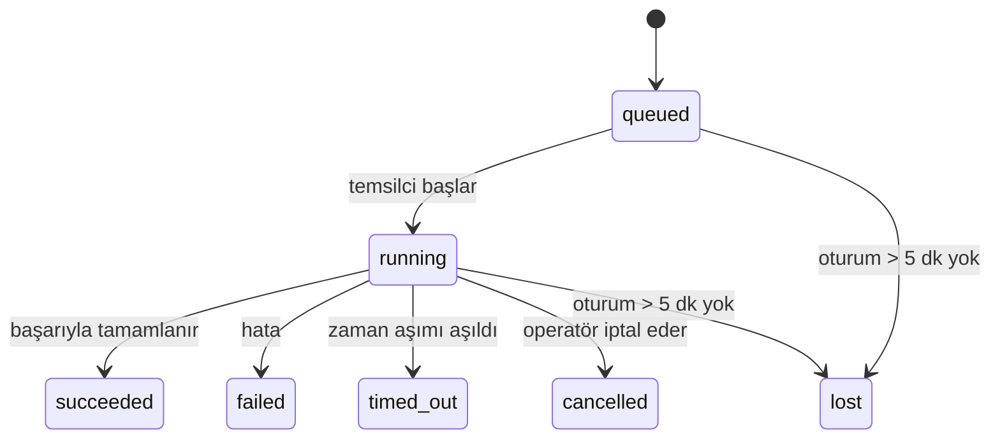

---
read_when:
    - Devam eden veya kısa süre önce tamamlanan arka plan işlerini incelerken
    - Ayrılmış temsilci çalıştırmaları için teslimat hatalarını ayıklarken
    - Arka plan çalıştırmalarının oturumlar, cron ve heartbeat ile nasıl ilişkili olduğunu anlamak için
summary: ACP çalıştırmaları, alt temsilciler, yalıtılmış cron işleri ve CLI işlemleri için arka plan görev takibi
title: Arka Plan Görevleri
x-i18n:
    generated_at: "2026-04-06T03:06:50Z"
    model: gpt-5.4
    provider: openai
    source_hash: 2f56c1ac23237907a090c69c920c09578a2f56f5d8bf750c7f2136c603c8a8ff
    source_path: automation/tasks.md
    workflow: 15
---

# Arka Plan Görevleri

> **Zamanlama mı arıyorsunuz?** Doğru mekanizmayı seçmek için [Automation & Tasks](/tr/automation) bölümüne bakın. Bu sayfa arka plan işlerinin **izlenmesini** kapsar, planlanmasını değil.

Arka plan görevleri, **ana konuşma oturumunuzun dışında** çalışan işleri izler:
ACP çalıştırmaları, alt temsilci başlatmaları, yalıtılmış cron işi yürütmeleri ve CLI ile başlatılan işlemler.

Görevler oturumların, cron işlerinin veya heartbeat'lerin yerini **almaz** — bunlar, ayrılmış olarak hangi işin gerçekleştiğini, ne zaman gerçekleştiğini ve başarılı olup olmadığını kaydeden **etkinlik kayıt defteridir**.

<Note>
Her temsilci çalıştırması bir görev oluşturmaz. Heartbeat dönüşleri ve normal etkileşimli sohbetler oluşturmaz. Tüm cron yürütmeleri, ACP başlatmaları, alt temsilci başlatmaları ve CLI temsilci komutları oluşturur.
</Note>

## Kısa özet

- Görevler zamanlayıcı değil, **kayıttır** — cron ve heartbeat işin _ne zaman_ çalışacağını belirler, görevler _ne olduğunu_ izler.
- ACP, alt temsilciler, tüm cron işleri ve CLI işlemleri görev oluşturur. Heartbeat dönüşleri oluşturmaz.
- Her görev `queued → running → terminal` aşamalarından geçer (`succeeded`, `failed`, `timed_out`, `cancelled` veya `lost`).
- Cron görevleri, cron çalışma zamanı işi hâlâ sahipleniyorsa etkin kalır; sohbet destekli CLI görevleri yalnızca sahibi olan çalıştırma bağlamı hâlâ etkinse etkin kalır.
- Tamamlanma itme temellidir: ayrılmış işler doğrudan bildirim gönderebilir veya bittiğinde istekte bulunan oturumu/heartbeat'i uyandırabilir; bu nedenle durum yoklama döngüleri genellikle yanlış yaklaşımdır.
- Yalıtılmış cron çalıştırmaları ve alt temsilci tamamlanmaları, son temizleme muhasebesinden önce alt oturumları için izlenen tarayıcı sekmelerini/süreçlerini en iyi çabayla temizler.
- Yalıtılmış cron teslimatı, soy alt temsilci işleri hâlâ boşalırken eski ara üst yanıtları bastırır ve teslimattan önce gelirse son soy çıktısını tercih eder.
- Tamamlanma bildirimleri doğrudan bir kanala teslim edilir veya bir sonraki heartbeat için kuyruğa alınır.
- `openclaw tasks list` tüm görevleri gösterir; `openclaw tasks audit` sorunları ortaya çıkarır.
- Terminal kayıtları 7 gün tutulur, ardından otomatik olarak temizlenir.

## Hızlı başlangıç

```bash
# Tüm görevleri listele (en yeniden başlayarak)
openclaw tasks list

# Çalışma zamanına veya duruma göre filtrele
openclaw tasks list --runtime acp
openclaw tasks list --status running

# Belirli bir görevin ayrıntılarını göster (kimlik, çalışma kimliği veya oturum anahtarıyla)
openclaw tasks show <lookup>

# Çalışan bir görevi iptal et (alt oturumu sonlandırır)
openclaw tasks cancel <lookup>

# Bir görev için bildirim ilkesini değiştir
openclaw tasks notify <lookup> state_changes

# Sağlık denetimi çalıştır
openclaw tasks audit

# Bakımı önizle veya uygula
openclaw tasks maintenance
openclaw tasks maintenance --apply

# TaskFlow durumunu incele
openclaw tasks flow list
openclaw tasks flow show <lookup>
openclaw tasks flow cancel <lookup>
```

## Bir görevi ne oluşturur

| Kaynak                 | Çalışma zamanı türü | Görev kaydının oluşturulduğu an                      | Varsayılan bildirim ilkesi |
| ---------------------- | ------------------- | ---------------------------------------------------- | -------------------------- |
| ACP arka plan çalıştırmaları    | `acp`        | Bir alt ACP oturumu başlatıldığında                           | `done_only`           |
| Alt temsilci orkestrasyonu | `subagent`   | `sessions_spawn` ile bir alt temsilci başlatıldığında               | `done_only`           |
| Cron işleri (tüm türler)  | `cron`       | Her cron yürütmesinde (ana oturum ve yalıtılmış)       | `silent`              |
| CLI işlemleri         | `cli`        | Ağ geçidi üzerinden çalışan `openclaw agent` komutlarında | `silent`              |
| Temsilci medya işleri       | `cli`        | Oturum destekli `video_generate` çalıştırmalarında                   | `silent`              |

Ana oturum cron görevleri varsayılan olarak `silent` bildirim ilkesi kullanır — izleme için kayıt oluştururlar ancak bildirim üretmezler. Yalıtılmış cron görevleri de varsayılan olarak `silent` kullanır, ancak kendi oturumlarında çalıştıkları için daha görünürdür.

Oturum destekli `video_generate` çalıştırmaları da `silent` bildirim ilkesi kullanır. Yine de görev kayıtları oluştururlar, ancak tamamlanma orijinal temsilci oturumuna dahili bir uyandırma olarak geri verilir; böylece temsilci takip mesajını yazabilir ve tamamlanan videoyu kendisi ekleyebilir. `tools.media.asyncCompletion.directSend` seçeneğini etkinleştirirseniz, asenkron `music_generate` ve `video_generate` tamamlanmaları, istekte bulunan oturum uyandırma yoluna geri dönmeden önce önce doğrudan kanal teslimatını dener.

Bir oturum destekli `video_generate` görevi hâlâ etkinken araç aynı zamanda bir koruma da görevi görür: aynı oturumda yinelenen `video_generate` çağrıları ikinci bir eşzamanlı üretim başlatmak yerine etkin görev durumunu döndürür. Temsilci tarafında açık bir ilerleme/durum sorgusu istediğinizde `action: "status"` kullanın.

**Görev oluşturmayanlar:**

- Heartbeat dönüşleri — ana oturum; bkz. [Heartbeat](/tr/gateway/heartbeat)
- Normal etkileşimli sohbet dönüşleri
- Doğrudan `/command` yanıtları

## Görev yaşam döngüsü



| Durum      | Anlamı                                                                     |
| ----------- | -------------------------------------------------------------------------- |
| `queued`    | Oluşturuldu, temsilcinin başlaması bekleniyor                                    |
| `running`   | Temsilci dönüşü etkin olarak yürütülüyor                                           |
| `succeeded` | Başarıyla tamamlandı                                                     |
| `failed`    | Bir hata ile tamamlandı                                                    |
| `timed_out` | Yapılandırılmış zaman aşımı aşıldı                                            |
| `cancelled` | Operatör tarafından `openclaw tasks cancel` ile durduruldu                        |
| `lost`      | Çalışma zamanı, 5 dakikalık ek süreden sonra yetkili arka plan durumunu kaybetti |

Geçişler otomatik gerçekleşir — ilişkili temsilci çalıştırması bittiğinde görev durumu buna uygun olarak güncellenir.

`lost` çalışma zamanına duyarlıdır:

- ACP görevleri: destekleyici ACP alt oturum meta verisi kayboldu.
- Alt temsilci görevleri: destekleyici alt oturum hedef temsilci deposundan kayboldu.
- Cron görevleri: cron çalışma zamanı artık işi etkin olarak izlemiyor.
- CLI görevleri: yalıtılmış alt oturum görevleri alt oturumu kullanır; sohbet destekli CLI görevleri ise canlı çalıştırma bağlamını kullanır, bu nedenle kalıcı kanal/grup/doğrudan oturum satırları onları etkin tutmaz.

## Teslimat ve bildirimler

Bir görev terminal duruma ulaştığında OpenClaw sizi bilgilendirir. İki teslimat yolu vardır:

**Doğrudan teslimat** — görevin bir kanal hedefi varsa (`requesterOrigin`), tamamlanma mesajı doğrudan o kanala gider (Telegram, Discord, Slack vb.). Alt temsilci tamamlanmalarında OpenClaw ayrıca mevcut olduğunda bağlı iş parçacığı/konu yönlendirmesini korur ve doğrudan teslimattan vazgeçmeden önce istekte bulunan oturumun saklanan rotasından (`lastChannel` / `lastTo` / `lastAccountId`) eksik bir `to` / hesap bilgisini doldurabilir.

**Oturum kuyruğuna alınmış teslimat** — doğrudan teslimat başarısız olursa veya kaynak ayarlanmadıysa güncelleme, istekte bulunanın oturumunda bir sistem olayı olarak kuyruğa alınır ve bir sonraki heartbeat'te görünür.

<Tip>
Görev tamamlanması anında bir heartbeat uyandırması tetikler, böylece sonucu hızlıca görürsünüz — bir sonraki planlı heartbeat işaretini beklemeniz gerekmez.
</Tip>

Bu, olağan iş akışının itme tabanlı olduğu anlamına gelir: ayrılmış işi bir kez başlatın, ardından çalışma zamanının tamamlandığında sizi uyandırmasına veya bilgilendirmesine izin verin. Görev durumunu yalnızca hata ayıklama, müdahale veya açık bir denetim gerektiğinde yoklayın.

### Bildirim ilkeleri

Her görev hakkında ne kadar bilgi alacağınızı denetleyin:

| İlke                | Teslim edilen içerik                                                       |
| --------------------- | ----------------------------------------------------------------------- |
| `done_only` (varsayılan) | Yalnızca terminal durum (`succeeded`, `failed` vb.) — **varsayılan budur** |
| `state_changes`       | Her durum geçişi ve ilerleme güncellemesi                              |
| `silent`              | Hiçbir şey                                                          |

Bir görev çalışırken ilkeyi değiştirin:

```bash
openclaw tasks notify <lookup> state_changes
```

## CLI başvurusu

### `tasks list`

```bash
openclaw tasks list [--runtime <acp|subagent|cron|cli>] [--status <status>] [--json]
```

Çıktı sütunları: Görev Kimliği, Tür, Durum, Teslimat, Çalıştırma Kimliği, Alt Oturum, Özet.

### `tasks show`

```bash
openclaw tasks show <lookup>
```

Arama belirteci bir görev kimliğini, çalışma kimliğini veya oturum anahtarını kabul eder. Zamanlama, teslimat durumu, hata ve terminal özet dahil olmak üzere tam kaydı gösterir.

### `tasks cancel`

```bash
openclaw tasks cancel <lookup>
```

ACP ve alt temsilci görevleri için bu, alt oturumu sonlandırır. Durum `cancelled` olarak geçiş yapar ve bir teslimat bildirimi gönderilir.

### `tasks notify`

```bash
openclaw tasks notify <lookup> <done_only|state_changes|silent>
```

### `tasks audit`

```bash
openclaw tasks audit [--json]
```

Operasyonel sorunları ortaya çıkarır. Sorunlar tespit edildiğinde bulgular `openclaw status` içinde de görünür.

| Bulgu                   | Önem derecesi | Tetikleyici                                               |
| ------------------------- | -------- | ----------------------------------------------------- |
| `stale_queued`            | warn     | 10 dakikadan uzun süredir kuyrukta                       |
| `stale_running`           | error    | 30 dakikadan uzun süredir çalışıyor                      |
| `lost`                    | error    | Çalışma zamanı destekli görev sahipliği kayboldu             |
| `delivery_failed`         | warn     | Teslimat başarısız oldu ve bildirim ilkesi `silent` değil     |
| `missing_cleanup`         | warn     | Temizleme zaman damgası olmayan terminal görev               |
| `inconsistent_timestamps` | warn     | Zaman çizelgesi ihlali (örneğin başlamadan önce bitmiş) |

### `tasks maintenance`

```bash
openclaw tasks maintenance [--json]
openclaw tasks maintenance --apply [--json]
```

Bunu, görevler ve Task Flow durumu için mutabakat, temizleme damgalama ve budamayı önizlemek veya uygulamak için kullanın.

Mutabakat çalışma zamanına duyarlıdır:

- ACP/alt temsilci görevleri, destekleyici alt oturumlarını kontrol eder.
- Cron görevleri, cron çalışma zamanının işi hâlâ sahiplenip sahiplenmediğini kontrol eder.
- Sohbet destekli CLI görevleri, yalnızca sohbet oturumu satırını değil, sahip olan canlı çalıştırma bağlamını kontrol eder.

Tamamlanma temizliği de çalışma zamanına duyarlıdır:

- Alt temsilci tamamlanması, duyuru temizliği devam etmeden önce alt oturum için izlenen tarayıcı sekmelerini/süreçlerini en iyi çabayla kapatır.
- Yalıtılmış cron tamamlanması, çalıştırma tamamen sonlanmadan önce cron oturumu için izlenen tarayıcı sekmelerini/süreçlerini en iyi çabayla kapatır.
- Yalıtılmış cron teslimatı, gerektiğinde soy alt temsilci takibini bekler ve
  eski üst onay metnini duyurmak yerine bastırır.
- Alt temsilci tamamlanma teslimatı, en son görünür yardımcı metnini tercih eder; bu boşsa temizlenmiş en son tool/toolResult metnine geri döner ve yalnızca zaman aşımına uğramış araç çağrısı çalıştırmaları kısa bir kısmi ilerleme özetine indirgenebilir.
- Temizleme hataları gerçek görev sonucunu gizlemez.

### `tasks flow list|show|cancel`

```bash
openclaw tasks flow list [--status <status>] [--json]
openclaw tasks flow show <lookup> [--json]
openclaw tasks flow cancel <lookup>
```

Bunları, tek bir arka plan görev kaydı yerine ilgilendiğiniz şey orkestre eden Task Flow olduğunda kullanın.

## Sohbet görev panosu (`/tasks`)

Herhangi bir sohbet oturumunda, o oturuma bağlı arka plan görevlerini görmek için `/tasks` kullanın. Pano etkin ve kısa süre önce tamamlanmış görevleri çalışma zamanı, durum, zamanlama ve ilerleme veya hata ayrıntılarıyla gösterir.

Geçerli oturumda görünür bağlı görev yoksa, `/tasks` diğer oturum ayrıntılarını sızdırmadan yine de genel bir görünüm alabilmeniz için temsilci-yerel görev sayılarına geri döner.

Tam operatör kayıt defteri için CLI kullanın: `openclaw tasks list`.

## Durum entegrasyonu (görev baskısı)

`openclaw status` hızlı bakışta bir görev özeti içerir:

```
Tasks: 3 queued · 2 running · 1 issues
```

Özet şunları bildirir:

- **active** — `queued` + `running` sayısı
- **failures** — `failed` + `timed_out` + `lost` sayısı
- **byRuntime** — `acp`, `subagent`, `cron`, `cli` dağılımı

Hem `/status` hem de `session_status` aracı temizlemeye duyarlı bir görev anlık görüntüsü kullanır: etkin görevler tercih edilir, eski tamamlanmış satırlar gizlenir ve son hatalar yalnızca etkin iş kalmadığında gösterilir. Bu, durum kartının şu anda önemli olana odaklanmasını sağlar.

## Depolama ve bakım

### Görevler nerede yaşar

Görev kayıtları SQLite içinde şu konumda kalıcı olarak saklanır:

```
$OPENCLAW_STATE_DIR/tasks/runs.sqlite
```

Kayıt defteri ağ geçidi başlangıcında belleğe yüklenir ve yeniden başlatmalar arasında dayanıklılık için yazmaları SQLite ile eşzamanlar.

### Otomatik bakım

Her **60 saniyede** bir temizleyici çalışır ve üç şeyi ele alır:

1. **Mutabakat** — etkin görevlerin hâlâ yetkili çalışma zamanı desteğine sahip olup olmadığını kontrol eder. ACP/alt temsilci görevleri alt oturum durumunu, cron görevleri etkin iş sahipliğini ve sohbet destekli CLI görevleri sahip olan çalıştırma bağlamını kullanır. Bu destekleyici durum 5 dakikadan uzun süre kayıpsa görev `lost` olarak işaretlenir.
2. **Temizleme damgalama** — terminal görevlerde bir `cleanupAfter` zaman damgası ayarlar (`endedAt + 7 days`).
3. **Budama** — `cleanupAfter` tarihini geçmiş kayıtları siler.

**Saklama süresi**: terminal görev kayıtları **7 gün** tutulur, ardından otomatik olarak temizlenir. Yapılandırma gerekmez.

## Görevlerin diğer sistemlerle ilişkisi

### Görevler ve Task Flow

[Task Flow](/tr/automation/taskflow), arka plan görevlerinin üzerindeki akış orkestrasyon katmanıdır. Tek bir akış, yaşam süresi boyunca yönetilen veya yansıtılmış eşzamanlama kiplerini kullanarak birden fazla görevi koordine edebilir. Tek tek görev kayıtlarını incelemek için `openclaw tasks`, orkestre eden akışı incelemek için `openclaw tasks flow` kullanın.

Ayrıntılar için [Task Flow](/tr/automation/taskflow) bölümüne bakın.

### Görevler ve cron

Bir cron işi **tanımı** `~/.openclaw/cron/jobs.json` içinde bulunur. **Her** cron yürütmesi bir görev kaydı oluşturur — hem ana oturum hem de yalıtılmış. Ana oturum cron görevleri varsayılan olarak `silent` bildirim ilkesi kullanır, böylece bildirim üretmeden izleme sağlar.

Bkz. [Cron Jobs](/tr/automation/cron-jobs).

### Görevler ve heartbeat

Heartbeat çalıştırmaları ana oturum dönüşleridir — görev kaydı oluşturmazlar. Bir görev tamamlandığında sonucu hızlı görmeniz için bir heartbeat uyandırması tetikleyebilir.

Bkz. [Heartbeat](/tr/gateway/heartbeat).

### Görevler ve oturumlar

Bir görev bir `childSessionKey` (işin çalıştığı yer) ve bir `requesterSessionKey` (onu kimin başlattığı) değerine başvurabilir. Oturumlar konuşma bağlamıdır; görevler bunun üzerindeki etkinlik izlemesidir.

### Görevler ve temsilci çalıştırmaları

Bir görevin `runId` değeri, işi yapan temsilci çalıştırmasına bağlanır. Temsilci yaşam döngüsü olayları (başlangıç, bitiş, hata) görev durumunu otomatik olarak günceller — yaşam döngüsünü elle yönetmeniz gerekmez.

## İlgili

- [Automation & Tasks](/tr/automation) — tüm otomasyon mekanizmalarına hızlı bakış
- [Task Flow](/tr/automation/taskflow) — görevlerin üzerindeki akış orkestrasyonu
- [Scheduled Tasks](/tr/automation/cron-jobs) — arka plan işlerini planlama
- [Heartbeat](/tr/gateway/heartbeat) — düzenli ana oturum dönüşleri
- [CLI: Tasks](/cli/index#tasks) — CLI komut başvurusu
