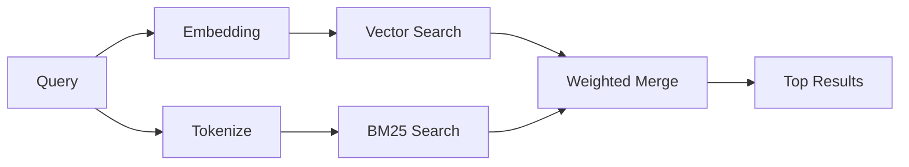

---
read_when:
    - '`memory_search` işleyişini anlamak istiyorsunuz'
    - Bir embedding sağlayıcısı seçmek istiyorsunuz
    - Arama kalitesini ayarlamak istiyorsunuz
summary: Bellek aramasının, gömmeler ve hibrit getirme kullanarak ilgili notları nasıl bulduğu
title: Bellek Araması
x-i18n:
    generated_at: "2026-04-06T03:06:38Z"
    model: gpt-5.4
    provider: openai
    source_hash: b6541cd702bff41f9a468dad75ea438b70c44db7c65a4b793cbacaf9e583c7e9
    source_path: concepts/memory-search.md
    workflow: 15
---

# Bellek Araması

`memory_search`, ifade biçimi özgün metinden farklı olsa bile bellek dosyalarınızdan ilgili notları bulur. Bunu, belleği küçük parçalara dizinleyip bunları embedding'ler, anahtar kelimeler veya her ikisiyle arayarak yapar.

## Hızlı başlangıç

Bir OpenAI, Gemini, Voyage veya Mistral API anahtarınız yapılandırılmışsa bellek araması otomatik olarak çalışır. Bir sağlayıcıyı açıkça ayarlamak için:

```json5
{
  agents: {
    defaults: {
      memorySearch: {
        provider: "openai", // veya "gemini", "local", "ollama" vb.
      },
    },
  },
}
```

API anahtarı olmadan yerel embedding'ler için `provider: "local"` kullanın (`node-llama-cpp` gerektirir).

## Desteklenen sağlayıcılar

| Sağlayıcı | Kimlik     | API anahtarı gerekir | Notlar                                               |
| --------- | ---------- | -------------------- | ---------------------------------------------------- |
| OpenAI    | `openai`   | Evet                 | Otomatik algılanır, hızlı                            |
| Gemini    | `gemini`   | Evet                 | Görsel/ses dizinlemeyi destekler                     |
| Voyage    | `voyage`   | Evet                 | Otomatik algılanır                                   |
| Mistral   | `mistral`  | Evet                 | Otomatik algılanır                                   |
| Bedrock   | `bedrock`  | Hayır                | AWS kimlik bilgisi zinciri çözümlendiğinde otomatik algılanır |
| Ollama    | `ollama`   | Hayır                | Yerel, açıkça ayarlanmalıdır                         |
| Local     | `local`    | Hayır                | GGUF modeli, ~0.6 GB indirme                         |

## Arama nasıl çalışır

OpenClaw iki getirme yolunu paralel çalıştırır ve sonuçları birleştirir:



- **Vektör araması**, anlam olarak benzer notları bulur ("gateway host", "OpenClaw'ı çalıştıran makine" ile eşleşir).
- **BM25 anahtar kelime araması**, tam eşleşmeleri bulur (kimlikler, hata dizeleri, yapılandırma anahtarları).

Yalnızca bir yol kullanılabiliyorsa (embedding yoksa veya FTS yoksa), diğeri tek başına çalışır.

## Arama kalitesini iyileştirme

İsteğe bağlı iki özellik, geniş bir not geçmişiniz olduğunda yardımcı olur:

### Zamansal azalma

Eski notlar sıralama ağırlığını kademeli olarak kaybeder, böylece son bilgiler önce öne çıkar. Varsayılan 30 günlük yarı ömür ile geçen aydan bir not özgün ağırlığının %50'siyle puanlanır. `MEMORY.md` gibi her zaman geçerli dosyalara hiçbir zaman azalma uygulanmaz.

<Tip>
Aracınızın aylara yayılan günlük notları varsa ve eski bilgiler sürekli daha yeni bağlamın önüne geçiyorsa zamansal azalmayı etkinleştirin.
</Tip>

### MMR (çeşitlilik)

Tekrarlayan sonuçları azaltır. Beş notun da aynı yönlendirici yapılandırmasından söz etmesi durumunda MMR, üst sonuçların tekrar etmek yerine farklı konuları kapsamasını sağlar.

<Tip>
`memory_search`, farklı günlük notlardan sürekli birbirine çok benzeyen parçaları döndürüyorsa MMR'yi etkinleştirin.
</Tip>

### Her ikisini de etkinleştirme

```json5
{
  agents: {
    defaults: {
      memorySearch: {
        query: {
          hybrid: {
            mmr: { enabled: true },
            temporalDecay: { enabled: true },
          },
        },
      },
    },
  },
}
```

## Çok modlu bellek

Gemini Embedding 2 ile görselleri ve ses dosyalarını Markdown ile birlikte dizinleyebilirsiniz. Arama sorguları metin olarak kalır, ancak görsel ve ses içeriğiyle eşleşir. Kurulum için [Bellek yapılandırma başvurusu](/tr/reference/memory-config) sayfasına bakın.

## Oturum belleği araması

İsterseniz oturum dökümlerini dizinleyebilirsiniz; böylece `memory_search` önceki konuşmaları geri çağırabilir. Bu, `memorySearch.experimental.sessionMemory` ile isteğe bağlı olarak etkinleştirilir. Ayrıntılar için [yapılandırma başvurusu](/tr/reference/memory-config) sayfasına bakın.

## Sorun giderme

**Sonuç yok mu?** Dizini kontrol etmek için `openclaw memory status` çalıştırın. Boşsa `openclaw memory index --force` çalıştırın.

**Yalnızca anahtar kelime eşleşmeleri mi var?** Embedding sağlayıcınız yapılandırılmamış olabilir. `openclaw memory status --deep` ile kontrol edin.

**CJK metni bulunamıyor mu?** FTS dizinini `openclaw memory index --force` ile yeniden oluşturun.

## Daha fazla bilgi

- [Bellek](/tr/concepts/memory) -- dosya düzeni, arka uçlar, araçlar
- [Bellek yapılandırma başvurusu](/tr/reference/memory-config) -- tüm yapılandırma seçenekleri
