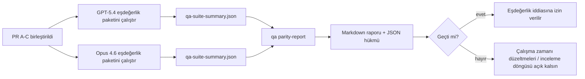

---
x-i18n:
    generated_at: "2026-04-11T15:15:48Z"
    model: gpt-5.4
    provider: openai
    source_hash: 910bcf7668becf182ef48185b43728bf2fa69629d6d50189d47d47b06f807a9e
    source_path: help/gpt54-codex-agentic-parity-maintainers.md
    workflow: 15
---

# GPT-5.4 / Codex Eşdeğerliği Sorumlu Notları

Bu not, özgün altı sözleşmeli mimariyi kaybetmeden GPT-5.4 / Codex eşdeğerliği programını dört birleştirme birimi olarak nasıl inceleyeceğinizi açıklar.

## Birleştirme birimleri

### PR A: katı agentic yürütme

Sahip olduğu alanlar:

- `executionContract`
- GPT-5-öncelikli aynı turda devam ettirme
- terminal olmayan ilerleme takibi olarak `update_plan`
- yalnızca plan içeren sessiz durmalar yerine açık engellenmiş durumlar

Sahip olmadığı alanlar:

- kimlik doğrulama/çalışma zamanı hata sınıflandırması
- izin doğruluğu
- yeniden oynatma/devam ettirme yeniden tasarımı
- eşdeğerlik kıyaslaması

### PR B: çalışma zamanı doğruluğu

Sahip olduğu alanlar:

- Codex OAuth kapsam doğruluğu
- türlendirilmiş sağlayıcı/çalışma zamanı hata sınıflandırması
- `/elevated full` kullanılabilirliği ve engellenme nedenlerinin doğru şekilde gösterilmesi

Sahip olmadığı alanlar:

- araç şeması normalleştirmesi
- yeniden oynatma/canlılık durumu
- kıyaslama kapısı

### PR C: yürütme doğruluğu

Sahip olduğu alanlar:

- sağlayıcıya ait OpenAI/Codex araç uyumluluğu
- parametresiz katı şema işleme
- replay-invalid durumunun görünür kılınması
- duraklatılmış, engellenmiş ve terk edilmiş uzun görev durumlarının görünürlüğü

Sahip olmadığı alanlar:

- kendi kendine seçilen devam ettirme
- sağlayıcı kancaları dışındaki genel Codex lehçesi davranışı
- kıyaslama kapısı

### PR D: eşdeğerlik düzeneği

Sahip olduğu alanlar:

- ilk dalga GPT-5.4 ile Opus 4.6 senaryo paketi
- eşdeğerlik dokümantasyonu
- eşdeğerlik raporu ve sürüm kapısı mekanikleri

Sahip olmadığı alanlar:

- QA-lab dışındaki çalışma zamanı davranış değişiklikleri
- düzenek içindeki kimlik doğrulama/proxy/DNS simülasyonu

## Özgün altı sözleşmeye geri eşleme

| Özgün sözleşme                          | Birleştirme birimi |
| --------------------------------------- | ------------------ |
| Sağlayıcı taşıma/kimlik doğrulama doğruluğu | PR B               |
| Araç sözleşmesi/şema uyumluluğu         | PR C               |
| Aynı turda yürütme                      | PR A               |
| İzin doğruluğu                          | PR B               |
| Yeniden oynatma/devam ettirme/canlılık doğruluğu | PR C               |
| Kıyaslama/sürüm kapısı                  | PR D               |

## İnceleme sırası

1. PR A
2. PR B
3. PR C
4. PR D

PR D ispat katmanıdır. Çalışma zamanı doğruluğu PR’lerinin gecikme nedeni olmamalıdır.

## Nelere bakılmalı

### PR A

- GPT-5 çalıştırmaları yorumda durmak yerine eyleme geçiyor veya güvenli şekilde başarısız oluyor
- `update_plan` artık tek başına ilerleme gibi görünmüyor
- davranış GPT-5-öncelikli ve gömülü-Pi kapsamlı kalıyor

### PR B

- kimlik doğrulama/proxy/çalışma zamanı hataları artık genel “model failed” işleyişine çökertilmiyor
- `/elevated full` yalnızca gerçekten kullanılabilir olduğunda kullanılabilir olarak açıklanıyor
- engellenme nedenleri hem model hem de kullanıcıya dönük çalışma zamanı için görünür durumda

### PR C

- katı OpenAI/Codex araç kaydı öngörülebilir davranıyor
- parametresiz araçlar katı şema denetimlerinde başarısız olmuyor
- yeniden oynatma ve sıkıştırma sonuçları doğru canlılık durumunu koruyor

### PR D

- senaryo paketi anlaşılır ve yeniden üretilebilir
- paket yalnızca salt okunur akışları değil, durum değiştiren bir yeniden oynatma güvenliği hattını da içeriyor
- raporlar insanlar ve otomasyon tarafından okunabilir
- eşdeğerlik iddiaları anekdota değil, kanıta dayanıyor

PR D’den beklenen çıktılar:

- her model çalıştırması için `qa-suite-report.md` / `qa-suite-summary.json`
- toplu ve senaryo düzeyinde karşılaştırma için `qa-agentic-parity-report.md`
- makine tarafından okunabilir hüküm için `qa-agentic-parity-summary.json`

## Sürüm kapısı

Aşağıdakiler gerçekleşmeden GPT-5.4’ün Opus 4.6 ile eşdeğer veya ondan üstün olduğunu iddia etmeyin:

- PR A, PR B ve PR C birleştirilmiş olmalı
- PR D ilk dalga eşdeğerlik paketini temiz şekilde çalıştırmalı
- çalışma zamanı doğruluğu regresyon paketleri yeşil kalmalı
- eşdeğerlik raporu sahte başarı durumu göstermemeli ve durma davranışında regresyon olmamalı

Eşdeğerlik düzeneği tek kanıt kaynağı değildir. İncelemede bu ayrımı açık tutun:

- PR D, senaryo tabanlı GPT-5.4 ile Opus 4.6 karşılaştırmasının sahibidir
- PR B deterministic paketleri, kimlik doğrulama/proxy/DNS ve tam erişim doğruluğu kanıtının sahibi olmaya devam eder

## Hedeften kanıta eşleme

| Tamamlama kapısı öğesi                  | Birincil sahip | İnceleme çıktısı                                                    |
| --------------------------------------- | -------------- | ------------------------------------------------------------------- |
| Yalnızca plan içeren duraksamalar yok   | PR A           | katı agentic çalışma zamanı testleri ve `approval-turn-tool-followthrough` |
| Sahte ilerleme veya sahte araç tamamlanması yok | PR A + PR D    | eşdeğerlik sahte başarı sayısı ve senaryo düzeyindeki rapor ayrıntıları |
| Yanlış `/elevated full` yönlendirmesi yok | PR B           | deterministic çalışma zamanı doğruluğu paketleri                    |
| Yeniden oynatma/canlılık hataları açık kalır | PR C + PR D    | yaşam döngüsü/yeniden oynatma paketleri ve `compaction-retry-mutating-tool` |
| GPT-5.4, Opus 4.6 ile eşleşir veya onu geçer | PR D           | `qa-agentic-parity-report.md` ve `qa-agentic-parity-summary.json`   |

## İnceleyici kısaltması: önce ve sonra

| Kullanıcı açısından görünür sorun, önce                     | Sonra inceleme sinyali                                                                  |
| ----------------------------------------------------------- | --------------------------------------------------------------------------------------- |
| GPT-5.4 planlamadan sonra duruyordu                         | PR A, yalnızca yorumla tamamlanma yerine eyleme geçme veya engellenme davranışı gösterir |
| Araç kullanımı katı OpenAI/Codex şemalarıyla kırılgan görünüyordu | PR C, araç kaydını ve parametresiz çağrımı öngörülebilir tutar                         |
| `/elevated full` ipuçları bazen yanıltıcıydı                | PR B, yönlendirmeyi gerçek çalışma zamanı yeteneği ve engellenme nedenlerine bağlar    |
| Uzun görevler yeniden oynatma/sıkıştırma belirsizliğinde kaybolabiliyordu | PR C, açık duraklatılmış, engellenmiş, terk edilmiş ve replay-invalid durumları üretir |
| Eşdeğerlik iddiaları anekdota dayanıyordu                   | PR D, her iki modelde de aynı senaryo kapsamıyla bir rapor ve JSON hükmü üretir |
