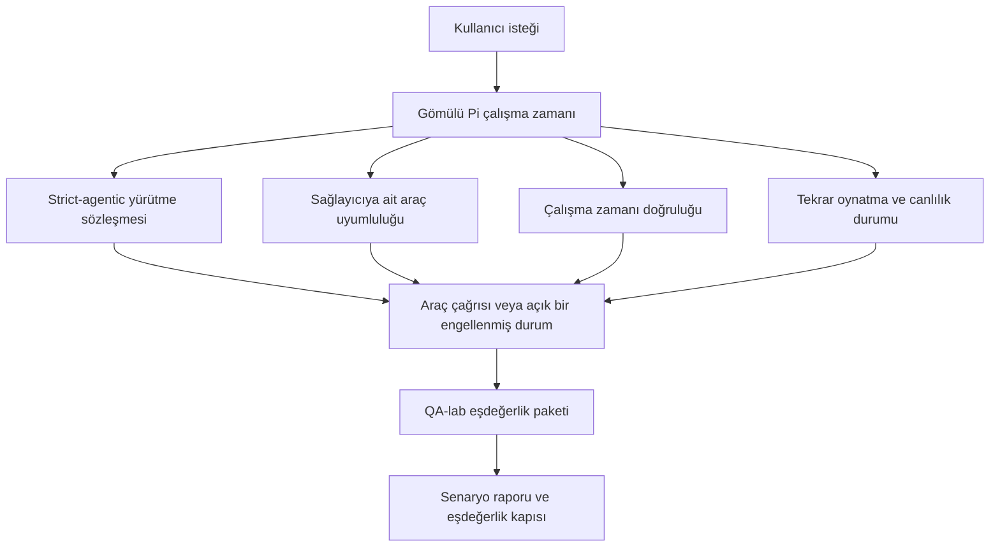
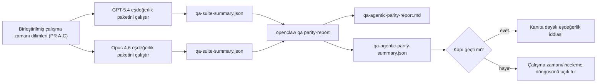

---
x-i18n:
    generated_at: "2026-04-11T15:15:48Z"
    model: gpt-5.4
    provider: openai
    source_hash: 7ee6b925b8a0f8843693cea9d50b40544657b5fb8a9e0860e2ff5badb273acb6
    source_path: help/gpt54-codex-agentic-parity.md
    workflow: 15
---

# OpenClaw'da GPT-5.4 / Codex Ajanik Eşdeğerliği

OpenClaw, araç kullanan frontier modellerle zaten iyi çalışıyordu, ancak GPT-5.4 ve Codex tarzı modeller hâlâ pratikte birkaç açıdan düşük performans gösteriyordu:

- işi yapmak yerine planlama sonrası durabiliyorlardı
- sıkı OpenAI/Codex araç şemalarını yanlış kullanabiliyorlardı
- tam erişim imkansız olsa bile `/elevated full` isteyebiliyorlardı
- tekrar oynatma veya sıkıştırma sırasında uzun süren görev durumunu kaybedebiliyorlardı
- Claude Opus 4.6 ile eşdeğerlik iddiaları tekrar üretilebilir senaryolar yerine anekdotlara dayanıyordu

Bu eşdeğerlik programı bu boşlukları incelenebilir dört dilimde kapatıyor.

## Neler değişti

### PR A: strict-agentic yürütme

Bu dilim, gömülü Pi GPT-5 çalıştırmaları için isteğe bağlı bir `strict-agentic` yürütme sözleşmesi ekler.

Etkinleştirildiğinde OpenClaw, yalnızca plan içeren turları artık “yeterince iyi” tamamlanmış saymaz. Model sadece ne yapmayı amaçladığını söyleyip gerçekten araç kullanmaz veya ilerleme göstermezse, OpenClaw bir hemen-harekete-geç yönlendirmesiyle yeniden dener ve ardından görevi sessizce bitirmek yerine açık bir engellenmiş durumla kapalı başarısızlığa düşer.

Bu, GPT-5.4 deneyimini özellikle şu durumlarda iyileştirir:

- kısa “tamam yap” takip mesajları
- ilk adımın açık olduğu kod görevleri
- `update_plan` kullanımının dolgu metin değil ilerleme takibi olması gereken akışlar

### PR B: çalışma zamanı doğruluğu

Bu dilim, OpenClaw'un iki konuda doğruyu söylemesini sağlar:

- sağlayıcı/çalışma zamanı çağrısının neden başarısız olduğu
- `/elevated full` özelliğinin gerçekten kullanılabilir olup olmadığı

Bu sayede GPT-5.4; eksik kapsam, kimlik doğrulama yenileme hataları, HTML 403 kimlik doğrulama hataları, proxy sorunları, DNS veya zaman aşımı hataları ve engellenmiş tam erişim modları için daha iyi çalışma zamanı sinyalleri alır. Modelin yanlış çözümü uydurma veya çalışma zamanının sağlayamayacağı bir izin modunu istemeye devam etme olasılığı azalır.

### PR C: yürütme doğruluğu

Bu dilim iki tür doğruluğu iyileştirir:

- sağlayıcıya ait OpenAI/Codex araç-şema uyumluluğu
- tekrar oynatma ve uzun görev canlılığı görünürlüğü

Araç uyumluluğu çalışması, sıkı OpenAI/Codex araç kaydı için şema sürtünmesini azaltır; özellikle parametresiz araçlar ve sıkı nesne-kök beklentileri etrafında. Tekrar oynatma/canlılık çalışması ise uzun süren görevleri daha gözlemlenebilir hale getirir; böylece duraklatılmış, engellenmiş ve terk edilmiş durumlar genel hata metinleri içinde kaybolmak yerine görünür olur.

### PR D: eşdeğerlik altyapısı

Bu dilim, GPT-5.4 ile Opus 4.6'nın aynı senaryolar üzerinden çalıştırılıp ortak kanıtlarla karşılaştırılabilmesi için ilk dalga QA-lab eşdeğerlik paketini ekler.

Eşdeğerlik paketi kanıt katmanıdır. Tek başına çalışma zamanı davranışını değiştirmez.

İki adet `qa-suite-summary.json` yapıtınız olduğunda, sürüm kapısı karşılaştırmasını şu komutla üretin:

```bash
pnpm openclaw qa parity-report \
  --repo-root . \
  --candidate-summary .artifacts/qa-e2e/gpt54/qa-suite-summary.json \
  --baseline-summary .artifacts/qa-e2e/opus46/qa-suite-summary.json \
  --output-dir .artifacts/qa-e2e/parity
```

Bu komut şunları yazar:

- insanlar tarafından okunabilir bir Markdown raporu
- makineler tarafından okunabilir bir JSON kararı
- açık bir `pass` / `fail` kapı sonucu

## Bunun GPT-5.4'ü pratikte nasıl iyileştirdiği

Bu çalışmadan önce, OpenClaw üzerindeki GPT-5.4 gerçek kodlama oturumlarında Opus'tan daha az ajanik hissettirebiliyordu çünkü çalışma zamanı, özellikle GPT-5 tarzı modeller için zararlı olan davranışlara tolerans gösteriyordu:

- yalnızca yorum içeren turlar
- araçlar etrafında şema sürtünmesi
- belirsiz izin geri bildirimi
- sessiz tekrar oynatma veya sıkıştırma bozulması

Amaç, GPT-5.4'ü Opus'u taklit etmeye zorlamak değildir. Amaç, GPT-5.4'e gerçek ilerlemeyi ödüllendiren, daha temiz araç ve izin semantiği sağlayan ve hata modlarını makine ve insanlar tarafından okunabilir açık durumlara dönüştüren bir çalışma zamanı sözleşmesi vermektir.

Bu, kullanıcı deneyimini şu durumdan değiştirir:

- “modelin iyi bir planı vardı ama durdu”

şuna dönüştürür:

- “model ya harekete geçti ya da OpenClaw neden yapamadığını tam olarak ortaya koydu”

## GPT-5.4 kullanıcıları için önce ve sonra

| Bu programdan önce                                                                                | PR A-D'den sonra                                                                        |
| ------------------------------------------------------------------------------------------------- | ---------------------------------------------------------------------------------------- |
| GPT-5.4 mantıklı bir plandan sonra sonraki araç adımını atmadan durabiliyordu                    | PR A, “yalnızca plan” durumunu “hemen harekete geç veya engellenmiş bir durum göster”a çevirir |
| Sıkı araç şemaları parametresiz veya OpenAI/Codex biçimli araçları kafa karıştırıcı şekilde reddedebiliyordu | PR C, sağlayıcıya ait araç kaydı ve çağrımını daha öngörülebilir hale getirir          |
| `/elevated full` yönlendirmesi engellenmiş çalışma zamanlarında belirsiz veya yanlış olabiliyordu | PR B, GPT-5.4'e ve kullanıcıya doğru çalışma zamanı ve izin ipuçları verir              |
| Tekrar oynatma veya sıkıştırma hataları görevin sessizce kaybolduğu hissini verebiliyordu        | PR C, duraklatılmış, engellenmiş, terk edilmiş ve tekrar oynatması geçersiz sonuçları açıkça gösterir |
| “GPT-5.4 Opus'tan daha kötü hissettiriyor” büyük ölçüde anekdot niteliğindeydi                   | PR D bunu aynı senaryo paketi, aynı metrikler ve kesin bir geç/kaldı kapısına dönüştürür |

## Mimari



## Sürüm akışı



## Senaryo paketi

İlk dalga eşdeğerlik paketi şu anda beş senaryoyu kapsıyor:

### `approval-turn-tool-followthrough`

Modelin kısa bir onaydan sonra “bunu yapacağım” diyerek durmadığını kontrol eder. Aynı turda ilk somut eylemi yapmalıdır.

### `model-switch-tool-continuity`

Araç kullanan çalışmanın model/çalışma zamanı geçiş sınırları boyunca yorum moduna sıfırlanmak veya yürütme bağlamını kaybetmek yerine tutarlı kalıp kalmadığını kontrol eder.

### `source-docs-discovery-report`

Modelin kaynak kodu ve dokümantasyonu okuyup bulguları sentezleyebildiğini ve ince bir özet üretip erken durmak yerine göreve ajanik biçimde devam edebildiğini kontrol eder.

### `image-understanding-attachment`

Ek içeren karma mod görevlerin eyleme geçirilebilir kalıp kalmadığını ve belirsiz anlatıma çöküp çökmediğini kontrol eder.

### `compaction-retry-mutating-tool`

Gerçek bir değiştirici yazma işlemi içeren bir görevin, çalışma sıkıştırılsa, yeniden denense veya baskı altında yanıt durumu kaybolsa bile tekrar oynatma güvensizliğini sessizce tekrar oynatma güvenliymiş gibi göstermeden açık tutup tutmadığını kontrol eder.

## Senaryo matrisi

| Senaryo                           | Test ettiği şey                           | İyi GPT-5.4 davranışı                                                            | Başarısızlık sinyali                                                              |
| --------------------------------- | ----------------------------------------- | -------------------------------------------------------------------------------- | ---------------------------------------------------------------------------------- |
| `approval-turn-tool-followthrough` | Bir plandan sonraki kısa onay turları     | Niyeti yeniden ifade etmek yerine ilk somut araç eylemini hemen başlatır        | yalnızca plan içeren takip, araç etkinliği yok veya gerçek bir engel olmadan engellenmiş tur |
| `model-switch-tool-continuity`     | Araç kullanımı altında çalışma zamanı/model geçişi | Görev bağlamını korur ve tutarlı biçimde eyleme devam eder                      | yorum moduna sıfırlanır, araç bağlamını kaybeder veya geçişten sonra durur        |
| `source-docs-discovery-report`     | Kaynak okuma + sentez + eylem             | Kaynakları bulur, araçları kullanır ve takılmadan faydalı bir rapor üretir      | ince özet, eksik araç çalışması veya eksik-tur durması                            |
| `image-understanding-attachment`   | Ek odaklı ajanik çalışma                  | Eki yorumlar, araçlarla ilişkilendirir ve göreve devam eder                     | belirsiz anlatım, ekin yok sayılması veya somut bir sonraki eylemin olmaması      |
| `compaction-retry-mutating-tool`   | Sıkıştırma baskısı altında değiştirici çalışma | Gerçek bir yazma işlemi yapar ve yan etkiden sonra tekrar oynatma güvensizliğini açık tutar | değiştirici yazma olur ama tekrar oynatma güvenliği ima edilir, eksik kalır veya çelişkili olur |

## Sürüm kapısı

GPT-5.4 ancak birleştirilmiş çalışma zamanı hem eşdeğerlik paketini hem de çalışma zamanı doğruluğu regresyonlarını aynı anda geçtiğinde eşdeğer veya daha iyi kabul edilebilir.

Gerekli sonuçlar:

- bir sonraki araç eylemi açıkken yalnızca plan kaynaklı takılma olmaması
- gerçek yürütme olmadan sahte tamamlanma olmaması
- yanlış `/elevated full` yönlendirmesi olmaması
- sessiz tekrar oynatma veya sıkıştırma nedeniyle terk edilme olmaması
- üzerinde anlaşılmış Opus 4.6 temel çizgisi kadar güçlü veya daha güçlü eşdeğerlik paketi metrikleri

İlk dalga altyapısı için kapı şu ölçütleri karşılaştırır:

- tamamlanma oranı
- amaç dışı durma oranı
- geçerli araç çağrısı oranı
- sahte başarı sayısı

Eşdeğerlik kanıtı kasıtlı olarak iki katmana ayrılmıştır:

- PR D, QA-lab ile aynı senaryolarda GPT-5.4 ile Opus 4.6 davranışını kanıtlar
- PR B deterministik paketleri, altyapı dışında kimlik doğrulama, proxy, DNS ve `/elevated full` doğruluğunu kanıtlar

## Hedeften kanıta matrisi

| Tamamlanma kapısı maddesi                              | Sorumlu PR  | Kanıt kaynağı                                                     | Geçiş sinyali                                                                          |
| ------------------------------------------------------ | ----------- | ----------------------------------------------------------------- | -------------------------------------------------------------------------------------- |
| GPT-5.4 artık planlamadan sonra takılmıyor             | PR A        | `approval-turn-tool-followthrough` ve PR A çalışma zamanı paketleri | onay turları gerçek işi veya açık bir engellenmiş durumu tetikler                     |
| GPT-5.4 artık sahte ilerleme veya sahte araç tamamlanması üretmiyor | PR A + PR D | eşdeğerlik raporu senaryo sonuçları ve sahte başarı sayısı        | şüpheli geçiş sonucu yok ve yalnızca yorum içeren tamamlanma yok                      |
| GPT-5.4 artık yanlış `/elevated full` yönlendirmesi vermiyor | PR B        | deterministik doğruluk paketleri                                  | engellenme nedenleri ve tam erişim ipuçları çalışma zamanına uygun doğrulukta kalır   |
| Tekrar oynatma/canlılık hataları açık kalır            | PR C + PR D | PR C yaşam döngüsü/tekrar oynatma paketleri ve `compaction-retry-mutating-tool` | değiştirici çalışma, sessizce kaybolmak yerine tekrar oynatma güvensizliğini açık tutar |
| GPT-5.4, üzerinde anlaşılmış metriklerde Opus 4.6'ya eşit veya daha iyi | PR D        | `qa-agentic-parity-report.md` ve `qa-agentic-parity-summary.json` | aynı senaryo kapsamı ve tamamlanma, durma davranışı veya geçerli araç kullanımında gerileme olmaması |

## Eşdeğerlik kararını nasıl okumalı

İlk dalga eşdeğerlik paketi için son makine tarafından okunabilir karar olarak `qa-agentic-parity-summary.json` içindeki kararı kullanın.

- `pass`, GPT-5.4'ün Opus 4.6 ile aynı senaryoları kapsadığı ve üzerinde anlaşılan toplu metriklerde gerileme göstermediği anlamına gelir.
- `fail`, en az bir kesin kapının tetiklendiği anlamına gelir: daha zayıf tamamlanma, daha kötü amaç dışı durmalar, daha zayıf geçerli araç kullanımı, herhangi bir sahte başarı durumu veya eşleşmeyen senaryo kapsamı.
- “shared/base CI issue” kendi başına bir eşdeğerlik sonucu değildir. PR D dışındaki CI gürültüsü bir çalıştırmayı engellerse, karar dal dönemine ait günlüklerden çıkarım yapmak yerine temiz bir birleştirilmiş çalışma zamanı yürütmesini beklemelidir.
- Kimlik doğrulama, proxy, DNS ve `/elevated full` doğruluğu hâlâ PR B'nin deterministik paketlerinden gelir; bu nedenle son sürüm iddiası için her ikisi de gerekir: geçen bir PR D eşdeğerlik kararı ve yeşil PR B doğruluk kapsamı.

## `strict-agentic` özelliğini kimler etkinleştirmeli

`strict-agentic` özelliğini şu durumlarda kullanın:

- bir sonraki adım açık olduğunda ajanın hemen harekete geçmesi bekleniyorsa
- birincil çalışma zamanı GPT-5.4 veya Codex ailesi modellerse
- “yardımcı” ama yalnızca özet yapan yanıtlar yerine açık engellenmiş durumları tercih ediyorsanız

Şu durumlarda varsayılan sözleşmeyi koruyun:

- mevcut daha gevşek davranışı istiyorsanız
- GPT-5 ailesi modeller kullanmıyorsanız
- çalışma zamanı zorlamasını değil istemleri test ediyorsanız
