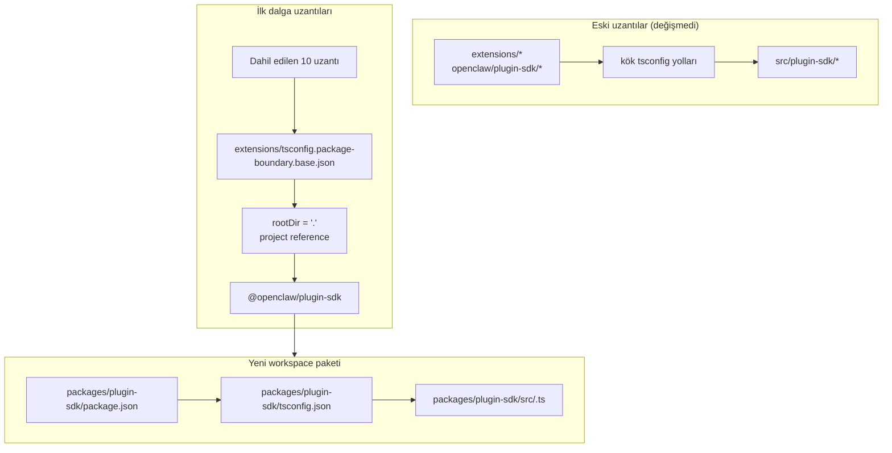

# refactor: plugin-sdk öğesini kademeli olarak gerçek bir workspace paketi haline getir

## Genel bakış

Bu plan, `packages/plugin-sdk` altında plugin SDK için gerçek bir workspace paketi
tanıtır ve bunu, küçük bir ilk uzantı dalgasını derleyici tarafından zorlanan
paket sınırlarına dahil etmek için kullanır. Amaç, seçili bir grup paketlenmiş
sağlayıcı uzantısı için, depoyu kapsayan bir geçişi veya devasa bir merge-conflict
alanını zorlamadan, normal `tsc` altında yasa dışı relative import'ların
başarısız olmasını sağlamaktır.

Temel kademeli adım, bir süre iki modu paralel çalıştırmaktır:

| Mod         | Import biçimi            | Bunu kim kullanır                     | Zorlama                                      |
| ----------- | ------------------------ | ------------------------------------- | -------------------------------------------- |
| Eski mod    | `openclaw/plugin-sdk/*`  | dahil edilmemiş mevcut tüm uzantılar  | mevcut esnek davranış korunur                |
| Dahil olma modu | `@openclaw/plugin-sdk/*` | yalnızca ilk dalga uzantıları         | paket yerel `rootDir` + project references   |

## Problem Çerçevesi

Mevcut depo büyük bir herkese açık plugin SDK yüzeyi dışa aktarır, ancak bu
gerçek bir workspace paketi değildir. Bunun yerine:

- kök `tsconfig.json`, `openclaw/plugin-sdk/*` değerini doğrudan
  `src/plugin-sdk/*.ts` dosyalarına eşler
- önceki deneye dahil edilmemiş uzantılar hâlâ bu genel kaynak takma adı
  davranışını paylaşır
- `rootDir` eklemek yalnızca izin verilen SDK import'ları artık ham
  depo kaynağına çözülmediğinde çalışır

Bu da deponun istenen sınır ilkesini tanımlayabildiği, ancak TypeScript'in
bunu çoğu uzantı için temiz şekilde zorlamadığı anlamına gelir.

İstediğiniz şey, şu özelliklere sahip kademeli bir yol:

- `plugin-sdk` öğesini gerçek hale getiren
- SDK'yı `@openclaw/plugin-sdk` adlı bir workspace paketine doğru taşıyan
- ilk PR'de yalnızca yaklaşık 10 uzantıyı değiştiren
- uzantı ağacının geri kalanını daha sonraki temizliklere kadar eski düzende bırakan
- ilk dalga dağıtımının birincil mekanizması olarak `tsconfig.plugin-sdk.dts.json` + postinstall ile üretilen declaration iş akışından kaçınan

## Gereksinim İzleme

- R1. `packages/` altında plugin SDK için gerçek bir workspace paketi oluştur.
- R2. Yeni paketin adını `@openclaw/plugin-sdk` yap.
- R3. Yeni SDK paketine kendi `package.json` ve `tsconfig.json` dosyalarını ver.
- R4. Geçiş penceresi sırasında dahil edilmemiş uzantılar için eski `openclaw/plugin-sdk/*` import'larını çalışır durumda tut.
- R5. İlk PR'de yalnızca küçük bir ilk uzantı dalgasını dahil et.
- R6. İlk dalga uzantıları, paket kökünün dışına çıkan relative import'lar için fail-closed davranmalıdır.
- R7. İlk dalga uzantıları SDK'yı, kök `paths` takma adları üzerinden değil,
  bir paket bağımlılığı ve bir TS project reference üzerinden tüketmelidir.
- R8. Plan, editör doğruluğu için depo genelinde zorunlu bir postinstall üretim adımından kaçınmalıdır.
- R9. İlk dalga dağıtımı incelenebilir ve birleştirilebilir, orta ölçekli bir PR olmalıdır;
  depo genelinde 300+ dosyalık bir refactor olmamalıdır.

## Kapsam Sınırları

- İlk PR'de tüm paketlenmiş uzantıların tam geçişi yok.
- İlk PR'de `src/plugin-sdk` öğesini silme zorunluluğu yok.
- Her kök derleme veya test yolunu yeni paketi hemen kullanacak şekilde yeniden bağlama zorunluluğu yok.
- Dahil edilmemiş her uzantı için VS Code squiggles zorlama girişimi yok.
- Uzantı ağacının geri kalanı için geniş kapsamlı lint temizliği yok.
- Dahil edilen uzantılar için import çözümleme, paket sahipliği
  ve sınır zorlaması dışında büyük çalışma zamanı davranış değişiklikleri yok.

## Bağlam ve Araştırma

### İlgili Kod ve Örüntüler

- `pnpm-workspace.yaml` zaten `packages/*` ve `extensions/*` içeriyor, bu yüzden
  `packages/plugin-sdk` altındaki yeni bir workspace paketi mevcut depo
  düzenine uyuyor.
- `packages/memory-host-sdk/package.json`
  ve `packages/plugin-package-contract/package.json` gibi mevcut workspace paketleri zaten
  `src/*.ts` köklerine dayanan paket yerel `exports` map'leri kullanıyor.
- Kök `package.json` şu anda SDK yüzeyini `./plugin-sdk`
  ve `./plugin-sdk/*` export'ları üzerinden, `dist/plugin-sdk/*.js` ve
  `dist/plugin-sdk/*.d.ts` ile destekleyerek yayımlıyor.
- `src/plugin-sdk/entrypoints.ts` ve `scripts/lib/plugin-sdk-entrypoints.json`
  zaten SDK yüzeyinin kanonik entrypoint envanteri olarak işlev görüyor.
- Kök `tsconfig.json` şu anda şunları eşliyor:
  - `openclaw/plugin-sdk` -> `src/plugin-sdk/index.ts`
  - `openclaw/plugin-sdk/*` -> `src/plugin-sdk/*.ts`
- Önceki sınır deneyi, izin verilen SDK import'ları artık uzantı paketinin
  dışındaki ham kaynağa çözülmediğinde, paket yerel `rootDir` ayarının yasa dışı
  relative import'lar için çalıştığını gösterdi.

### İlk Dalga Uzantı Seti

Bu plan, karmaşık channel-runtime edge case'lerini sürükleme olasılığı daha düşük olan
sağlayıcı ağırlıklı ilk dalgayı varsayar:

- `extensions/anthropic`
- `extensions/exa`
- `extensions/firecrawl`
- `extensions/groq`
- `extensions/mistral`
- `extensions/openai`
- `extensions/perplexity`
- `extensions/tavily`
- `extensions/together`
- `extensions/xai`

### İlk Dalga SDK Yüzey Envanteri

İlk dalga uzantıları şu anda yönetilebilir bir SDK alt yol alt kümesini import ediyor.
Başlangıç `@openclaw/plugin-sdk` paketinin yalnızca şunları kapsaması gerekir:

- `agent-runtime`
- `cli-runtime`
- `config-runtime`
- `core`
- `image-generation`
- `media-runtime`
- `media-understanding`
- `plugin-entry`
- `plugin-runtime`
- `provider-auth`
- `provider-auth-api-key`
- `provider-auth-login`
- `provider-auth-runtime`
- `provider-catalog-shared`
- `provider-entry`
- `provider-http`
- `provider-model-shared`
- `provider-onboard`
- `provider-stream-family`
- `provider-stream-shared`
- `provider-tools`
- `provider-usage`
- `provider-web-fetch`
- `provider-web-search`
- `realtime-transcription`
- `realtime-voice`
- `runtime-env`
- `secret-input`
- `security-runtime`
- `speech`
- `testing`

### Kurumsal Öğrenimler

- Bu worktree içinde ilgili `docs/solutions/` girdileri yoktu.

### Dış Referanslar

- Bu plan için dış araştırmaya gerek yoktu. Depo zaten ilgili
  workspace-package ve SDK-export örüntülerini içeriyor.

## Temel Teknik Kararlar

- Yeni bir workspace paketi olarak `@openclaw/plugin-sdk` tanıtılırken,
  geçiş süresince eski kök `openclaw/plugin-sdk/*` yüzeyi canlı tutulacak.
  Gerekçe: bu, ilk dalga uzantı setinin gerçek paket çözümlemesine geçmesine
  olanak tanırken her uzantının ve her kök derleme yolunun aynı anda
  değişmesini zorlamaz.

- Herkes için mevcut uzantı temelini değiştirmek yerine,
  `extensions/tsconfig.package-boundary.base.json` gibi özel bir dahil olma sınır temel config'i kullanılacak.
  Gerekçe: depo, geçiş süresince hem eski hem de dahil olmalı uzantı modlarını
  aynı anda desteklemelidir.

- İlk dalga uzantılarından `packages/plugin-sdk/tsconfig.json` dosyasına TS project references kullanılacak
  ve dahil olma sınır modunda
  `disableSourceOfProjectReferenceRedirect` ayarlanacak.
  Gerekçe: bu, `tsc` için gerçek bir paket grafiği verirken editör ve
  derleyicinin ham kaynak geçişine geri düşmesini caydırır.

- İlk dalgada `@openclaw/plugin-sdk` gizli tutulacak.
  Gerekçe: acil hedef, yüzey kararlı hale gelmeden ikinci bir dış SDK sözleşmesi yayımlamak değil,
  iç sınır zorlaması ve güvenli geçiştir.

- İlk uygulama diliminde yalnızca ilk dalga SDK alt yolları taşınacak ve
  geri kalan için uyumluluk köprüleri korunacak.
  Gerekçe: tüm 315 `src/plugin-sdk/*.ts` dosyasını tek PR'de fiziksel olarak taşımak,
  bu planın kaçınmaya çalıştığı merge-conflict alanının ta kendisidir.

- İlk dalga için SDK declaration'larını oluşturmak üzere
  `scripts/postinstall-bundled-plugins.mjs` dosyasına dayanılmayacak.
  Gerekçe: açık derleme/reference akışlarını anlamak daha kolaydır ve depo davranışını
  daha öngörülebilir tutar.

## Açık Sorular

### Planlama Sırasında Çözülenler

- Hangi uzantılar ilk dalgada olmalı?
  Yukarıda listelenen 10 sağlayıcı/web-search uzantısını kullanın; çünkü bunlar
  daha ağır kanal paketlerine göre yapısal olarak daha izoledir.

- İlk PR tüm uzantı ağacını mı değiştirmeli?
  Hayır. İlk PR iki modu paralel desteklemeli ve yalnızca ilk dalgayı dahil etmelidir.

- İlk dalga bir postinstall declaration derlemesi gerektirmeli mi?
  Hayır. Paket/reference grafiği açık olmalı ve CI ilgili paket yerel typecheck'i bilinçli şekilde çalıştırmalıdır.

### Uygulamaya Ertelenenler

- İlk dalga paketi yalnızca project references ile doğrudan paket yerel `src/*.ts`
  dosyalarına işaret edebilir mi, yoksa
  `@openclaw/plugin-sdk` paketi için küçük bir declaration-emission adımı hâlâ gerekli mi?
  Bu, uygulamaya ait bir TS grafik doğrulama sorusudur.

- Kök `openclaw` paketi ilk dalga SDK alt yollarını hemen `packages/plugin-sdk`
  çıktılarından mı proxy'lemeli yoksa `src/plugin-sdk` altındaki oluşturulmuş
  uyumluluk shim'lerini kullanmaya devam mı etmeli?
  Bu, CI'ı yeşil tutan en minimal uygulama yoluna bağlı olan bir uyumluluk ve
  derleme biçimi ayrıntısıdır.

## Yüksek Seviyeli Teknik Tasarım

> Bu bölüm amaçlanan yaklaşımı gösterir ve inceleme için yönlendirici rehberdir; uygulama spesifikasyonu değildir. Uygulamayı yapan aracı bunu yeniden üretilecek kod olarak değil, bağlam olarak değerlendirmelidir.

## Uygulama Birimleri

- [ ] **Birim 1: Gerçek `@openclaw/plugin-sdk` workspace paketini tanıt**

**Hedef:** Depo genelinde geçişi zorlamadan ilk dalga alt yol yüzeyine sahip olabilecek
SDK için gerçek bir workspace paketi oluşturmak.

**Gereksinimler:** R1, R2, R3, R8, R9

**Bağımlılıklar:** Yok

**Dosyalar:**

- Oluştur: `packages/plugin-sdk/package.json`
- Oluştur: `packages/plugin-sdk/tsconfig.json`
- Oluştur: `packages/plugin-sdk/src/index.ts`
- Oluştur: ilk dalga SDK alt yolları için `packages/plugin-sdk/src/*.ts`
- Değiştir: yalnızca paket glob ayarlamaları gerekiyorsa `pnpm-workspace.yaml`
- Değiştir: `package.json`
- Değiştir: `src/plugin-sdk/entrypoints.ts`
- Değiştir: `scripts/lib/plugin-sdk-entrypoints.json`
- Test: `src/plugins/contracts/plugin-sdk-workspace-package.contract.test.ts`

**Yaklaşım:**

- `@openclaw/plugin-sdk` adlı yeni bir workspace paketi ekle.
- Tüm 315 dosyalık ağaç yerine ilk dalga SDK alt yollarıyla başla.
- Bir ilk dalga entrypoint'ini doğrudan taşımak aşırı büyük bir diff oluşturacaksa,
  ilk PR bu alt yolu önce `packages/plugin-sdk/src` içinde ince bir paket sarmalayıcısı olarak tanıtabilir,
  ardından sonraki bir PR'de o alt yol kümesi için gerçek kaynak noktasını pakete çevirebilir.
- İlk dalga paket yüzeyinin tek bir kanonik yerde tanımlanması için mevcut entrypoint envanteri mekanizmasını yeniden kullan.
- Kök paket export'larını eski kullanıcılar için canlı tutarken, workspace paketi yeni dahil olma sözleşmesi haline gelsin.

**İzlenecek örüntüler:**

- `packages/memory-host-sdk/package.json`
- `packages/plugin-package-contract/package.json`
- `src/plugin-sdk/entrypoints.ts`

**Test senaryoları:**

- Başarılı durum: workspace paketi planda listelenen her ilk dalga alt yolunu dışa aktarır ve gerekli hiçbir ilk dalga export'u eksik değildir.
- Uç durum: ilk dalga giriş listesi yeniden üretildiğinde veya kanonik envanterle karşılaştırıldığında paket export meta verisi kararlı kalır.
- Entegrasyon: yeni workspace paketi tanıtıldıktan sonra kök paket eski SDK export'ları mevcut kalır.

**Doğrulama:**

- Depo, kararlı bir ilk dalga export map'ine sahip geçerli bir `@openclaw/plugin-sdk`
  workspace paketi içerir ve kök `package.json` içinde eski export gerilemesi yoktur.

- [ ] **Birim 2: Paket tarafından zorlanan uzantılar için dahil olmalı bir TS sınır modu ekle**

**Hedef:** Dahil edilen uzantıların kullanacağı TS yapılandırma modunu tanımlarken,
  herkes için mevcut uzantı TS davranışını değiştirmemek.

**Gereksinimler:** R4, R6, R7, R8, R9

**Bağımlılıklar:** Birim 1

**Dosyalar:**

- Oluştur: `extensions/tsconfig.package-boundary.base.json`
- Oluştur: `tsconfig.boundary-optin.json`
- Değiştir: `extensions/xai/tsconfig.json`
- Değiştir: `extensions/openai/tsconfig.json`
- Değiştir: `extensions/anthropic/tsconfig.json`
- Değiştir: `extensions/mistral/tsconfig.json`
- Değiştir: `extensions/groq/tsconfig.json`
- Değiştir: `extensions/together/tsconfig.json`
- Değiştir: `extensions/perplexity/tsconfig.json`
- Değiştir: `extensions/tavily/tsconfig.json`
- Değiştir: `extensions/exa/tsconfig.json`
- Değiştir: `extensions/firecrawl/tsconfig.json`
- Test: `src/plugins/contracts/extension-package-project-boundaries.test.ts`
- Test: `test/extension-package-tsc-boundary.test.ts`

**Yaklaşım:**

- Eski uzantılar için `extensions/tsconfig.base.json` dosyasını yerinde bırak.
- Şunları yapan yeni bir dahil olma temel config'i ekle:
  - `rootDir: "."` ayarlar
  - `packages/plugin-sdk` için reference ekler
  - `composite` etkinleştirir
  - gerektiğinde project-reference source redirect'i devre dışı bırakır
- Aynı PR'de kök depo TS projesini yeniden şekillendirmek yerine,
  ilk dalga typecheck grafiği için özel bir solution config ekle.

**Yürütme notu:** Örüntüyü 10 uzantının tamamına uygulamadan önce
dahil edilen bir uzantı için başarısız olan paket yerel bir canary typecheck ile başlayın.

**İzlenecek örüntüler:**

- Önceki sınır çalışmasından mevcut paket yerel uzantı `tsconfig.json` örüntüsü
- `packages/memory-host-sdk` içindeki workspace paket örüntüsü

**Test senaryoları:**

- Başarılı durum: dahil edilen her uzantı paket sınırı TS config'i üzerinden başarıyla typecheck edilir.
- Hata yolu: `../../src/cli/acp-cli.ts` yolundan gelen bir canary relative import,
  dahil edilen bir uzantı için `TS6059` ile başarısız olur.
- Entegrasyon: dahil edilmemiş uzantılar dokunulmadan kalır ve yeni solution config'e katılmak zorunda değildir.

**Doğrulama:**

- Dahil edilen 10 uzantı için özel bir typecheck grafiği vardır ve bunlardan birinden gelen
  kötü relative import'lar normal `tsc` üzerinden başarısız olur.

- [ ] **Birim 3: İlk dalga uzantılarını `@openclaw/plugin-sdk` üzerine taşı**

**Hedef:** İlk dalga uzantılarını, gerçek SDK paketini
bağımlılık meta verileri, project references ve paket adı import'ları üzerinden tüketecek şekilde değiştirmek.

**Gereksinimler:** R5, R6, R7, R9

**Bağımlılıklar:** Birim 2

**Dosyalar:**

- Değiştir: `extensions/anthropic/package.json`
- Değiştir: `extensions/exa/package.json`
- Değiştir: `extensions/firecrawl/package.json`
- Değiştir: `extensions/groq/package.json`
- Değiştir: `extensions/mistral/package.json`
- Değiştir: `extensions/openai/package.json`
- Değiştir: `extensions/perplexity/package.json`
- Değiştir: `extensions/tavily/package.json`
- Değiştir: `extensions/together/package.json`
- Değiştir: `extensions/xai/package.json`
- Değiştir: şu anda `openclaw/plugin-sdk/*` referanslayan 10 uzantı kökünün her biri altındaki üretim ve test import'ları

**Yaklaşım:**

- İlk dalga uzantılarının `devDependencies` bölümüne
  `@openclaw/plugin-sdk: workspace:*` ekle.
- Bu paketlerdeki `openclaw/plugin-sdk/*` import'larını
  `@openclaw/plugin-sdk/*` ile değiştir.
- Yerel uzantı içi import'ları `./api.ts` ve `./runtime-api.ts` gibi yerel barrel'larda tut.
- Bu PR'de dahil edilmemiş uzantıları değiştirme.

**İzlenecek örüntüler:**

- Mevcut uzantı yerel import barrel'ları (`api.ts`, `runtime-api.ts`)
- Diğer `@openclaw/*` workspace paketlerinde kullanılan paket bağımlılığı biçimi

**Test senaryoları:**

- Başarılı durum: taşınan her uzantı, import yeniden yazımından sonra mevcut plugin testleri üzerinden hâlâ kaydolur/yüklenir.
- Uç durum: dahil edilen uzantı kümesindeki yalnızca test amaçlı SDK import'ları yeni paket üzerinden hâlâ doğru çözülür.
- Entegrasyon: taşınan uzantılar typecheck için kök `openclaw/plugin-sdk/*` takma adlarına ihtiyaç duymaz.

**Doğrulama:**

- İlk dalga uzantıları, eski kök SDK takma adı yoluna ihtiyaç duymadan
  `@openclaw/plugin-sdk` üzerinde derlenir ve test edilir.

- [ ] **Birim 4: Geçiş kısmi iken eski uyumluluğu koru**

**Hedef:** Geçiş sırasında SDK hem eski hem yeni paket biçiminde var olurken
deponun geri kalanının çalışmasını sağlamak.

**Gereksinimler:** R4, R8, R9

**Bağımlılıklar:** Birim 1-3

**Dosyalar:**

- Değiştir: gerektiğinde ilk dalga uyumluluk shim'leri için `src/plugin-sdk/*.ts`
- Değiştir: `package.json`
- Değiştir: SDK artefact'larını bir araya getiren derleme veya export tesisatı
- Test: `src/plugins/contracts/plugin-sdk-runtime-api-guardrails.test.ts`
- Test: `src/plugins/contracts/plugin-sdk-index.bundle.test.ts`

**Yaklaşım:**

- Eski uzantılar ve henüz taşınmamış dış tüketiciler için
  kök `openclaw/plugin-sdk/*` yüzeyini uyumluluk yüzeyi olarak koru.
- `packages/plugin-sdk` içine taşınan ilk dalga alt yolları için
  ya oluşturulmuş shim'leri ya da kök export proxy bağlantısını kullan.
- Bu aşamada kök SDK yüzeyini kaldırmaya çalışma.

**İzlenecek örüntüler:**

- `src/plugin-sdk/entrypoints.ts` üzerinden mevcut kök SDK export üretimi
- Kök `package.json` içindeki mevcut paket export uyumluluğu

**Test senaryoları:**

- Başarılı durum: yeni paket mevcut olduktan sonra, dahil edilmemiş bir uzantı için eski kök SDK import'u hâlâ çözülür.
- Uç durum: bir ilk dalga alt yolu, geçiş penceresi sırasında hem eski kök yüzey hem de yeni paket yüzeyi üzerinden çalışır.
- Entegrasyon: plugin-sdk index/bundle sözleşme testleri tutarlı bir herkese açık yüzey görmeye devam eder.

**Doğrulama:**

- Depo, değişmemiş uzantıları bozmadan hem eski hem de dahil olma tabanlı SDK tüketim modlarını destekler.

- [ ] **Birim 5: Kapsamlı zorlamayı ekle ve geçiş sözleşmesini belgele**

**Hedef:** Tüm uzantı ağacının taşındığı izlenimi vermeden,
ilk dalga için yeni davranışı zorlayan CI ve katkıcı rehberliğini yerleştirmek.

**Gereksinimler:** R5, R6, R8, R9

**Bağımlılıklar:** Birim 1-4

**Dosyalar:**

- Değiştir: `package.json`
- Değiştir: dahil olma sınırı typecheck'ini çalıştırması gereken CI workflow dosyaları
- Değiştir: `AGENTS.md`
- Değiştir: `docs/plugins/sdk-overview.md`
- Değiştir: `docs/plugins/sdk-entrypoints.md`
- Değiştir: `docs/plans/2026-04-05-001-refactor-extension-package-resolution-boundary-plan.md`

**Yaklaşım:**

- `packages/plugin-sdk` ile dahil edilen 10 uzantı için ayrılmış bir `tsc -b` solution çalıştırması gibi,
  açık bir ilk dalga kapısı ekle.
- Deponun artık hem eski hem de dahil olma tabanlı uzantı modlarını desteklediğini
  ve yeni uzantı sınırı çalışmalarında yeni paket yolunun tercih edilmesi gerektiğini belgeleyin.
- Sonraki PR'lerin mimariyi yeniden tartışmadan daha fazla uzantı ekleyebilmesi için
  sonraki dalga geçiş kuralını kaydedin.

**İzlenecek örüntüler:**

- `src/plugins/contracts/` altındaki mevcut sözleşme testleri
- Aşamalı geçişleri açıklayan mevcut dokümantasyon güncellemeleri

**Test senaryoları:**

- Başarılı durum: yeni ilk dalga typecheck kapısı workspace paketi
  ve dahil edilen uzantılar için geçer.
- Hata yolu: dahil edilen bir uzantıya yeni yasa dışı bir relative import eklendiğinde,
  kapsamlı typecheck kapısı başarısız olur.
- Entegrasyon: CI henüz dahil edilmemiş uzantıların yeni paket sınırı modunu karşılamasını gerektirmez.

**Doğrulama:**

- İlk dalga zorlama yolu belgelenmiş, test edilmiş ve tüm uzantı ağacının
  taşınmasını zorlamadan çalıştırılabilir durumdadır.

## Sistem Genelindeki Etki

- **Etkileşim grafiği:** bu çalışma SDK kaynak doğruluk noktasını, kök paket
  export'larını, uzantı paket meta verilerini, TS grafik düzenini ve CI doğrulamasını etkiler.
- **Hata yayılımı:** ana hedeflenen hata modu, özel script tabanlı
  hatalar yerine dahil edilen uzantılarda derleme zamanlı TS hataları (`TS6059`) olur.
- **Durum yaşam döngüsü riskleri:** çift yüzeyli geçiş, kök uyumluluk export'ları
  ile yeni workspace paketi arasında kayma riski getirir.
- **API yüzey eşliği:** ilk dalga alt yolları, geçiş sırasında hem
  `openclaw/plugin-sdk/*` hem de `@openclaw/plugin-sdk/*` üzerinden anlamsal olarak aynı kalmalıdır.
- **Entegrasyon kapsamı:** birim testleri yeterli değildir; sınırı kanıtlamak için
  kapsamlı paket grafik typecheck'leri gerekir.
- **Değişmeyen değişmezler:** dahil edilmemiş uzantılar PR 1'de mevcut davranışlarını korur.
  Bu plan, depo genelinde import-boundary zorlaması iddiasında bulunmaz.

## Riskler ve Bağımlılıklar

| Risk                                                                                                   | Azaltma yöntemi                                                                                                         |
| ------------------------------------------------------------------------------------------------------ | ----------------------------------------------------------------------------------------------------------------------- |
| İlk dalga paketi yine ham kaynağa çözülür ve `rootDir` gerçekten fail-closed olmaz                    | İlk uygulama adımını, tam sete genişletmeden önce dahil edilen tek bir uzantı üzerinde paket-reference canary yap      |
| Çok fazla SDK kaynağını bir anda taşımak, özgün merge-conflict problemini yeniden yaratır             | İlk PR'de yalnızca ilk dalga alt yolları taşı ve kök uyumluluk köprülerini koru                                        |
| Eski ve yeni SDK yüzeyleri anlamsal olarak kayar                                                      | Tek bir entrypoint envanteri koru, uyumluluk sözleşmesi testleri ekle ve çift yüzey eşliğini açık hale getir          |
| Kök depo derleme/test yolları denetimsiz şekilde yanlışlıkla yeni pakete bağımlı hale gelir           | Özel bir dahil olma solution config kullan ve ilk PR'de kök-geneli TS topoloji değişikliklerini dışarıda tut           |

## Aşamalı Teslimat

### Faz 1

- `@openclaw/plugin-sdk` öğesini tanıt
- İlk dalga alt yol yüzeyini tanımla
- Dahil edilen bir uzantının `rootDir` üzerinden fail-closed davranabildiğini kanıtla

### Faz 2

- 10 ilk dalga uzantısını dahil et
- Diğer herkes için kök uyumluluğu canlı tut

### Faz 3

- Daha sonraki PR'lerde daha fazla uzantı ekle
- Daha fazla SDK alt yolunu workspace paketine taşı
- Eski uzantı kümesi ortadan kalktıktan sonra kök uyumluluğu kaldır

## Dokümantasyon / Operasyon Notları

- İlk PR, kendisini depo genelinde zorlama tamamlanması olarak değil,
  açıkça çift modlu bir geçiş olarak tanımlamalıdır.
- Geçiş kılavuzu, sonraki PR'lerin aynı paket/bağımlılık/reference örüntüsünü izleyerek
  daha fazla uzantı eklemesini kolaylaştırmalıdır.

## Kaynaklar ve Referanslar

- Önceki plan: `docs/plans/2026-04-05-001-refactor-extension-package-resolution-boundary-plan.md`
- Workspace config: `pnpm-workspace.yaml`
- Mevcut SDK entrypoint envanteri: `src/plugin-sdk/entrypoints.ts`
- Mevcut kök SDK export'ları: `package.json`
- Mevcut workspace paket örüntüleri:
  - `packages/memory-host-sdk/package.json`
  - `packages/plugin-package-contract/package.json`
