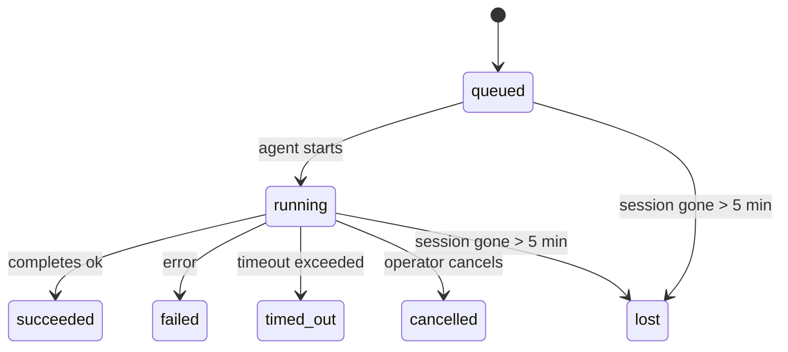

---
read_when:
    - Перегляд фонової роботи, що виконується або нещодавно завершилася
    - Налагодження збоїв доставки для відокремлених запусків агента
    - Розуміння того, як фонові запуски пов’язані із сеансами, cron і heartbeat
summary: Відстеження фонових завдань для запусків ACP, субагентів, ізольованих cron-завдань і операцій CLI
title: Фонові завдання
x-i18n:
    generated_at: "2026-04-09T11:48:34Z"
    model: gpt-5.4
    provider: openai
    source_hash: d7b5ba41f1025e0089986342ce85698bc62f676439c3ccf03f3ed146beb1b1ac
    source_path: automation/tasks.md
    workflow: 15
---

# Фонові завдання

> **Шукаєте планування?** Див. [Автоматизація й завдання](/uk/automation), щоб вибрати правильний механізм. Ця сторінка присвячена **відстеженню** фонової роботи, а не її плануванню.

Фонові завдання відстежують роботу, яка виконується **поза межами вашого основного сеансу розмови**:
запуски ACP, створення субагентів, виконання ізольованих cron-завдань і операції, ініційовані через CLI.

Завдання **не** замінюють сеанси, cron-завдання або heartbeat — це **журнал активності**, який фіксує, яка відокремлена робота відбулася, коли саме і чи була вона успішною.

<Note>
Не кожен запуск агента створює завдання. Heartbeat-цикли та звичайний інтерактивний чат цього не роблять. Усі cron-виконання, ACP-створення, створення субагентів і команди агента CLI — так.
</Note>

## Коротко

- Завдання — це **записи**, а не планувальники: cron і heartbeat вирішують, _коли_ виконується робота, а завдання відстежують, _що сталося_.
- ACP, субагенти, усі cron-завдання та операції CLI створюють завдання. Heartbeat-цикли — ні.
- Кожне завдання проходить через `queued → running → terminal` (succeeded, failed, timed_out, cancelled або lost).
- Cron-завдання залишаються активними, поки середовище виконання cron усе ще володіє завданням; CLI-завдання на основі чату залишаються активними лише доти, доки активний їхній контекст запуску.
- Завершення працює за push-моделлю: відокремлена робота може напряму сповістити або пробудити
  сеанс/heartbeat запитувача після завершення, тому цикли опитування стану
  зазвичай є невдалим підходом.
- Ізольовані cron-запуски та завершення субагентів у межах best-effort очищають відстежувані вкладки/процеси браузера для свого дочірнього сеансу перед фінальним обліком очищення.
- Доставка для ізольованого cron пригнічує застарілі проміжні відповіді батьківського процесу, поки
  дочірня робота субагентів іще завершується, і надає перевагу фінальному дочірньому
  виводу, якщо він надходить до доставки.
- Сповіщення про завершення доставляються безпосередньо в канал або ставляться в чергу до наступного heartbeat.
- `openclaw tasks list` показує всі завдання; `openclaw tasks audit` виявляє проблеми.
- Термінальні записи зберігаються 7 днів, а потім автоматично очищаються.

## Швидкий старт

```bash
# Показати всі завдання (спочатку найновіші)
openclaw tasks list

# Фільтрувати за середовищем виконання або статусом
openclaw tasks list --runtime acp
openclaw tasks list --status running

# Показати подробиці конкретного завдання (за ID, ID запуску або ключем сеансу)
openclaw tasks show <lookup>

# Скасувати запущене завдання (завершує дочірній сеанс)
openclaw tasks cancel <lookup>

# Змінити політику сповіщень для завдання
openclaw tasks notify <lookup> state_changes

# Запустити аудит стану
openclaw tasks audit

# Переглянути або застосувати обслуговування
openclaw tasks maintenance
openclaw tasks maintenance --apply

# Переглянути стан TaskFlow
openclaw tasks flow list
openclaw tasks flow show <lookup>
openclaw tasks flow cancel <lookup>
```

## Що створює завдання

| Джерело                | Тип середовища виконання | Коли створюється запис завдання                      | Типова політика сповіщень |
| ---------------------- | ------------------------ | ---------------------------------------------------- | ------------------------- |
| Фонові запуски ACP     | `acp`                    | Створення дочірнього сеансу ACP                      | `done_only`               |
| Оркестрація субагентів | `subagent`               | Створення субагента через `sessions_spawn`           | `done_only`               |
| Cron-завдання (усі типи) | `cron`                 | Кожне виконання cron (основний сеанс та ізольований) | `silent`                  |
| Операції CLI           | `cli`                    | Команди `openclaw agent`, що виконуються через шлюз | `silent`                  |
| Медіазавдання агента   | `cli`                    | Запуски `video_generate` на основі сеансу            | `silent`                  |

Cron-завдання основного сеансу типово використовують політику сповіщень `silent` — вони створюють записи для відстеження, але не генерують сповіщень. Ізольовані cron-завдання також типово мають `silent`, але помітніші, бо виконуються у власному сеансі.

Запуски `video_generate` на основі сеансу також використовують політику сповіщень `silent`. Вони все одно створюють записи завдань, але завершення передається назад у вихідний сеанс агента як внутрішнє пробудження, щоб агент міг сам написати подальше повідомлення й прикріпити готове відео. Якщо ви вмикаєте `tools.media.asyncCompletion.directSend`, асинхронні завершення `music_generate` і `video_generate` спочатку намагаються доставити результат безпосередньо в канал, а вже потім повертаються до шляху пробудження сеансу запитувача.

Поки завдання `video_generate` на основі сеансу ще активне, інструмент також виконує роль запобіжника: повторні виклики `video_generate` у тому самому сеансі повертають статус активного завдання замість запуску другого паралельного генерування. Використовуйте `action: "status"`, якщо вам потрібен явний запит прогресу/стану з боку агента.

**Що не створює завдання:**

- Heartbeat-цикли — основний сеанс; див. [Heartbeat](/uk/gateway/heartbeat)
- Звичайні інтерактивні цикли чату
- Прямі відповіді `/command`

## Життєвий цикл завдання



| Статус      | Що це означає                                                           |
| ----------- | ----------------------------------------------------------------------- |
| `queued`    | Створено, очікує на запуск агента                                       |
| `running`   | Цикл агента активно виконується                                         |
| `succeeded` | Успішно завершено                                                       |
| `failed`    | Завершено з помилкою                                                    |
| `timed_out` | Перевищено налаштований тайм-аут                                        |
| `cancelled` | Зупинено оператором через `openclaw tasks cancel`                       |
| `lost`      | Середовище виконання втратило авторитетний базовий стан після 5-хвилинного пільгового періоду |

Переходи відбуваються автоматично — коли пов’язаний запуск агента завершується, статус завдання оновлюється відповідно.

`lost` залежить від середовища виконання:

- Завдання ACP: зникли метадані дочірнього сеансу ACP.
- Завдання субагента: дочірній сеанс зник зі сховища цільового агента.
- Cron-завдання: середовище виконання cron більше не відстежує завдання як активне.
- Завдання CLI: завдання ізольованого дочірнього сеансу використовують дочірній сеанс; CLI-завдання на основі чату натомість використовують живий контекст запуску, тому завислі рядки сеансу каналу/групи/прямого чату не підтримують їхню активність.

## Доставка та сповіщення

Коли завдання досягає термінального стану, OpenClaw сповіщає вас. Є два шляхи доставки:

**Пряма доставка** — якщо завдання має ціль каналу (`requesterOrigin`), повідомлення про завершення надсилається прямо в цей канал (Telegram, Discord, Slack тощо). Для завершень субагента OpenClaw також зберігає прив’язану маршрутизацію thread/topic, якщо вона доступна, і може заповнити відсутній `to` / обліковий запис зі збереженого маршруту сеансу запитувача (`lastChannel` / `lastTo` / `lastAccountId`), перш ніж відмовитися від прямої доставки.

**Доставка через чергу сеансу** — якщо пряма доставка не вдається або не задано origin, оновлення ставиться в чергу як системна подія в сеансі запитувача й з’являється під час наступного heartbeat.

<Tip>
Завершення завдання негайно запускає пробудження heartbeat, тож ви швидко бачите результат — вам не потрібно чекати на наступний запланований heartbeat-тик.
</Tip>

Це означає, що типовий робочий процес побудовано на push-моделі: достатньо один раз запустити
відокремлену роботу, а далі дозволити середовищу виконання пробудити або сповістити вас після завершення. Опитуйте стан завдання лише тоді, коли
потрібні налагодження, втручання або явний аудит.

### Політики сповіщень

Керуйте тим, скільки інформації ви отримуєте про кожне завдання:

| Політика              | Що доставляється                                                           |
| --------------------- | -------------------------------------------------------------------------- |
| `done_only` (типово)  | Лише термінальний стан (succeeded, failed тощо) — **це типове значення**   |
| `state_changes`       | Кожен перехід стану та оновлення прогресу                                  |
| `silent`              | Нічого                                                                      |

Змініть політику, поки завдання виконується:

```bash
openclaw tasks notify <lookup> state_changes
```

## Довідка CLI

### `tasks list`

```bash
openclaw tasks list [--runtime <acp|subagent|cron|cli>] [--status <status>] [--json]
```

Стовпці виводу: ID завдання, тип, статус, доставка, ID запуску, дочірній сеанс, зведення.

### `tasks show`

```bash
openclaw tasks show <lookup>
```

Маркер пошуку може бути ID завдання, ID запуску або ключем сеансу. Показує повний запис, зокрема часові дані, стан доставки, помилку й термінальне зведення.

### `tasks cancel`

```bash
openclaw tasks cancel <lookup>
```

Для завдань ACP і субагентів це завершує дочірній сеанс. Для завдань, що відстежуються через CLI, скасування фіксується в реєстрі завдань (окремого дескриптора дочірнього середовища виконання немає). Статус переходить у `cancelled`, і коли це доречно, надсилається сповіщення про доставку.

### `tasks notify`

```bash
openclaw tasks notify <lookup> <done_only|state_changes|silent>
```

### `tasks audit`

```bash
openclaw tasks audit [--json]
```

Виявляє операційні проблеми. Якщо проблеми виявлено, результати також з’являються в `openclaw status`.

| Результат                   | Серйозність | Умова                                                   |
| --------------------------- | ----------- | ------------------------------------------------------- |
| `stale_queued`              | warn        | У стані черги понад 10 хвилин                           |
| `stale_running`             | error       | Виконується понад 30 хвилин                             |
| `lost`                      | error       | Зникло володіння завданням із боку середовища виконання |
| `delivery_failed`           | warn        | Доставка не вдалася, і політика сповіщень не `silent`   |
| `missing_cleanup`           | warn        | Термінальне завдання без часової позначки очищення      |
| `inconsistent_timestamps`   | warn        | Порушення часової послідовності (наприклад, завершено раніше, ніж розпочато) |

### `tasks maintenance`

```bash
openclaw tasks maintenance [--json]
openclaw tasks maintenance --apply [--json]
```

Використовуйте це, щоб переглянути або застосувати звіряння, позначення очищення та очищення застарілих записів
для завдань і стану Task Flow.

Звіряння залежить від середовища виконання:

- Завдання ACP/субагентів перевіряють свій базовий дочірній сеанс.
- Cron-завдання перевіряють, чи середовище виконання cron усе ще володіє завданням.
- CLI-завдання на основі чату перевіряють базовий живий контекст запуску, а не лише рядок сеансу чату.

Очищення після завершення також залежить від середовища виконання:

- Після завершення субагента в межах best-effort закриваються відстежувані вкладки/процеси браузера для дочірнього сеансу, перш ніж продовжується очищення з оголошенням.
- Після завершення ізольованого cron у межах best-effort закриваються відстежувані вкладки/процеси браузера для cron-сеансу, перш ніж виконання повністю згортається.
- Доставка для ізольованого cron за потреби очікує завершення дочірніх дій субагента
  і пригнічує застарілий текст підтвердження від батьківського процесу замість його оголошення.
- Доставка завершення субагента надає перевагу найновішому видимому тексту помічника; якщо його немає, використовується очищений найновіший текст tool/toolResult, а запуски лише з викликом інструмента, що завершилися тайм-аутом, можуть стискатися до короткого підсумку часткового прогресу.
- Помилки очищення не маскують реальний результат завдання.

### `tasks flow list|show|cancel`

```bash
openclaw tasks flow list [--status <status>] [--json]
openclaw tasks flow show <lookup> [--json]
openclaw tasks flow cancel <lookup>
```

Використовуйте це, коли вас цікавить саме оркеструвальний Task Flow,
а не окремий запис фонового завдання.

## Дошка завдань чату (`/tasks`)

Використовуйте `/tasks` у будь-якому сеансі чату, щоб побачити фонові завдання, пов’язані з цим сеансом. Дошка показує
активні та нещодавно завершені завдання з середовищем виконання, статусом, часом і деталями прогресу або помилки.

Коли поточний сеанс не має видимих пов’язаних завдань, `/tasks` повертається до локальних для агента лічильників завдань,
щоб ви все одно мали загальний огляд без розкриття деталей інших сеансів.

Для повного журналу оператора використовуйте CLI: `openclaw tasks list`.

## Інтеграція статусу (навантаження завдань)

`openclaw status` містить короткий підсумок завдань:

```
Tasks: 3 queued · 2 running · 1 issues
```

Підсумок повідомляє:

- **active** — кількість `queued` + `running`
- **failures** — кількість `failed` + `timed_out` + `lost`
- **byRuntime** — розподіл за `acp`, `subagent`, `cron`, `cli`

І `/status`, і інструмент `session_status` використовують знімок завдань з урахуванням очищення: активні завдання
мають пріоритет, застарілі завершені рядки приховуються, а нещодавні збої показуються лише тоді, коли не лишається
активної роботи. Це дає змогу картці статусу зосереджуватися на тому, що важливо саме зараз.

## Зберігання та обслуговування

### Де зберігаються завдання

Записи завдань зберігаються в SQLite за адресою:

```
$OPENCLAW_STATE_DIR/tasks/runs.sqlite
```

Реєстр завантажується в пам’ять під час запуску шлюзу й синхронізує записи до SQLite для надійності після перезапусків.

### Автоматичне обслуговування

Очищувач запускається кожні **60 секунд** і виконує три завдання:

1. **Звіряння** — перевіряє, чи активні завдання все ще мають авторитетну базову підтримку середовища виконання. Завдання ACP/субагентів використовують стан дочірнього сеансу, cron-завдання — володіння активним завданням, а CLI-завдання на основі чату — базовий контекст запуску. Якщо цей базовий стан відсутній понад 5 хвилин, завдання позначається як `lost`.
2. **Позначення очищення** — встановлює часову мітку `cleanupAfter` для термінальних завдань (`endedAt` + 7 днів).
3. **Очищення** — видаляє записи, що перевищили дату `cleanupAfter`.

**Термін зберігання**: записи термінальних завдань зберігаються **7 днів**, а потім автоматично очищаються. Жодного налаштування не потрібно.

## Як завдання пов’язані з іншими системами

### Завдання і Task Flow

[Task Flow](/uk/automation/taskflow) — це шар оркестрації потоків над фоновими завданнями. Один потік може координувати кілька завдань протягом свого життєвого циклу, використовуючи керовані або дзеркальні режими синхронізації. Використовуйте `openclaw tasks`, щоб переглядати окремі записи завдань, і `openclaw tasks flow`, щоб переглядати оркеструвальний потік.

Докладніше див. у [Task Flow](/uk/automation/taskflow).

### Завдання і cron

**Визначення** cron-завдання зберігається в `~/.openclaw/cron/jobs.json`. **Кожне** виконання cron створює запис завдання — як для основного сеансу, так і для ізольованого. Cron-завдання основного сеансу типово мають політику сповіщень `silent`, тому вони відстежуються без створення сповіщень.

Див. [Cron Jobs](/uk/automation/cron-jobs).

### Завдання і heartbeat

Запуски heartbeat — це цикли основного сеансу, вони не створюють записи завдань. Коли завдання завершується, воно може спричинити пробудження heartbeat, щоб ви швидко побачили результат.

Див. [Heartbeat](/uk/gateway/heartbeat).

### Завдання і сеанси

Завдання може посилатися на `childSessionKey` (де виконується робота) і `requesterSessionKey` (хто її запустив). Сеанси — це контекст розмови; завдання — це відстеження активності поверх нього.

### Завдання і запуски агента

`runId` завдання пов’язує його із запуском агента, що виконує роботу. Події життєвого циклу агента (start, end, error) автоматично оновлюють статус завдання — вам не потрібно керувати життєвим циклом вручну.

## Пов’язане

- [Автоматизація й завдання](/uk/automation) — усі механізми автоматизації з першого погляду
- [Task Flow](/uk/automation/taskflow) — оркестрація потоків над завданнями
- [Заплановані завдання](/uk/automation/cron-jobs) — планування фонової роботи
- [Heartbeat](/uk/gateway/heartbeat) — періодичні цикли основного сеансу
- [CLI: Tasks](/cli/index#tasks) — довідка з команд CLI
