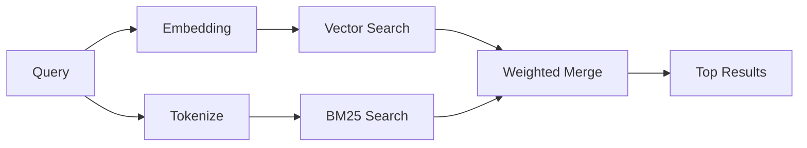

---
read_when:
    - Ви хочете зрозуміти, як працює memory_search
    - Ви хочете вибрати постачальника ембедингів
    - Ви хочете налаштувати якість пошуку
summary: Як пошук у пам’яті знаходить релевантні нотатки за допомогою ембедингів і гібридного пошуку
title: Пошук у пам’яті
x-i18n:
    generated_at: "2026-04-15T09:41:08Z"
    model: gpt-5.4
    provider: openai
    source_hash: f5757aa8fe8f7fec30ef5c826f72230f591ce4cad591d81a091189d50d4262ed
    source_path: concepts/memory-search.md
    workflow: 15
---

# Пошук у пам’яті

`memory_search` знаходить релевантні нотатки з ваших файлів пам’яті, навіть якщо
формулювання відрізняється від оригінального тексту. Це працює шляхом індексації пам’яті на невеликі
фрагменти та пошуку по них за допомогою ембедингів, ключових слів або обох підходів.

## Швидкий старт

Якщо у вас налаштовано підписку GitHub Copilot або API-ключ OpenAI, Gemini, Voyage чи Mistral,
пошук у пам’яті працює автоматично. Щоб явно вказати постачальника:

```json5
{
  agents: {
    defaults: {
      memorySearch: {
        provider: "openai", // або "gemini", "local", "ollama" тощо
      },
    },
  },
}
```

Для локальних ембедингів без API-ключа використовуйте `provider: "local"` (потребує
node-llama-cpp).

## Підтримувані постачальники

| Постачальник  | ID               | Потрібен API-ключ | Примітки                                             |
| ------------- | ---------------- | ----------------- | ---------------------------------------------------- |
| Bedrock       | `bedrock`        | Ні                | Визначається автоматично, коли спрацьовує ланцюжок облікових даних AWS |
| Gemini        | `gemini`         | Так               | Підтримує індексацію зображень/аудіо                 |
| GitHub Copilot | `github-copilot` | Ні               | Визначається автоматично, використовує підписку Copilot |
| Local         | `local`          | Ні                | Модель GGUF, завантаження ~0.6 ГБ                    |
| Mistral       | `mistral`        | Так               | Визначається автоматично                             |
| Ollama        | `ollama`         | Ні                | Локальний, потрібно вказати явно                     |
| OpenAI        | `openai`         | Так               | Визначається автоматично, швидкий                    |
| Voyage        | `voyage`         | Так               | Визначається автоматично                             |

## Як працює пошук

OpenClaw запускає два шляхи отримання даних паралельно та об’єднує результати:



- **Векторний пошук** знаходить нотатки зі схожим змістом ("gateway host" відповідає
  "машина, на якій запущено OpenClaw").
- **Пошук за ключовими словами BM25** знаходить точні збіги (ID, рядки помилок, ключі
  конфігурації).

Якщо доступний лише один шлях (немає ембедингів або немає FTS), інший працює окремо.

Коли ембединги недоступні, OpenClaw усе одно використовує лексичне ранжування поверх результатів FTS замість того, щоб повертатися лише до простого впорядкування за точними збігами. У цьому деградованому режимі підвищуються фрагменти з кращим покриттям термінів запиту та релевантними шляхами до файлів, що зберігає корисну повноту пошуку навіть без `sqlite-vec` або постачальника ембедингів.

## Покращення якості пошуку

Дві необов’язкові функції допомагають, якщо у вас велика історія нотаток:

### Часове згасання

Старі нотатки поступово втрачають вагу в ранжуванні, тож новіша інформація
з’являється першою. За стандартного періоду напіврозпаду 30 днів нотатка з минулого місяця матиме 50%
від своєї початкової ваги. Для сталих файлів, таких як `MEMORY.md`, згасання ніколи не застосовується.

<Tip>
Увімкніть часове згасання, якщо у вашого агента є щоденні нотатки за кілька місяців і застаріла
інформація постійно випереджає новіший контекст.
</Tip>

### MMR (різноманітність)

Зменшує кількість надлишкових результатів. Якщо п’ять нотаток усі згадують ту саму конфігурацію роутера, MMR
гарантує, що верхні результати охоплюватимуть різні теми, а не повторюватимуться.

<Tip>
Увімкніть MMR, якщо `memory_search` постійно повертає майже дубльовані фрагменти з
різних щоденних нотаток.
</Tip>

### Увімкнути обидва

```json5
{
  agents: {
    defaults: {
      memorySearch: {
        query: {
          hybrid: {
            mmr: { enabled: true },
            temporalDecay: { enabled: true },
          },
        },
      },
    },
  },
}
```

## Мультимодальна пам’ять

З Gemini Embedding 2 ви можете індексувати зображення та аудіофайли разом із
Markdown. Пошукові запити залишаються текстовими, але вони зіставляються з візуальним і аудіоконтентом. Див.
[довідник з конфігурації пам’яті](/uk/reference/memory-config) для
налаштування.

## Пошук у пам’яті сеансів

Ви можете за бажанням індексувати транскрипти сеансів, щоб `memory_search` міг пригадувати
попередні розмови. Це вмикається вручну через
`memorySearch.experimental.sessionMemory`. Див.
[довідник з конфігурації](/uk/reference/memory-config) для подробиць.

## Усунення несправностей

**Немає результатів?** Виконайте `openclaw memory status`, щоб перевірити індекс. Якщо він порожній, виконайте
`openclaw memory index --force`.

**Лише збіги за ключовими словами?** Можливо, ваш постачальник ембедингів не налаштований. Перевірте
`openclaw memory status --deep`.

**Текст CJK не знаходиться?** Перебудуйте індекс FTS за допомогою
`openclaw memory index --force`.

## Подальше читання

- [Active Memory](/uk/concepts/active-memory) -- пам’ять субагента для інтерактивних сеансів чату
- [Пам’ять](/uk/concepts/memory) -- структура файлів, бекенди, інструменти
- [Довідник з конфігурації пам’яті](/uk/reference/memory-config) -- усі параметри конфігурації
