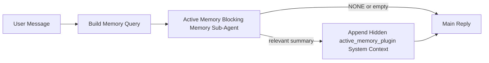

---
read_when:
    - 你想了解活跃记忆的用途
    - 你想为一个对话式智能体开启活跃记忆
    - 你想调整活跃记忆的行为，而不在所有地方都启用它
summary: 一个由插件拥有的阻塞式记忆子智能体，会将相关记忆注入到交互式聊天会话中
title: 活跃记忆
x-i18n:
    generated_at: "2026-04-12T19:24:37Z"
    model: gpt-5.4
    provider: openai
    source_hash: 10fd37790ef54498679d10718c4874b3683824a4a198542e9851f219e736b58b
    source_path: concepts/active-memory.md
    workflow: 15
---

# 活跃记忆

活跃记忆是一个可选的、由插件拥有的阻塞式记忆子智能体，会在符合条件的对话式会话中，于主回复生成之前运行。

它之所以存在，是因为大多数记忆系统虽然能力很强，但都是被动响应的。它们依赖主智能体来决定何时搜索记忆，或者依赖用户说出像“记住这个”或“搜索记忆”这样的话。到了那时，原本可以让回复显得自然的记忆介入时机其实已经错过了。

活跃记忆会在主回复生成之前，给系统一次有边界限制的机会来提取相关记忆。

## 将此内容粘贴到你的智能体中

如果你想为你的智能体启用活跃记忆，并采用一个自包含、默认安全的设置，请将以下内容粘贴进去：

```json5
{
  plugins: {
    entries: {
      "active-memory": {
        enabled: true,
        config: {
          enabled: true,
          agents: ["main"],
          allowedChatTypes: ["direct"],
          modelFallback: "google/gemini-3-flash",
          queryMode: "recent",
          promptStyle: "balanced",
          timeoutMs: 15000,
          maxSummaryChars: 220,
          persistTranscripts: false,
          logging: true,
        },
      },
    },
  },
}
```

这会为 `main` 智能体开启该插件，默认将其限制在私信风格的会话中，优先让它继承当前会话的模型，并且仅在没有可用的显式模型或继承模型时，才使用配置的后备模型。

之后，重启 Gateway 网关：

```bash
openclaw gateway
```

如果你想在对话中实时查看它的行为：

```text
/verbose on
/trace on
```

## 开启活跃记忆

最安全的设置方式是：

1. 启用插件
2. 指定一个对话式智能体
3. 仅在调优期间保持日志开启

先在 `openclaw.json` 中加入以下内容：

```json5
{
  plugins: {
    entries: {
      "active-memory": {
        enabled: true,
        config: {
          agents: ["main"],
          allowedChatTypes: ["direct"],
          modelFallback: "google/gemini-3-flash",
          queryMode: "recent",
          promptStyle: "balanced",
          timeoutMs: 15000,
          maxSummaryChars: 220,
          persistTranscripts: false,
          logging: true,
        },
      },
    },
  },
}
```

然后重启 Gateway 网关：

```bash
openclaw gateway
```

这表示：

- `plugins.entries.active-memory.enabled: true` 会启用该插件
- `config.agents: ["main"]` 只为 `main` 智能体启用活跃记忆
- `config.allowedChatTypes: ["direct"]` 默认只在私信风格的会话中启用活跃记忆
- 如果未设置 `config.model`，活跃记忆会优先继承当前会话模型
- `config.modelFallback` 可选，用于为记忆召回提供你自己的后备提供商 / 模型
- `config.promptStyle: "balanced"` 会为 `recent` 模式使用默认的通用提示风格
- 活跃记忆仍然只会在符合条件的交互式持久聊天会话中运行

## 如何查看它

活跃记忆会为模型注入隐藏的系统上下文。它不会向客户端暴露原始的 `<active_memory_plugin>...</active_memory_plugin>` 标签。

## 会话开关

当你想在不修改配置的情况下，为当前聊天会话暂停或恢复活跃记忆时，请使用插件命令：

```text
/active-memory status
/active-memory off
/active-memory on
```

这是会话级的。它不会更改
`plugins.entries.active-memory.enabled`、智能体目标设置或其他全局配置。

如果你希望该命令写入配置，并为所有会话暂停或恢复活跃记忆，请使用显式的全局形式：

```text
/active-memory status --global
/active-memory off --global
/active-memory on --global
```

全局形式会写入 `plugins.entries.active-memory.config.enabled`。它会保留
`plugins.entries.active-memory.enabled` 为开启状态，这样你之后仍可使用该命令重新开启活跃记忆。

如果你想在实时会话中查看活跃记忆正在做什么，请开启与你想查看输出相匹配的会话开关：

```text
/verbose on
/trace on
```

启用后，OpenClaw 可以显示：

- 当 `/verbose on` 时，显示一条活跃记忆状态行，例如 `Active Memory: ok 842ms recent 34 chars`
- 当 `/trace on` 时，显示一条可读的调试摘要，例如 `Active Memory Debug: Lemon pepper wings with blue cheese.`

这些行来自同一次活跃记忆处理流程，也就是为隐藏系统上下文提供内容的那次处理，但它们是面向人类格式化的，而不是暴露原始提示标记。它们会作为普通助手回复之后的一条后续诊断消息发送，因此像 Telegram 这样的渠道客户端不会在回复前闪现一个单独的诊断气泡。

默认情况下，这个阻塞式记忆子智能体的转录是临时的，并会在运行完成后删除。

示例流程：

```text
/verbose on
/trace on
what wings should i order?
```

预期的可见回复形式：

```text
...normal assistant reply...

🧩 Active Memory: ok 842ms recent 34 chars
🔎 Active Memory Debug: Lemon pepper wings with blue cheese.
```

## 何时运行

活跃记忆使用两个门槛条件：

1. **配置显式启用**
   必须启用该插件，并且当前智能体 id 必须出现在
   `plugins.entries.active-memory.config.agents` 中。
2. **严格的运行时资格判定**
   即使已启用并已被指定，活跃记忆也只会在符合条件的交互式持久聊天会话中运行。

实际规则是：

```text
plugin enabled
+
agent id targeted
+
allowed chat type
+
eligible interactive persistent chat session
=
active memory runs
```

如果其中任何一项不满足，活跃记忆就不会运行。

## 会话类型

`config.allowedChatTypes` 控制哪些类型的对话可以运行活跃记忆。

默认值是：

```json5
allowedChatTypes: ["direct"]
```

这意味着活跃记忆默认会在私信风格的会话中运行，但不会在群组或渠道会话中运行，除非你显式为它们启用。

示例：

```json5
allowedChatTypes: ["direct"]
```

```json5
allowedChatTypes: ["direct", "group"]
```

```json5
allowedChatTypes: ["direct", "group", "channel"]
```

## 在哪里运行

活跃记忆是一项对话增强功能，而不是平台范围内的推理功能。

| Surface | 运行活跃记忆？ |
| ------------------------------------------------------------------- | ------------------------------------------------------- |
| Control UI / web chat 持久会话 | 是，如果插件已启用且智能体已被指定 |
| 同一持久聊天路径上的其他交互式渠道会话 | 是，如果插件已启用且智能体已被指定 |
| 无头单次运行 | 否 |
| 心跳 / 后台运行 | 否 |
| 通用内部 `agent-command` 路径 | 否 |
| 子智能体 / 内部辅助执行 | 否 |

## 为什么要使用它

在以下情况下使用活跃记忆：

- 会话是持久的并且面向用户
- 智能体拥有值得搜索的有意义长期记忆
- 连续性和个性化比原始提示的确定性更重要

它尤其适用于：

- 稳定偏好
- 重复习惯
- 应当自然浮现的长期用户上下文

它不适合用于：

- 自动化
- 内部工作进程
- 单次 API 任务
- 任何会让隐藏个性化显得突兀的场景

## 工作原理

运行时结构如下：



这个阻塞式记忆子智能体只能使用：

- `memory_search`
- `memory_get`

如果连接较弱，它应返回 `NONE`。

## 查询模式

`config.queryMode` 控制阻塞式记忆子智能体能看到多少对话内容。

## 提示风格

`config.promptStyle` 控制阻塞式记忆子智能体在决定是否返回记忆时有多积极或多严格。

可用风格：

- `balanced`：适用于 `recent` 模式的通用默认风格
- `strict`：最不积极；适合你希望尽量减少附近上下文串扰时使用
- `contextual`：最有利于连续性；适合对话历史应当更重要时使用
- `recall-heavy`：即使匹配较弱但仍合理，也更愿意提取记忆
- `precision-heavy`：除非匹配非常明显，否则会强烈偏向返回 `NONE`
- `preference-only`：针对收藏、习惯、日常、口味和重复出现的个人事实进行了优化

当未设置 `config.promptStyle` 时，默认映射如下：

```text
message -> strict
recent -> balanced
full -> contextual
```

如果你显式设置了 `config.promptStyle`，则以该覆盖值为准。

示例：

```json5
promptStyle: "preference-only"
```

## 模型后备策略

如果未设置 `config.model`，活跃记忆会按以下顺序尝试解析模型：

```text
explicit plugin model
-> current session model
-> agent primary model
-> optional configured fallback model
```

`config.modelFallback` 控制已配置的后备步骤。

可选的自定义后备：

```json5
modelFallback: "google/gemini-3-flash"
```

如果无法解析出显式模型、继承模型或已配置的后备模型，活跃记忆将在该轮跳过记忆召回。

`config.modelFallbackPolicy` 仅作为已弃用的兼容字段保留，用于支持旧配置。
它不再改变运行时行为。

## 高级逃生阀

这些选项有意不包含在推荐设置中。

`config.thinking` 可以覆盖阻塞式记忆子智能体的思考级别：

```json5
thinking: "medium"
```

默认值：

```json5
thinking: "off"
```

默认不要启用它。活跃记忆运行在回复路径中，因此额外的思考时间会直接增加用户可见的延迟。

`config.promptAppend` 会在默认的活跃记忆提示之后、对话上下文之前添加额外的操作员指令：

```json5
promptAppend: "Prefer stable long-term preferences over one-off events."
```

`config.promptOverride` 会替换默认的活跃记忆提示。OpenClaw
仍会在其后附加对话上下文：

```json5
promptOverride: "You are a memory search agent. Return NONE or one compact user fact."
```

除非你是在有意测试不同的召回契约，否则不推荐进行提示自定义。默认提示已经过调优，会为主模型返回 `NONE` 或紧凑的用户事实上下文。

### `message`

只发送最新的一条用户消息。

```text
Latest user message only
```

适用于以下情况：

- 你想要最快的行为
- 你希望最强烈地偏向稳定偏好召回
- 后续轮次不需要对话上下文

推荐超时时间：

- 从 `3000` 到 `5000` ms 左右开始

### `recent`

发送最新的一条用户消息以及一小段最近的对话尾部内容。

```text
Recent conversation tail:
user: ...
assistant: ...
user: ...

Latest user message:
...
```

适用于以下情况：

- 你想在速度与对话语境之间取得更好的平衡
- 后续问题常常依赖最近几轮对话

推荐超时时间：

- 从 `15000` ms 开始

### `full`

将完整对话发送给阻塞式记忆子智能体。

```text
Full conversation context:
user: ...
assistant: ...
user: ...
...
```

适用于以下情况：

- 最强的召回质量比延迟更重要
- 对话中在线程较早位置包含重要的铺垫信息

推荐超时时间：

- 相较于 `message` 或 `recent` 明显提高
- 依据线程大小，从 `15000` ms 或更高开始

一般来说，超时时间应随着上下文大小而增加：

```text
message < recent < full
```

## 转录持久化

活跃记忆阻塞式记忆子智能体的运行会在阻塞式记忆子智能体调用期间创建一个真实的 `session.jsonl` 转录文件。

默认情况下，这个转录文件是临时的：

- 它会写入临时目录
- 它仅用于这次阻塞式记忆子智能体运行
- 运行结束后会立即删除

如果你想将这些阻塞式记忆子智能体转录保留在磁盘上以便调试或检查，请显式开启持久化：

```json5
{
  plugins: {
    entries: {
      "active-memory": {
        enabled: true,
        config: {
          agents: ["main"],
          persistTranscripts: true,
          transcriptDir: "active-memory",
        },
      },
    },
  },
}
```

启用后，活跃记忆会将转录存储在目标智能体会话文件夹下的单独目录中，而不是主用户对话转录路径中。

默认布局在概念上如下所示：

```text
agents/<agent>/sessions/active-memory/<blocking-memory-sub-agent-session-id>.jsonl
```

你可以通过 `config.transcriptDir` 更改这个相对的子目录。

请谨慎使用：

- 阻塞式记忆子智能体转录在繁忙会话中可能会很快累积
- `full` 查询模式可能会复制大量对话上下文
- 这些转录包含隐藏的提示上下文和召回的记忆

## 配置

所有活跃记忆配置都位于：

```text
plugins.entries.active-memory
```

最重要的字段有：

| Key | Type | Meaning |
| --------------------------- | ---------------------------------------------------------------------------------------------------- | ------------------------------------------------------------------------------------------------------ |
| `enabled` | `boolean` | 启用插件本身 |
| `config.agents` | `string[]` | 可使用活跃记忆的智能体 id |
| `config.model` | `string` | 可选的阻塞式记忆子智能体模型引用；未设置时，活跃记忆会使用当前会话模型 |
| `config.queryMode` | `"message" \| "recent" \| "full"` | 控制阻塞式记忆子智能体可以看到多少对话内容 |
| `config.promptStyle` | `"balanced" \| "strict" \| "contextual" \| "recall-heavy" \| "precision-heavy" \| "preference-only"` | 控制阻塞式记忆子智能体在决定是否返回记忆时有多积极或多严格 |
| `config.thinking` | `"off" \| "minimal" \| "low" \| "medium" \| "high" \| "xhigh" \| "adaptive"` | 阻塞式记忆子智能体的高级思考覆盖设置；默认是 `off` 以保证速度 |
| `config.promptOverride` | `string` | 高级完整提示替换；不建议在正常使用中启用 |
| `config.promptAppend` | `string` | 附加到默认或覆盖提示后的高级额外指令 |
| `config.timeoutMs` | `number` | 阻塞式记忆子智能体的硬超时时间 |
| `config.maxSummaryChars` | `number` | 活跃记忆摘要允许的最大总字符数 |
| `config.logging` | `boolean` | 在调优期间输出活跃记忆日志 |
| `config.persistTranscripts` | `boolean` | 将阻塞式记忆子智能体转录保留在磁盘上，而不是删除临时文件 |
| `config.transcriptDir` | `string` | 位于智能体会话文件夹下的相对阻塞式记忆子智能体转录目录 |

实用的调优字段：

| Key | Type | Meaning |
| ----------------------------- | -------- | ------------------------------------------------------------- |
| `config.maxSummaryChars` | `number` | 活跃记忆摘要允许的最大总字符数 |
| `config.recentUserTurns` | `number` | 当 `queryMode` 为 `recent` 时，要包含的先前用户轮次数 |
| `config.recentAssistantTurns` | `number` | 当 `queryMode` 为 `recent` 时，要包含的先前助手轮次数 |
| `config.recentUserChars` | `number` | 每个最近用户轮次的最大字符数 |
| `config.recentAssistantChars` | `number` | 每个最近助手轮次的最大字符数 |
| `config.cacheTtlMs` | `number` | 对重复的相同查询进行缓存复用 |

## 推荐设置

从 `recent` 开始。

```json5
{
  plugins: {
    entries: {
      "active-memory": {
        enabled: true,
        config: {
          agents: ["main"],
          queryMode: "recent",
          promptStyle: "balanced",
          timeoutMs: 15000,
          maxSummaryChars: 220,
          logging: true,
        },
      },
    },
  },
}
```

如果你想在调优时检查实时行为，请使用 `/verbose on` 查看常规状态行，使用 `/trace on` 查看活跃记忆调试摘要，而不是去寻找单独的活跃记忆调试命令。在聊天渠道中，这些诊断行会在主助手回复之后发送，而不是之前。

然后再根据需要切换到：

- 如果你想降低延迟，使用 `message`
- 如果你认为额外上下文值得更慢的阻塞式记忆子智能体，则使用 `full`

## 调试

如果活跃记忆没有出现在你预期的位置：

1. 确认插件已在 `plugins.entries.active-memory.enabled` 下启用。
2. 确认当前智能体 id 已列在 `config.agents` 中。
3. 确认你正在通过交互式持久聊天会话进行测试。
4. 开启 `config.logging: true` 并观察 Gateway 网关日志。
5. 使用 `openclaw memory status --deep` 验证记忆搜索本身是否正常工作。

如果记忆命中过于嘈杂，请收紧：

- `maxSummaryChars`

如果活跃记忆太慢，请调整：

- 降低 `queryMode`
- 降低 `timeoutMs`
- 减少最近轮次数
- 减少每轮字符上限

## 常见问题

### 嵌入提供商意外变化

活跃记忆使用 `agents.defaults.memorySearch` 下的常规 `memory_search` 流程。这意味着，只有当你的 `memorySearch` 设置需要嵌入来实现你想要的行为时，嵌入提供商设置才是必需项。

在实践中：

- 如果你想使用一个不会被自动检测到的提供商，例如 `ollama`，则**必须**进行显式提供商设置
- 如果自动检测无法为你的环境解析出任何可用的嵌入提供商，则**必须**进行显式提供商设置
- 如果你想要确定性的提供商选择，而不是“第一个可用者获胜”，则**强烈建议**进行显式提供商设置
- 如果自动检测已经解析出你想要的提供商，并且该提供商在你的部署中是稳定的，那么通常**不需要**显式提供商设置

如果未设置 `memorySearch.provider`，OpenClaw 会自动检测第一个可用的嵌入提供商。

这在真实部署中可能会令人困惑：

- 新增的可用 API 密钥可能会改变记忆搜索所使用的提供商
- 某个命令或诊断界面可能会让所选提供商看起来与实时记忆同步或搜索引导过程中实际命中的路径不同
- 托管提供商可能会因配额或速率限制而失败，而这些问题往往只有在活跃记忆开始在每次回复前发起召回搜索后才会显现出来

如果嵌入不可用，而你的 `memorySearch` 设置可以退回到仅词法检索，活跃记忆仍然可以运行，但语义召回质量通常会下降。如果你依赖基于嵌入的召回、多模态索引，或某个特定的本地 / 远程提供商，请显式固定该提供商，而不要依赖自动检测。

常见的固定示例：

OpenAI：

```json5
{
  agents: {
    defaults: {
      memorySearch: {
        provider: "openai",
        model: "text-embedding-3-small",
      },
    },
  },
}
```

Gemini：

```json5
{
  agents: {
    defaults: {
      memorySearch: {
        provider: "gemini",
        model: "gemini-embedding-001",
      },
    },
  },
}
```

Ollama：

```json5
{
  agents: {
    defaults: {
      memorySearch: {
        provider: "ollama",
        model: "nomic-embed-text",
      },
    },
  },
}
```

如果你希望在运行时错误（例如配额耗尽）发生时进行提供商故障切换，仅固定一个提供商是不够的。还要配置一个显式后备：

```json5
{
  agents: {
    defaults: {
      memorySearch: {
        provider: "openai",
        fallback: "gemini",
      },
    },
  },
}
```

### 调试提供商问题

如果活跃记忆很慢、为空，或看起来意外切换了提供商：

- 在复现问题时观察 Gateway 网关日志；查找诸如 `active-memory: ... start|done`、`memory sync failed (search-bootstrap)` 或特定提供商的嵌入错误等日志行
- 开启 `/trace on`，以便在会话中显示由插件拥有的活跃记忆调试摘要
- 如果你还想在每次回复后看到常规的 `🧩 Active Memory: ...` 状态行，请同时开启 `/verbose on`
- 运行 `openclaw memory status --deep` 以检查当前的记忆搜索后端和索引健康状态
- 检查 `agents.defaults.memorySearch.provider` 以及相关的凭证 / 配置，确保你期望的提供商实际上就是运行时可以解析到的那个
- 如果你使用 `ollama`，请确认配置的嵌入模型已安装，例如运行 `ollama list`

示例调试流程：

```text
1. Start the gateway and watch its logs
2. In the chat session, run /trace on
3. Send one message that should trigger Active Memory
4. Compare the chat-visible debug line with the gateway log lines
5. If provider choice is ambiguous, pin agents.defaults.memorySearch.provider explicitly
```

示例：

```json5
{
  agents: {
    defaults: {
      memorySearch: {
        provider: "ollama",
        model: "nomic-embed-text",
      },
    },
  },
}
```

或者，如果你想使用 Gemini 嵌入：

```json5
{
  agents: {
    defaults: {
      memorySearch: {
        provider: "gemini",
      },
    },
  },
}
```

更改提供商后，重启 Gateway 网关，并在开启 `/trace on` 的情况下进行一次新的测试，这样活跃记忆调试行才能反映新的嵌入路径。

## 相关页面

- [记忆搜索](/zh-CN/concepts/memory-search)
- [记忆配置参考](/zh-CN/reference/memory-config)
- [插件 SDK 设置](/zh-CN/plugins/sdk-setup)
