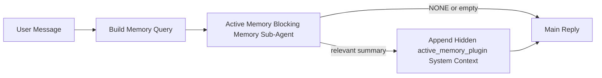

---
read_when:
    - 你想了解活跃记忆的用途
    - 你想为一个对话式智能体启用活跃记忆
    - 你想调整活跃记忆的行为，而不在所有地方都启用它
summary: 一个由插件拥有的、用于阻塞式记忆的子智能体，会将相关记忆注入交互式聊天会话中
title: 活跃记忆
x-i18n:
    generated_at: "2026-04-09T16:29:19Z"
    model: gpt-5.4
    provider: openai
    source_hash: 6a51437df4ae4d9d57764601dfcfcdadb269e2895bf49dc82b9f496c1b3cb341
    source_path: concepts/active-memory.md
    workflow: 15
---

# 活跃记忆

活跃记忆是一个可选的、由插件拥有的阻塞式记忆子智能体，会在符合条件的对话会话中于主回复之前运行。

之所以存在它，是因为大多数记忆系统虽然能力很强，但都是被动响应式的。它们要么依赖主智能体来决定何时搜索记忆，要么依赖用户说出像“记住这个”或“搜索记忆”这样的话。等到了那时，原本可以让回复显得自然的记忆介入时机，往往已经过去了。

活跃记忆为系统提供了一次受限的机会，让它在生成主回复之前先呈现相关记忆。

## 将这段内容粘贴到你的智能体中

如果你想让你的智能体通过一个自包含、默认安全的配置来启用活跃记忆，请将以下内容粘贴进去：

```json5
{
  plugins: {
    entries: {
      "active-memory": {
        enabled: true,
        config: {
          enabled: true,
          agents: ["main"],
          allowedChatTypes: ["direct"],
          modelFallbackPolicy: "default-remote",
          queryMode: "recent",
          promptStyle: "balanced",
          timeoutMs: 15000,
          maxSummaryChars: 220,
          persistTranscripts: false,
          logging: true,
        },
      },
    },
  },
}
```

这会为 `main` 智能体启用该插件，默认将其限制在私信风格的会话中，优先让它继承当前会话模型，并且当没有显式模型或继承模型可用时，仍允许使用内置远程回退。

之后，重启 Gateway 网关：

```bash
node scripts/run-node.mjs gateway --profile dev
```

如果你想在对话中实时检查它：

```text
/verbose on
```

## 启用活跃记忆

最安全的配置方式是：

1. 启用插件
2. 指定一个对话式智能体
3. 仅在调优期间保持日志开启

先在 `openclaw.json` 中加入以下内容：

```json5
{
  plugins: {
    entries: {
      "active-memory": {
        enabled: true,
        config: {
          agents: ["main"],
          allowedChatTypes: ["direct"],
          modelFallbackPolicy: "default-remote",
          queryMode: "recent",
          promptStyle: "balanced",
          timeoutMs: 15000,
          maxSummaryChars: 220,
          persistTranscripts: false,
          logging: true,
        },
      },
    },
  },
}
```

然后重启 Gateway 网关：

```bash
node scripts/run-node.mjs gateway --profile dev
```

这意味着：

- `plugins.entries.active-memory.enabled: true` 会启用该插件
- `config.agents: ["main"]` 只让 `main` 智能体使用活跃记忆
- `config.allowedChatTypes: ["direct"]` 默认只在私信风格的会话中启用活跃记忆
- 如果未设置 `config.model`，活跃记忆会优先继承当前会话模型
- `config.modelFallbackPolicy: "default-remote"` 会在没有显式模型或继承模型可用时，保留内置远程回退这一默认行为
- `config.promptStyle: "balanced"` 会为 `recent` 模式使用默认的通用提示风格
- 活跃记忆仍然只会在符合条件的交互式持久聊天会话中运行

## 如何查看它

活跃记忆会为模型注入隐藏的系统上下文。它不会向客户端暴露原始的 `<active_memory_plugin>...</active_memory_plugin>` 标签。

## 会话开关

如果你想在不编辑配置的情况下，为当前聊天会话暂停或恢复活跃记忆，请使用插件命令：

```text
/active-memory status
/active-memory off
/active-memory on
```

这是会话级别的。它不会更改
`plugins.entries.active-memory.enabled`、智能体目标设置或其他全局配置。

如果你希望这个命令写入配置，并为所有会话暂停或恢复活跃记忆，请使用显式的全局形式：

```text
/active-memory status --global
/active-memory off --global
/active-memory on --global
```

全局形式会写入 `plugins.entries.active-memory.config.enabled`。它会保持
`plugins.entries.active-memory.enabled` 为开启状态，以便该命令之后仍可用于重新启用活跃记忆。

如果你想查看活跃记忆在实时会话中的具体行为，请为该会话开启详细模式：

```text
/verbose on
```

启用详细模式后，OpenClaw 可以显示：

- 一行活跃记忆状态，例如 `Active Memory: ok 842ms recent 34 chars`
- 一条可读的调试摘要，例如 `Active Memory Debug: Lemon pepper wings with blue cheese.`

这些行源自同一次活跃记忆过程，该过程也会为隐藏系统上下文提供内容，但这里是面向人类格式化后的结果，而不是暴露原始提示标记。

默认情况下，这个阻塞式记忆子智能体的转录是临时的，并会在运行完成后删除。

示例流程：

```text
/verbose on
what wings should i order?
```

预期可见回复形式：

```text
...normal assistant reply...

🧩 Active Memory: ok 842ms recent 34 chars
🔎 Active Memory Debug: Lemon pepper wings with blue cheese.
```

## 它何时运行

活跃记忆使用两个门槛条件：

1. **配置选择启用**
   必须启用该插件，且当前智能体 id 必须出现在
   `plugins.entries.active-memory.config.agents` 中。
2. **严格的运行时资格**
   即使已启用并已指定目标，活跃记忆也只会在符合条件的交互式持久聊天会话中运行。

实际规则是：

```text
plugin enabled
+
agent id targeted
+
allowed chat type
+
eligible interactive persistent chat session
=
active memory runs
```

如果其中任一条件失败，活跃记忆都不会运行。

## 会话类型

`config.allowedChatTypes` 控制哪些类型的对话可以运行活跃记忆。

默认值是：

```json5
allowedChatTypes: ["direct"]
```

这意味着，默认情况下活跃记忆会在私信风格的会话中运行，但不会在群组或渠道会话中运行，除非你显式将它们加入。

示例：

```json5
allowedChatTypes: ["direct"]
```

```json5
allowedChatTypes: ["direct", "group"]
```

```json5
allowedChatTypes: ["direct", "group", "channel"]
```

## 它在哪些地方运行

活跃记忆是一项对话增强功能，而不是一个平台范围内的推理功能。

| 界面 | 会运行活跃记忆吗？ |
| ------------------------------------------------------------------- | ------------------------------------------------------- |
| Control UI / web chat 持久会话 | 是，前提是插件已启用且智能体已被指定为目标 |
| 同一持久聊天路径上的其他交互式渠道会话 | 是，前提是插件已启用且智能体已被指定为目标 |
| 无头单次运行 | 否 |
| 心跳/后台运行 | 否 |
| 通用内部 `agent-command` 路径 | 否 |
| 子智能体/内部辅助执行 | 否 |

## 为什么使用它

在以下情况下，请使用活跃记忆：

- 会话是持久的且面向用户
- 智能体拥有有意义的长期记忆可供搜索
- 连续性与个性化比纯粹的提示确定性更重要

它尤其适合：

- 稳定偏好
- 重复习惯
- 应该自然浮现的长期用户上下文

它不适合：

- 自动化
- 内部工作器
- 单次 API 任务
- 那些隐藏式个性化会让人感到意外的场景

## 它如何工作

运行时形态如下：



这个阻塞式记忆子智能体只能使用：

- `memory_search`
- `memory_get`

如果连接较弱，它应返回 `NONE`。

## 查询模式

`config.queryMode` 控制阻塞式记忆子智能体能看到多少对话内容。

## 提示风格

`config.promptStyle` 控制阻塞式记忆子智能体在决定是否返回记忆时有多积极或多严格。

可用风格：

- `balanced`：适用于 `recent` 模式的通用默认值
- `strict`：最不积极；适合你希望尽量减少附近上下文外溢影响时使用
- `contextual`：最有利于连续性；适合对话历史应当更重要时使用
- `recall-heavy`：即使匹配较弱但仍合理时，也更愿意呈现记忆
- `precision-heavy`：除非匹配非常明显，否则会强烈偏向返回 `NONE`
- `preference-only`：针对收藏、习惯、例行模式、口味和重复性个人事实进行优化

当未设置 `config.promptStyle` 时，默认映射为：

```text
message -> strict
recent -> balanced
full -> contextual
```

如果你显式设置了 `config.promptStyle`，则以该覆盖值为准。

示例：

```json5
promptStyle: "preference-only"
```

## 模型回退策略

如果未设置 `config.model`，活跃记忆会按以下顺序尝试解析模型：

```text
explicit plugin model
-> current session model
-> agent primary model
-> optional built-in remote fallback
```

`config.modelFallbackPolicy` 控制最后这一步。

默认值：

```json5
modelFallbackPolicy: "default-remote"
```

另一个选项：

```json5
modelFallbackPolicy: "resolved-only"
```

如果你希望在没有显式模型或继承模型可用时，活跃记忆跳过召回，而不是回退到内置远程默认值，请使用 `resolved-only`。

## 高级逃生舱选项

这些选项有意不属于推荐配置的一部分。

`config.thinking` 可以覆盖阻塞式记忆子智能体的思考级别：

```json5
thinking: "medium"
```

默认值：

```json5
thinking: "off"
```

默认不要启用它。活跃记忆运行在回复路径上，因此额外的思考时间会直接增加用户可感知的延迟。

`config.promptAppend` 会在默认活跃记忆提示之后、对话上下文之前，附加额外的操作员指令：

```json5
promptAppend: "Prefer stable long-term preferences over one-off events."
```

`config.promptOverride` 会替换默认的活跃记忆提示。OpenClaw 仍会在其后附加对话上下文：

```json5
promptOverride: "You are a memory search agent. Return NONE or one compact user fact."
```

除非你是在有意测试不同的召回契约，否则不建议自定义提示。默认提示已针对返回 `NONE` 或适用于主模型的紧凑用户事实上下文进行了调优。

### `message`

只发送最新一条用户消息。

```text
Latest user message only
```

适用场景：

- 你想要最快的行为
- 你希望对稳定偏好召回有最强的偏向
- 后续轮次不需要对话上下文

推荐超时：

- 从 `3000` 到 `5000` ms 左右开始

### `recent`

发送最新一条用户消息以及少量最近的对话尾部内容。

```text
Recent conversation tail:
user: ...
assistant: ...
user: ...

Latest user message:
...
```

适用场景：

- 你希望在速度和对话语境之间取得更好的平衡
- 后续问题通常依赖最近几轮对话

推荐超时：

- 从 `15000` ms 左右开始

### `full`

将完整对话发送给阻塞式记忆子智能体。

```text
Full conversation context:
user: ...
assistant: ...
user: ...
...
```

适用场景：

- 你更看重最强的召回质量，而不是延迟
- 对话中在线程较早位置包含重要铺垫信息

推荐超时：

- 与 `message` 或 `recent` 相比，应显著增加
- 根据线程大小，从 `15000` ms 或更高开始

一般来说，超时时间应随上下文大小增加而增加：

```text
message < recent < full
```

## 转录持久化

活跃记忆阻塞式记忆子智能体运行时，会在该阻塞式记忆子智能体调用期间创建一个真实的 `session.jsonl` 转录。

默认情况下，该转录是临时的：

- 它会被写入临时目录
- 它仅用于阻塞式记忆子智能体运行
- 运行结束后会立即删除

如果你想出于调试或检查目的，将这些阻塞式记忆子智能体转录保留在磁盘上，请显式启用持久化：

```json5
{
  plugins: {
    entries: {
      "active-memory": {
        enabled: true,
        config: {
          agents: ["main"],
          persistTranscripts: true,
          transcriptDir: "active-memory",
        },
      },
    },
  },
}
```

启用后，活跃记忆会将转录存储在目标智能体会话文件夹下的单独目录中，而不是主用户对话转录路径中。

默认布局在概念上是：

```text
agents/<agent>/sessions/active-memory/<blocking-memory-sub-agent-session-id>.jsonl
```

你可以使用 `config.transcriptDir` 更改这个相对子目录。

请谨慎使用：

- 在繁忙会话中，阻塞式记忆子智能体转录可能会快速累积
- `full` 查询模式可能会复制大量对话上下文
- 这些转录包含隐藏提示上下文和已召回的记忆

## 配置

所有活跃记忆配置都位于：

```text
plugins.entries.active-memory
```

最重要的字段有：

| 键名 | 类型 | 含义 |
| --------------------------- | ---------------------------------------------------------------------------------------------------- | ------------------------------------------------------------------------------------------------------ |
| `enabled` | `boolean` | 启用插件本身 |
| `config.agents` | `string[]` | 可使用活跃记忆的智能体 id |
| `config.model` | `string` | 可选的阻塞式记忆子智能体模型引用；未设置时，活跃记忆会使用当前会话模型 |
| `config.queryMode` | `"message" \| "recent" \| "full"` | 控制阻塞式记忆子智能体能看到多少对话内容 |
| `config.promptStyle` | `"balanced" \| "strict" \| "contextual" \| "recall-heavy" \| "precision-heavy" \| "preference-only"` | 控制阻塞式记忆子智能体在决定是否返回记忆时有多积极或多严格 |
| `config.thinking` | `"off" \| "minimal" \| "low" \| "medium" \| "high" \| "xhigh" \| "adaptive"` | 阻塞式记忆子智能体的高级思考覆盖设置；默认值为 `off` 以提高速度 |
| `config.promptOverride` | `string` | 高级完整提示替换；不建议正常使用 |
| `config.promptAppend` | `string` | 附加到默认或覆盖提示后的高级额外指令 |
| `config.timeoutMs` | `number` | 阻塞式记忆子智能体的硬超时时间 |
| `config.maxSummaryChars` | `number` | 活跃记忆摘要允许的最大总字符数 |
| `config.logging` | `boolean` | 在调优期间输出活跃记忆日志 |
| `config.persistTranscripts` | `boolean` | 将阻塞式记忆子智能体转录保留在磁盘上，而不是删除临时文件 |
| `config.transcriptDir` | `string` | 智能体会话文件夹下的相对阻塞式记忆子智能体转录目录 |

有用的调优字段：

| 键名 | 类型 | 含义 |
| ----------------------------- | -------- | ------------------------------------------------------------- |
| `config.maxSummaryChars` | `number` | 活跃记忆摘要允许的最大总字符数 |
| `config.recentUserTurns` | `number` | 当 `queryMode` 为 `recent` 时要包含的先前用户轮次数 |
| `config.recentAssistantTurns` | `number` | 当 `queryMode` 为 `recent` 时要包含的先前助手轮次数 |
| `config.recentUserChars` | `number` | 每个最近用户轮次的最大字符数 |
| `config.recentAssistantChars` | `number` | 每个最近助手轮次的最大字符数 |
| `config.cacheTtlMs` | `number` | 对重复且相同查询的缓存复用时间 |

## 推荐设置

从 `recent` 开始。

```json5
{
  plugins: {
    entries: {
      "active-memory": {
        enabled: true,
        config: {
          agents: ["main"],
          queryMode: "recent",
          promptStyle: "balanced",
          timeoutMs: 15000,
          maxSummaryChars: 220,
          logging: true,
        },
      },
    },
  },
}
```

如果你想在调优时检查实时行为，请在会话中使用 `/verbose on`，而不要寻找单独的活跃记忆调试命令。

然后再转向：

- 如果你想降低延迟，使用 `message`
- 如果你认为额外上下文值得更慢的阻塞式记忆子智能体，则使用 `full`

## 调试

如果活跃记忆没有出现在你预期的位置：

1. 确认已在 `plugins.entries.active-memory.enabled` 下启用该插件。
2. 确认当前智能体 id 已列在 `config.agents` 中。
3. 确认你是在通过交互式持久聊天会话进行测试。
4. 打开 `config.logging: true` 并查看 Gateway 网关日志。
5. 使用 `openclaw memory status --deep` 验证记忆搜索本身是否正常工作。

如果记忆命中过于嘈杂，请收紧：

- `maxSummaryChars`

如果活跃记忆太慢：

- 降低 `queryMode`
- 降低 `timeoutMs`
- 减少最近轮次数
- 降低每轮字符上限

## 相关页面

- [记忆搜索](/zh-CN/concepts/memory-search)
- [记忆配置参考](/zh-CN/reference/memory-config)
- [插件 SDK 设置](/zh-CN/plugins/sdk-setup)
