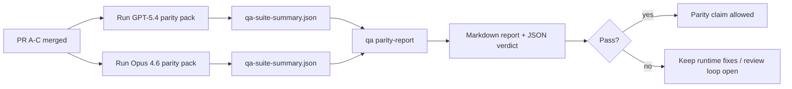

---
x-i18n:
    generated_at: "2026-04-11T13:24:09Z"
    model: gpt-5.4
    provider: openai
    source_hash: 910bcf7668becf182ef48185b43728bf2fa69629d6d50189d47d47b06f807a9e
    source_path: help/gpt54-codex-agentic-parity-maintainers.md
    workflow: 15
---

# GPT-5.4 / Codex 一致性维护者说明

本说明解释了如何将 GPT-5.4 / Codex 一致性计划按四个合并单元进行评审，同时不丢失原始的六合同架构。

## 合并单元

### PR A：严格 agentic 执行

负责：

- `executionContract`
- 以 GPT-5 为先的同回合继续执行
- 将 `update_plan` 作为非终态的进度跟踪
- 使用显式阻塞状态，而不是仅有计划的静默停止

不负责：

- 鉴权 / 运行时失败分类
- 权限真实性
- 重放 / 续接重设计
- 一致性基准评测

### PR B：运行时真实性

负责：

- Codex OAuth scope 正确性
- 类型化的提供商 / 运行时失败分类
- 如实反映 `/elevated full` 的可用性及阻塞原因

不负责：

- 工具 schema 规范化
- 重放 / 活性状态
- 基准评测门禁

### PR C：执行正确性

负责：

- 由 provider 持有的 OpenAI / Codex 工具兼容性
- 无参数严格 schema 处理
- 暴露 replay-invalid
- 长任务状态可见性：paused、blocked 和 abandoned

不负责：

- 自主选择的续接
- provider hook 之外的通用 Codex 方言行为
- 基准评测门禁

### PR D：一致性验证框架

负责：

- 首波 GPT-5.4 对比 Opus 4.6 的场景包
- 一致性文档
- 一致性报告和发布门禁机制

不负责：

- QA-lab 之外的运行时行为变更
- 在验证框架内模拟 auth / proxy / DNS

## 映射回原始六合同

| 原始合同 | 合并单元 |
| ---------------------------------------- | ---------- |
| 提供商传输 / 鉴权正确性 | PR B |
| 工具合同 / schema 兼容性 | PR C |
| 同回合执行 | PR A |
| 权限真实性 | PR B |
| 重放 / 续接 / 活性正确性 | PR C |
| 基准评测 / 发布门禁 | PR D |

## 评审顺序

1. PR A
2. PR B
3. PR C
4. PR D

PR D 是证明层。它不应成为延迟运行时正确性 PR 的理由。

## 需要关注的内容

### PR A

- GPT-5 运行会执行动作，或在失败时闭合失败，而不是停在说明性文字
- `update_plan` 本身不再看起来像进展
- 行为仍然保持 “以 GPT-5 为先” 且限定在 embedded-Pi 范围内

### PR B

- auth / proxy / 运行时失败不再被折叠成通用的 “model failed” 处理
- 只有在实际可用时，才将 `/elevated full` 描述为可用
- 阻塞原因对模型和面向用户的运行时都可见

### PR C

- 严格 OpenAI / Codex 工具注册行为可预测
- 无参数工具不会因严格 schema 检查而失败
- 重放和压缩结果保留真实的活性状态

### PR D

- 场景包易于理解并且可复现
- 场景包包含变更型的重放安全测试通道，而不仅仅是只读流程
- 报告对人类和自动化都可读
- 一致性声明有证据支撑，而不是轶事式判断

PR D 的预期产物：

- 每次模型运行都生成 `qa-suite-report.md` / `qa-suite-summary.json`
- `qa-agentic-parity-report.md`，包含聚合对比和场景级对比
- `qa-agentic-parity-summary.json`，提供机器可读的结论

## 发布门禁

在满足以下条件之前，不要声称 GPT-5.4 与 Opus 4.6 一致，或优于 Opus 4.6：

- PR A、PR B 和 PR C 已合并
- PR D 已干净地跑完首波一致性场景包
- 运行时真实性回归测试套件保持绿色
- 一致性报告显示不存在虚假成功案例，且停止行为没有回退

一致性验证框架不是唯一的证据来源。在评审中要明确保持这种拆分：

- PR D 负责基于场景的 GPT-5.4 与 Opus 4.6 对比
- PR B 的确定性测试套件仍然负责 auth / proxy / DNS 和完整访问真实性证据

## 目标到证据映射

| 完成门禁项 | 主要负责人 | 评审产物 |
| ---------------------------------------- | ------------- | ------------------------------------------------------------------- |
| 没有仅计划式停滞 | PR A | 严格 agentic 运行时测试和 `approval-turn-tool-followthrough` |
| 没有虚假进展或虚假工具完成 | PR A + PR D | 一致性虚假成功计数，以及场景级报告细节 |
| 没有错误的 `/elevated full` 指引 | PR B | 确定性的运行时真实性测试套件 |
| 重放 / 活性失败保持显式 | PR C + PR D | 生命周期 / 重放测试套件，以及 `compaction-retry-mutating-tool` |
| GPT-5.4 达到或超过 Opus 4.6 | PR D | `qa-agentic-parity-report.md` 和 `qa-agentic-parity-summary.json` |

## 评审速记：前后对比

| 变更前用户可见问题 | 变更后评审信号 |
| ----------------------------------------------------------- | --------------------------------------------------------------------------------------- |
| GPT-5.4 在规划后停止 | PR A 展示执行或阻塞行为，而不是仅以说明性文字结束 |
| 在严格 OpenAI / Codex schema 下，工具使用显得脆弱 | PR C 让工具注册和无参数调用保持可预测 |
| `/elevated full` 提示有时具有误导性 | PR B 将指引绑定到实际运行时能力和阻塞原因 |
| 长任务可能消失在重放 / 压缩歧义中 | PR C 发出显式的 paused、blocked、abandoned 和 replay-invalid 状态 |
| 一致性声明只是轶事式判断 | PR D 产出报告和 JSON 结论，并对两个模型使用相同的场景覆盖 |
