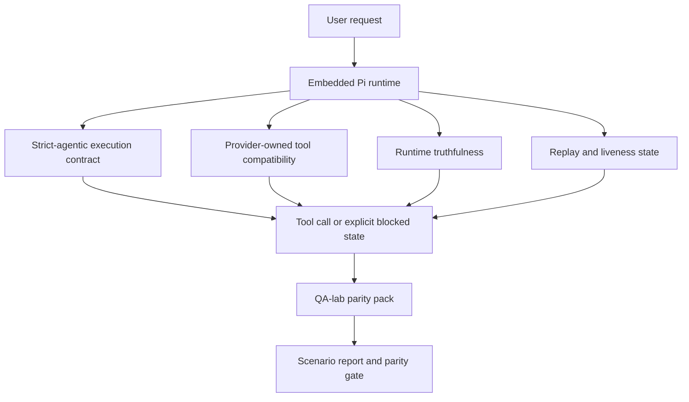
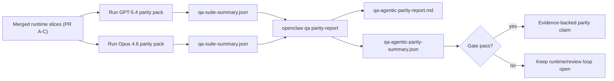

---
x-i18n:
    generated_at: "2026-04-11T13:24:09Z"
    model: gpt-5.4
    provider: openai
    source_hash: 7ee6b925b8a0f8843693cea9d50b40544657b5fb8a9e0860e2ff5badb273acb6
    source_path: help/gpt54-codex-agentic-parity.md
    workflow: 15
---

# OpenClaw 中的 GPT-5.4 / Codex Agentic 对齐

OpenClaw 早已能够很好地支持会使用工具的前沿模型，但 GPT-5.4 和 Codex 风格模型在一些实际场景中仍然表现不佳：

- 它们可能会在规划之后停止，而不去真正执行工作
- 它们可能会错误使用严格的 OpenAI/Codex 工具 schema
- 即使根本不可能获得完整访问权限，它们也可能会请求 `/elevated full`
- 它们可能会在回放或压缩期间丢失长时间运行任务的状态
- 与 Claude Opus 4.6 的对齐声明过去更多基于轶事，而不是可重复的场景

这个对齐计划通过四个可审查的切片修复了这些差距。

## 发生了哪些变化

### PR A: 严格 agentic 执行

这个切片为嵌入式 Pi GPT-5 运行新增了一个可选启用的 `strict-agentic` 执行契约。

启用后，OpenClaw 不再把“仅有计划”的回合作为“足够好”的完成状态接受。如果模型只是说明它打算做什么，而没有实际使用工具或取得进展，OpenClaw 会通过一个“立即行动”的引导重试；如果仍然没有行动，则会以显式的阻塞状态失败关闭，而不是悄悄结束任务。

这对 GPT-5.4 体验的提升最明显体现在：

- 简短的“好的，去做吧”后续回合
- 第一步非常明确的代码任务
- `update_plan` 应该用于进度跟踪，而不是充当填充文本的流程

### PR B: 运行时真实性

这个切片让 OpenClaw 在两件事上如实表达：

- 提供商 / 运行时调用为什么失败
- `/elevated full` 是否真的可用

这意味着，GPT-5.4 能获得更好的运行时信号，用于识别缺失的 scope、auth 刷新失败、HTML 403 auth 失败、代理问题、DNS 或超时失败，以及被阻止的完整访问模式。模型不太可能再虚构错误的修复建议，或持续请求运行时根本无法提供的权限模式。

### PR C: 执行正确性

这个切片改进了两类正确性：

- 由提供商拥有的 OpenAI/Codex 工具 schema 兼容性
- 回放和长任务存活状态的呈现

工具兼容性工作减少了严格 OpenAI/Codex 工具注册中的 schema 摩擦，尤其是在无参数工具和严格对象根期望方面。回放 / 存活状态工作则让长时间运行的任务更容易观测，因此暂停、阻塞和已放弃状态会清晰可见，而不是消失在通用失败文本中。

### PR D: 对齐验证 harness

这个切片新增了首批 QA-lab 对齐测试包，使 GPT-5.4 和 Opus 4.6 能够通过相同场景进行测试，并基于共享证据进行比较。

这个对齐测试包是证据层。本身并不会改变运行时行为。

在你拿到两个 `qa-suite-summary.json` 产物后，可通过以下命令生成发布门禁对比报告：

```bash
pnpm openclaw qa parity-report \
  --repo-root . \
  --candidate-summary .artifacts/qa-e2e/gpt54/qa-suite-summary.json \
  --baseline-summary .artifacts/qa-e2e/opus46/qa-suite-summary.json \
  --output-dir .artifacts/qa-e2e/parity
```

该命令会写出：

- 一份人类可读的 Markdown 报告
- 一份机器可读的 JSON 判定结果
- 一个显式的 `pass` / `fail` 门禁结果

## 为什么这会在实践中改进 GPT-5.4

在这项工作之前，GPT-5.4 在 OpenClaw 上的真实编码会话中，可能会比 Opus 显得更不够 agentic，因为运行时容忍了一些对 GPT-5 风格模型尤其有害的行为：

- 只有评论、没有执行的回合
- 围绕工具的 schema 摩擦
- 含糊不清的权限反馈
- 无声的回放或压缩损坏

目标不是让 GPT-5.4 模仿 Opus。目标是为 GPT-5.4 提供一种运行时契约：奖励真实进展，提供更清晰的工具和权限语义，并把失败模式转换成显式、同时可供机器和人类读取的状态。

这会把用户体验从：

- “模型有一个不错的计划，但停下来了”

变成：

- “模型要么已经执行了，要么 OpenClaw 明确给出了它无法执行的具体原因”

## GPT-5.4 用户的前后对比

| 此计划之前 | PR A-D 之后 |
| ---------------------------------------------------------------------------------------------- | ---------------------------------------------------------------------------------------- |
| GPT-5.4 可能会在提出一个合理计划后就停止，而不执行下一步工具操作 | PR A 将“只有计划”转变为“立即执行，否则呈现阻塞状态” |
| 严格工具 schema 可能会以令人困惑的方式拒绝无参数工具或 OpenAI/Codex 形状的工具 | PR C 让由提供商拥有的工具注册和调用更可预测 |
| 在受阻运行时中，`/elevated full` 指引可能含糊甚至错误 | PR B 为 GPT-5.4 和用户提供真实的运行时与权限提示 |
| 回放或压缩失败可能让任务看起来像是悄悄消失了 | PR C 会显式呈现暂停、阻塞、已放弃和回放无效等结果 |
| “GPT-5.4 感觉比 Opus 差”过去大多只是轶事 | PR D 将其转化为同一套场景、同一组指标和一个硬性的 pass/fail 门禁 |

## 架构



## 发布流程



## 场景测试包

首批对齐测试包目前覆盖五个场景：

### `approval-turn-tool-followthrough`

检查模型在简短批准之后，是否不会停留在“我会去做”的表述上。它应当在同一回合中采取第一个具体动作。

### `model-switch-tool-continuity`

检查在模型 / 运行时切换边界上，依赖工具的工作是否仍然保持连贯，而不是重置为评论性文字或丢失执行上下文。

### `source-docs-discovery-report`

检查模型是否能读取源码和文档、综合发现，并继续以 agentic 方式推进任务，而不是只给出一个单薄的总结后就提前停止。

### `image-understanding-attachment`

检查涉及附件的混合模式任务是否仍然可执行，而不会退化成模糊的叙述。

### `compaction-retry-mutating-tool`

检查当一个任务发生真实的变更写入时，如果运行在压力下发生压缩、重试或丢失回复状态，系统是否仍然把回放不安全性显式保留下来，而不是悄悄让它看起来像是可安全回放的。

## 场景矩阵

| 场景 | 测试内容 | 良好的 GPT-5.4 行为 | 失败信号 |
| ---------------------------------- | --------------------------------------- | ------------------------------------------------------------------------------ | ------------------------------------------------------------------------------ |
| `approval-turn-tool-followthrough` | 计划之后的简短批准回合 | 立即开始第一个具体工具动作，而不是重述意图 | 只有计划的后续、没有工具活动，或在没有真实阻塞因素时给出阻塞回合 |
| `model-switch-tool-continuity` | 工具使用过程中的运行时 / 模型切换 | 保留任务上下文，并连贯地继续执行 | 重置为评论性文字、丢失工具上下文，或在切换后停止 |
| `source-docs-discovery-report` | 源码阅读 + 综合分析 + 行动 | 能找到源码，使用工具，并产出有用报告而不陷入停滞 | 总结单薄、缺少工具工作，或在未完成回合时停止 |
| `image-understanding-attachment` | 由附件驱动的 agentic 工作 | 能理解附件、将其与工具关联，并继续推进任务 | 模糊叙述、忽略附件，或没有任何具体下一步行动 |
| `compaction-retry-mutating-tool` | 压缩压力下的变更性工作 | 执行真实写入，并在副作用发生后仍然显式保留回放不安全性 | 已发生变更写入，但回放安全性被暗示为安全、缺失，或表述矛盾 |

## 发布门禁

只有在合并后的运行时同时通过对齐测试包和运行时真实性回归测试时，GPT-5.4 才能被视为达到或超过对齐水平。

必需结果：

- 当下一步工具动作明确时，不再出现只停留在计划阶段的卡顿
- 不再出现没有真实执行的虚假完成
- 不再给出错误的 `/elevated full` 指引
- 不再出现无声的回放或压缩放弃
- 对齐测试包中的指标至少与约定的 Opus 4.6 基线同样强

对于首批 harness，门禁比较以下指标：

- 完成率
- 非预期停止率
- 有效工具调用率
- 虚假成功次数

对齐证据被有意拆分为两层：

- PR D 通过 QA-lab 证明 GPT-5.4 与 Opus 4.6 在相同场景下的行为
- PR B 的确定性测试套件则在该 harness 之外，证明 auth、代理、DNS 和 `/elevated full` 真实性

## 目标到证据矩阵

| 完成门禁项 | 归属 PR | 证据来源 | 通过信号 |
| -------------------------------------------------------- | ----------- | ------------------------------------------------------------------ | ---------------------------------------------------------------------------------------- |
| GPT-5.4 不再在规划后停滞 | PR A | `approval-turn-tool-followthrough` 加上 PR A 运行时测试套件 | 批准回合会触发真实工作，或给出显式阻塞状态 |
| GPT-5.4 不再伪造进展或伪造工具完成 | PR A + PR D | 对齐报告中的场景结果与 fake-success 次数 | 没有可疑的通过结果，也没有只有评论而无执行的完成 |
| GPT-5.4 不再给出错误的 `/elevated full` 指引 | PR B | 确定性的真实性测试套件 | 阻塞原因和完整访问提示始终与运行时真实情况一致 |
| 回放 / 存活状态失败始终保持显式 | PR C + PR D | PR C 生命周期 / 回放测试套件加上 `compaction-retry-mutating-tool` | 发生变更性工作后，回放不安全性会被显式保留，而不是悄悄消失 |
| GPT-5.4 在约定指标上达到或超过 Opus 4.6 | PR D | `qa-agentic-parity-report.md` 和 `qa-agentic-parity-summary.json` | 场景覆盖相同，且在完成率、停止行为或有效工具使用上没有回归 |

## 如何读取对齐判定结果

将 `qa-agentic-parity-summary.json` 中的判定结果用作首批对齐测试包的最终机器可读决策。

- `pass` 表示 GPT-5.4 覆盖了与 Opus 4.6 相同的场景，并且在约定的聚合指标上没有回归。
- `fail` 表示至少触发了一个硬性门禁：更弱的完成率、更差的非预期停止、更弱的有效工具使用、任何虚假成功案例，或场景覆盖不一致。
- “shared/base CI issue” 本身并不是对齐结果。如果 PR D 之外的 CI 噪声阻塞了一次运行，则应等待一次干净的已合并运行时执行后再给出判定，而不是根据分支时期的日志进行推断。
- auth、代理、DNS 和 `/elevated full` 的真实性仍然来自 PR B 的确定性测试套件，因此最终的发布声明需要同时满足两点：PR D 对齐判定通过，以及 PR B 真实性覆盖为绿色。

## 谁应该启用 `strict-agentic`

在以下情况下使用 `strict-agentic`：

- 当下一步很明确时，期望智能体立即行动
- GPT-5.4 或 Codex 系列模型是主要运行时
- 你更希望看到显式阻塞状态，而不是“有帮助”的仅总结式回复

在以下情况下保留默认契约：

- 你希望保持现有较宽松的行为
- 你没有使用 GPT-5 系列模型
- 你测试的是提示词，而不是运行时强制执行
