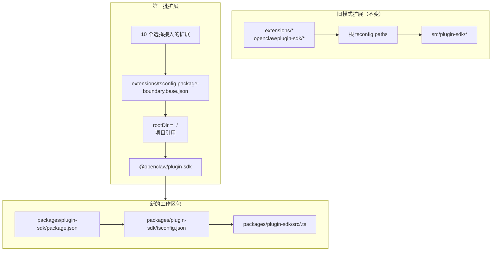

# 重构：逐步将 plugin-sdk 变成真正的工作区包

## 概述

该计划在 `packages/plugin-sdk` 下为插件 SDK 引入一个真正的工作区包，并用它让第一批少量扩展选择性地接入由编译器强制执行的包边界。目标是让非法相对导入在普通 `tsc` 下对选定的一组内置 provider 扩展直接失败，而不强制进行全仓库迁移，也不制造一个巨大的合并冲突面。

关键的渐进式动作是在一段时间内并行运行两种模式：

| 模式 | 导入形态 | 使用者 | 强制机制 |
| ----------- | ------------------------ | ------------------------------------ | -------------------------------------------- |
| 旧模式 | `openclaw/plugin-sdk/*`  | 所有现有未选择接入的扩展 | 保持当前宽松行为 |
| 选择接入模式 | `@openclaw/plugin-sdk/*` | 仅第一批扩展 | 包本地 `rootDir` + 项目引用 |

## 问题框架

当前仓库导出了一个庞大的公共插件 SDK 表面，但它并不是真正的工作区包。而是：

- 根 `tsconfig.json` 将 `openclaw/plugin-sdk/*` 直接映射到
  `src/plugin-sdk/*.ts`
- 未选择接入先前实验的扩展仍然共享这种
  全局源码别名行为
- 只有在允许的 SDK 导入不再解析到扩展包之外的原始仓库源码后，添加 `rootDir` 才会生效

这意味着仓库可以描述期望的边界策略，但 TypeScript 无法对大多数扩展清晰地强制执行它。

你需要一条渐进式路径，以便：

- 让 `plugin-sdk` 变得真实
- 将 SDK 迁移为名为 `@openclaw/plugin-sdk` 的工作区包
- 在第一个 PR 中只改动大约 10 个扩展
- 暂时让其余扩展树继续使用旧方案，等待后续清理
- 避免把 `tsconfig.plugin-sdk.dts.json` + postinstall 生成声明文件的流程作为第一批 rollout 的主要机制

## 需求追踪

- R1. 在 `packages/` 下为插件 SDK 创建一个真正的工作区包。
- R2. 将新包命名为 `@openclaw/plugin-sdk`。
- R3. 为新的 SDK 包提供独立的 `package.json` 和 `tsconfig.json`。
- R4. 在迁移窗口期间，为未选择接入的扩展保留旧的
  `openclaw/plugin-sdk/*` 导入可用。
- R5. 在第一个 PR 中只让少量第一批扩展选择接入。
- R6. 对第一批扩展，离开其包根目录的相对导入必须以失败关闭。
- R7. 第一批扩展必须通过包依赖和 TS 项目引用来使用 SDK，
  而不是通过根 `paths` 别名。
- R8. 该计划必须避免为编辑器正确性引入全仓库强制性的 postinstall 生成步骤。
- R9. 第一批 rollout 必须能以中等规模 PR 的形式审阅和合并，
  而不是一次全仓库 300+ 文件的重构。

## 范围边界

- 第一个 PR 不进行所有内置扩展的完整迁移。
- 第一个 PR 不要求删除 `src/plugin-sdk`。
- 第一个 PR 不要求立即将每个根构建或测试路径都改为使用新包。
- 不尝试为每个未选择接入的扩展都强制提供 VS Code 红线提示。
- 不为扩展树其余部分做大范围 lint 清理。
- 除了导入解析、包归属和对选择接入扩展的边界强制之外，不引入大的运行时行为变化。

## 上下文与研究

### 相关代码和模式

- `pnpm-workspace.yaml` 已经包含 `packages/*` 和 `extensions/*`，因此在 `packages/plugin-sdk` 下添加新的工作区包符合现有仓库布局。
- 现有工作区包，例如 `packages/memory-host-sdk/package.json`
  和 `packages/plugin-package-contract/package.json`，已经使用以 `src/*.ts` 为根的包本地 `exports` 映射。
- 根 `package.json` 当前通过 `./plugin-sdk`
  和 `./plugin-sdk/*` 导出 SDK 表面，其后端为 `dist/plugin-sdk/*.js` 和
  `dist/plugin-sdk/*.d.ts`。
- `src/plugin-sdk/entrypoints.ts` 和 `scripts/lib/plugin-sdk-entrypoints.json`
  已经充当 SDK 表面的规范入口点清单。
- 根 `tsconfig.json` 当前映射：
  - `openclaw/plugin-sdk` -> `src/plugin-sdk/index.ts`
  - `openclaw/plugin-sdk/*` -> `src/plugin-sdk/*.ts`
- 先前的边界实验表明，只有在允许的 SDK 导入不再解析到扩展包之外的原始源码后，包本地 `rootDir` 才会对非法相对导入生效。

### 第一批扩展集合

该计划假定第一批是 provider 较重的一组，因为它们最不容易牵涉复杂的渠道运行时边缘情况：

- `extensions/anthropic`
- `extensions/exa`
- `extensions/firecrawl`
- `extensions/groq`
- `extensions/mistral`
- `extensions/openai`
- `extensions/perplexity`
- `extensions/tavily`
- `extensions/together`
- `extensions/xai`

### 第一批 SDK 表面清单

第一批扩展当前导入的是一组可控的 SDK 子路径。初始的 `@openclaw/plugin-sdk` 包只需要覆盖这些：

- `agent-runtime`
- `cli-runtime`
- `config-runtime`
- `core`
- `image-generation`
- `media-runtime`
- `media-understanding`
- `plugin-entry`
- `plugin-runtime`
- `provider-auth`
- `provider-auth-api-key`
- `provider-auth-login`
- `provider-auth-runtime`
- `provider-catalog-shared`
- `provider-entry`
- `provider-http`
- `provider-model-shared`
- `provider-onboard`
- `provider-stream-family`
- `provider-stream-shared`
- `provider-tools`
- `provider-usage`
- `provider-web-fetch`
- `provider-web-search`
- `realtime-transcription`
- `realtime-voice`
- `runtime-env`
- `secret-input`
- `security-runtime`
- `speech`
- `testing`

### 制度性经验

- 该工作树中没有相关的 `docs/solutions/` 条目。

### 外部参考

- 该计划不需要外部研究。仓库中已经包含相关的工作区包和 SDK 导出模式。

## 关键技术决策

- 在迁移期间引入 `@openclaw/plugin-sdk` 作为新的工作区包，同时保留旧的根 `openclaw/plugin-sdk/*` 表面。
  理由：这样可以让第一批扩展集合迁移到真正的包解析方式，而无需同时更改所有扩展和所有根构建路径。

- 使用专门的选择接入边界基础配置，例如
  `extensions/tsconfig.package-boundary.base.json`，而不是替换所有人现有的扩展基础配置。
  理由：仓库在迁移期间需要同时支持旧模式和选择接入模式两种扩展模式。

- 对第一批扩展使用指向
  `packages/plugin-sdk/tsconfig.json` 的 TS 项目引用，并为选择接入边界模式设置
  `disableSourceOfProjectReferenceRedirect`。
  理由：这为 `tsc` 提供了真实的包图，同时抑制编辑器和编译器回退到原始源码遍历。

- 在第一批中保持 `@openclaw/plugin-sdk` 为私有。
  理由：眼下的目标是内部边界强制与迁移安全，而不是在表面尚未稳定之前就发布第二份外部 SDK 合约。

- 第一轮实现只迁移第一批 SDK 子路径，其余部分保留兼容桥接。
  理由：在一个 PR 中物理移动 `src/plugin-sdk/*.ts` 下全部 315 个文件，正是这个计划试图避免的合并冲突面。

- 第一批不要依赖 `scripts/postinstall-bundled-plugins.mjs` 来构建 SDK 声明文件。
  理由：显式的构建/引用流程更容易理解，也能让仓库行为更可预测。

## 开放问题

### 规划期间已解决

- 哪些扩展应纳入第一批？
  使用上面列出的 10 个 provider/web-search 扩展，因为它们在结构上比更重的渠道包更独立。

- 第一个 PR 是否应替换整个扩展树？
  不。第一个 PR 应并行支持两种模式，并且只让第一批选择接入。

- 第一批是否应要求 postinstall 声明构建？
  不。包/引用图应显式可见，CI 应有意运行相关的包本地 typecheck。

### 延后到实现阶段

- 第一批包是否可以仅通过项目引用直接指向包本地 `src/*.ts`，还是
  `@openclaw/plugin-sdk` 包仍需要一个小型声明文件发射步骤。
  这是一个由实现阶段决定的 TS 图验证问题。

- 根 `openclaw` 包是否应立即将第一批 SDK 子路径代理到
  `packages/plugin-sdk` 的输出，还是继续使用
  `src/plugin-sdk` 下生成的兼容 shim。
  这是一个兼容性和构建形态细节问题，取决于哪种最小实现路径能保持 CI 绿色。

## 高层技术设计

> 此处用于说明预期方法，属于供审阅参考的方向性指导，而不是实现规范。实施该变更的智能体应将其视为上下文，而不是需要照抄的代码。

## 实施单元

- [ ] **单元 1：引入真正的 `@openclaw/plugin-sdk` 工作区包**

**目标：** 为 SDK 创建一个真正的工作区包，使其能够拥有第一批子路径表面，而不强制进行全仓库迁移。

**需求：** R1、R2、R3、R8、R9

**依赖：** 无

**文件：**

- 创建：`packages/plugin-sdk/package.json`
- 创建：`packages/plugin-sdk/tsconfig.json`
- 创建：`packages/plugin-sdk/src/index.ts`
- 创建：第一批 SDK 子路径对应的 `packages/plugin-sdk/src/*.ts`
- 修改：仅在需要调整包 glob 时修改 `pnpm-workspace.yaml`
- 修改：`package.json`
- 修改：`src/plugin-sdk/entrypoints.ts`
- 修改：`scripts/lib/plugin-sdk-entrypoints.json`
- 测试：`src/plugins/contracts/plugin-sdk-workspace-package.contract.test.ts`

**方法：**

- 添加一个名为 `@openclaw/plugin-sdk` 的新工作区包。
- 初始只包含第一批 SDK 子路径，而不是整个 315 文件树。
- 如果直接移动某个第一批入口点会导致 diff 过大，那么第一个 PR
  可以先在 `packages/plugin-sdk/src` 中以薄包装器的形式引入该子路径，
  然后在后续 PR 中再把该子路径簇的真正规范源码切换到该包。
- 复用现有入口点清单机制，以便在一个规范位置声明第一批包表面。
- 在工作区包成为新的选择接入合约时，继续保留根包导出供旧用户使用。

**应遵循的模式：**

- `packages/memory-host-sdk/package.json`
- `packages/plugin-package-contract/package.json`
- `src/plugin-sdk/entrypoints.ts`

**测试场景：**

- 正常路径：工作区包导出计划中列出的每个第一批子路径，且没有缺失任何所需的第一批导出。
- 边缘情况：当重新生成第一批入口列表或将其与规范清单比较时，包导出元数据保持稳定。
- 集成：引入新的工作区包后，根包中的旧版 SDK 导出仍然存在。

**验证：**

- 仓库中存在一个有效的 `@openclaw/plugin-sdk` 工作区包，
  具有稳定的第一批导出映射，并且根 `package.json`
  中没有旧版导出回归。

- [ ] **单元 2：为包级强制边界扩展添加选择接入的 TS 边界模式**

**目标：** 定义选择接入扩展将使用的 TS 配置模式，同时为其他所有扩展保留现有扩展 TS 行为不变。

**需求：** R4、R6、R7、R8、R9

**依赖：** 单元 1

**文件：**

- 创建：`extensions/tsconfig.package-boundary.base.json`
- 创建：`tsconfig.boundary-optin.json`
- 修改：`extensions/xai/tsconfig.json`
- 修改：`extensions/openai/tsconfig.json`
- 修改：`extensions/anthropic/tsconfig.json`
- 修改：`extensions/mistral/tsconfig.json`
- 修改：`extensions/groq/tsconfig.json`
- 修改：`extensions/together/tsconfig.json`
- 修改：`extensions/perplexity/tsconfig.json`
- 修改：`extensions/tavily/tsconfig.json`
- 修改：`extensions/exa/tsconfig.json`
- 修改：`extensions/firecrawl/tsconfig.json`
- 测试：`src/plugins/contracts/extension-package-project-boundaries.test.ts`
- 测试：`test/extension-package-tsc-boundary.test.ts`

**方法：**

- 为旧模式扩展保留 `extensions/tsconfig.base.json`。
- 添加一个新的选择接入基础配置，它：
  - 设置 `rootDir: "."`
  - 引用 `packages/plugin-sdk`
  - 启用 `composite`
  - 在需要时禁用项目引用源码重定向
- 添加一个专用的第一批 typecheck 解决方案配置，而不是在同一个 PR 中重塑根仓库 TS 项目。

**执行说明：** 在把模式扩展到全部 10 个扩展前，先从一个已选择接入扩展的失败包本地 canary typecheck 开始。

**应遵循的模式：**

- 先前边界工作中的现有包本地扩展 `tsconfig.json` 模式
- 来自 `packages/memory-host-sdk` 的工作区包模式

**测试场景：**

- 正常路径：每个已选择接入的扩展都能通过包边界 TS 配置成功 typecheck。
- 错误路径：对于已选择接入扩展，来自 `../../src/cli/acp-cli.ts` 的 canary 非法相对导入会以 `TS6059` 失败。
- 集成：未选择接入的扩展保持不变，不需要参与新的解决方案配置。

**验证：**

- 针对这 10 个已选择接入扩展有一个专用的 typecheck 图，而且其中之一的错误相对导入会通过普通 `tsc` 失败。

- [ ] **单元 3：将第一批扩展迁移到 `@openclaw/plugin-sdk`**

**目标：** 让第一批扩展通过依赖元数据、项目引用和包名导入来使用真正的 SDK 包。

**需求：** R5、R6、R7、R9

**依赖：** 单元 2

**文件：**

- 修改：`extensions/anthropic/package.json`
- 修改：`extensions/exa/package.json`
- 修改：`extensions/firecrawl/package.json`
- 修改：`extensions/groq/package.json`
- 修改：`extensions/mistral/package.json`
- 修改：`extensions/openai/package.json`
- 修改：`extensions/perplexity/package.json`
- 修改：`extensions/tavily/package.json`
- 修改：`extensions/together/package.json`
- 修改：`extensions/xai/package.json`
- 修改：上述 10 个扩展根目录下当前引用 `openclaw/plugin-sdk/*`
  的生产与测试导入

**方法：**

- 将 `@openclaw/plugin-sdk: workspace:*` 添加到第一批扩展的
  `devDependencies`。
- 将这些包中的 `openclaw/plugin-sdk/*` 导入替换为
  `@openclaw/plugin-sdk/*`。
- 保持扩展内部本地导入通过诸如 `./api.ts` 和 `./runtime-api.ts` 这样的本地 barrel。
- 本 PR 中不修改未选择接入的扩展。

**应遵循的模式：**

- 现有扩展本地导入 barrel（`api.ts`、`runtime-api.ts`）
- 其他 `@openclaw/*` 工作区包所使用的包依赖形态

**测试场景：**

- 正常路径：每个已迁移扩展在导入改写后，仍然能通过其现有插件测试完成注册/加载。
- 边缘情况：已选择接入扩展集合中的仅测试用 SDK 导入，仍然可以通过新包正确解析。
- 集成：已迁移扩展在 typecheck 时不再依赖根 `openclaw/plugin-sdk/*`
  别名路径。

**验证：**

- 第一批扩展可以基于 `@openclaw/plugin-sdk` 构建和测试，
  不需要旧的根 SDK 别名路径。

- [ ] **单元 4：在部分迁移期间保留旧版兼容性**

**目标：** 在 SDK 以旧版和新包两种形式同时存在的迁移期间，让仓库其余部分继续正常工作。

**需求：** R4、R8、R9

**依赖：** 单元 1-3

**文件：**

- 修改：根据需要修改第一批兼容 shim 对应的 `src/plugin-sdk/*.ts`
- 修改：`package.json`
- 修改：组装 SDK 工件的构建或导出管线
- 测试：`src/plugins/contracts/plugin-sdk-runtime-api-guardrails.test.ts`
- 测试：`src/plugins/contracts/plugin-sdk-index.bundle.test.ts`

**方法：**

- 保留根 `openclaw/plugin-sdk/*` 作为未迁移旧扩展以及尚未迁移的外部使用者的兼容性表面。
- 对已移动到 `packages/plugin-sdk` 的第一批子路径，使用生成的 shim 或根导出代理接线。
- 在这个阶段不要尝试淘汰根 SDK 表面。

**应遵循的模式：**

- 通过 `src/plugin-sdk/entrypoints.ts` 生成现有根 SDK 导出
- 根 `package.json` 中现有的包导出兼容性

**测试场景：**

- 正常路径：在新包存在后，非选择接入扩展的旧版根 SDK 导入仍然可以解析。
- 边缘情况：迁移窗口期间，第一批某个子路径可以同时通过旧的根表面和新的包表面工作。
- 集成：plugin-sdk index/bundle 合约测试继续看到一致的公共表面。

**验证：**

- 仓库同时支持旧模式和选择接入模式两种 SDK 使用方式，而不会破坏未变更的扩展。

- [ ] **单元 5：添加有范围限制的强制机制并记录迁移合约**

**目标：** 落地 CI 和贡献者指南，以便对第一批强制执行新行为，而不假装整个扩展树都已迁移。

**需求：** R5、R6、R8、R9

**依赖：** 单元 1-4

**文件：**

- 修改：`package.json`
- 修改：应运行选择接入边界 typecheck 的 CI 工作流文件
- 修改：`AGENTS.md`
- 修改：`docs/plugins/sdk-overview.md`
- 修改：`docs/plugins/sdk-entrypoints.md`
- 修改：`docs/plans/2026-04-05-001-refactor-extension-package-resolution-boundary-plan.md`

**方法：**

- 添加一个显式的第一批 gate，例如为
  `packages/plugin-sdk` 加上 10 个已选择接入扩展运行专用的 `tsc -b` 解决方案。
- 记录仓库现在同时支持旧模式和选择接入模式两种扩展模式，以及新的扩展边界工作应优先采用新包路径。
- 记录下一批迁移规则，以便后续 PR 能在不重新争论架构的前提下添加更多扩展。

**应遵循的模式：**

- `src/plugins/contracts/` 下现有的合约测试
- 解释分阶段迁移的现有文档更新方式

**测试场景：**

- 正常路径：新的第一批 typecheck gate 对工作区包和已选择接入扩展通过。
- 错误路径：在某个已选择接入扩展中引入新的非法相对导入，会导致有范围限制的 typecheck gate 失败。
- 集成：CI 尚不要求未选择接入扩展满足新的包边界模式。

**验证：**

- 第一批强制路径已有文档、测试且可运行，而不会强制整个扩展树迁移。

## 全系统影响

- **交互图：** 该工作会影响 SDK 规范源码、根包导出、扩展包元数据、TS 图布局和 CI 验证。
- **错误传播：** 主要的预期失败模式将变成已选择接入扩展中的编译期 TS
  错误（`TS6059`），而不是仅靠自定义脚本失败。
- **状态生命周期风险：** 双表面迁移会引入根兼容导出与新工作区包之间的漂移风险。
- **API 表面一致性：** 在过渡期间，第一批子路径必须通过
  `openclaw/plugin-sdk/*` 和 `@openclaw/plugin-sdk/*`
  两种方式保持语义完全一致。
- **集成覆盖：** 仅靠单元测试不够；必须有具备范围限制的包图 typecheck 才能证明边界成立。
- **未改变的不变量：** 未选择接入的扩展在 PR 1 中保持当前行为。该计划并不声称实现了全仓库导入边界强制。

## 风险与依赖

| 风险 | 缓解措施 |
| ------------------------------------------------------------------------------------------------------ | ----------------------------------------------------------------------------------------------------------------------- |
| 第一批包仍然会解析回原始源码，导致 `rootDir` 实际上没有以失败关闭 | 将首个实现步骤设为对一个已选择接入扩展进行包引用 canary 验证，在扩展到整个集合前先验证 |
| 一次移动过多 SDK 源码会重现最初的合并冲突问题 | 第一个 PR 只移动第一批子路径，并保留根兼容桥接 |
| 旧版和新 SDK 表面在语义上发生漂移 | 保持单一入口点清单，添加兼容性合约测试，并明确双表面一致性要求 |
| 根仓库的构建/测试路径意外以不可控方式开始依赖新包 | 使用专用的选择接入解决方案配置，并将全仓库 TS 拓扑变更排除在第一个 PR 之外 |

## 分阶段交付

### 第一阶段

- 引入 `@openclaw/plugin-sdk`
- 定义第一批子路径表面
- 证明一个已选择接入扩展可以通过 `rootDir` 以失败关闭

### 第二阶段

- 让 10 个第一批扩展选择接入
- 为其他所有扩展保留根兼容性

### 第三阶段

- 在后续 PR 中添加更多扩展
- 将更多 SDK 子路径迁移到工作区包
- 仅在旧扩展集合消失后再淘汰根兼容性

## 文档 / 运维说明

- 第一个 PR 应明确说明自己是双模式迁移，而不是全仓库强制完成。
- 迁移指南应让后续 PR 可以轻松通过相同的包/依赖/引用模式添加更多扩展。

## 来源与参考

- 先前计划：`docs/plans/2026-04-05-001-refactor-extension-package-resolution-boundary-plan.md`
- 工作区配置：`pnpm-workspace.yaml`
- 现有 SDK 入口点清单：`src/plugin-sdk/entrypoints.ts`
- 现有根 SDK 导出：`package.json`
- 现有工作区包模式：
  - `packages/memory-host-sdk/package.json`
  - `packages/plugin-package-contract/package.json`
